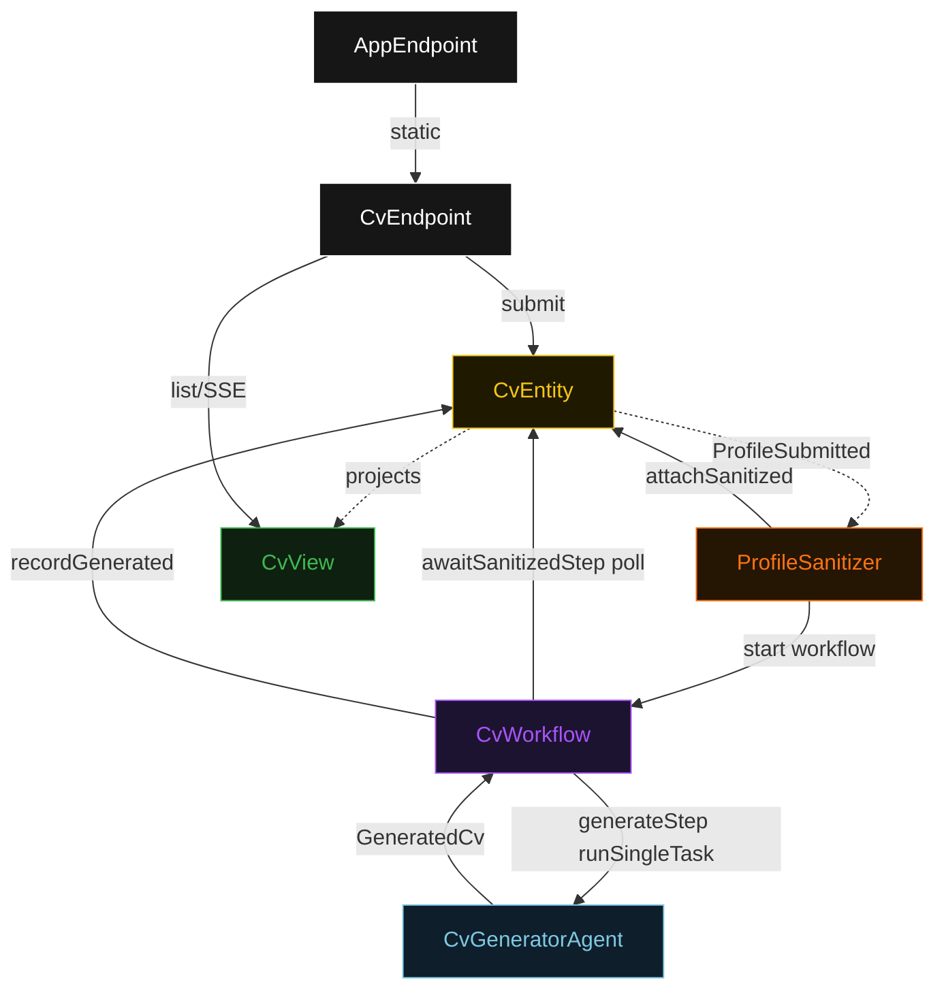
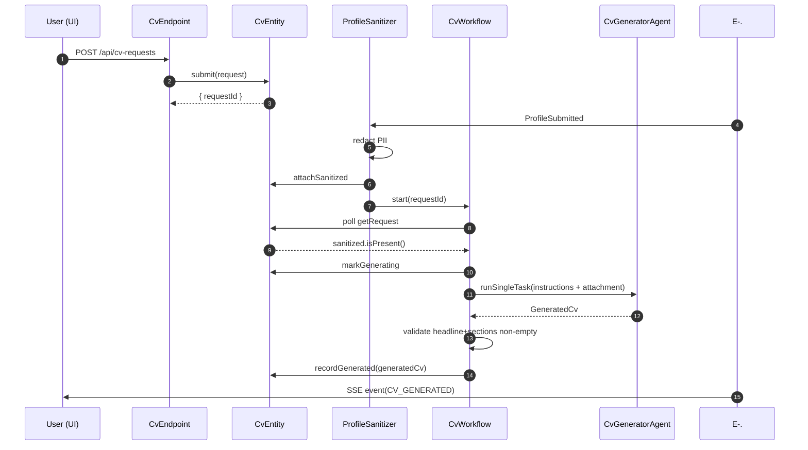
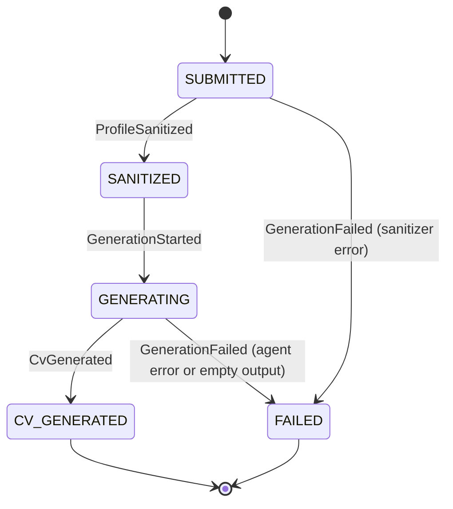
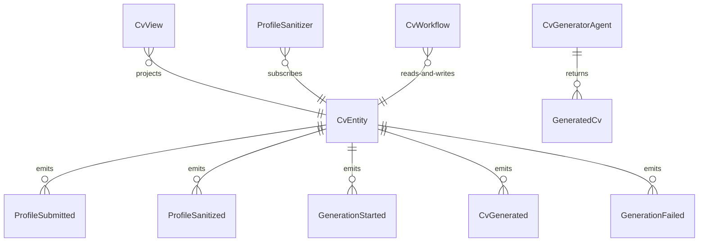

# PLAN — basic-cv-agent

Architectural sketch consumed by `/akka:plan` and rendered on the generated system's Architecture tab. The four mermaid diagrams below carry the theme variables and CSS overrides from Lesson 24; without them, state names render black-on-black and edge labels clip.

---

## Component graph

## Interaction sequence — J1 (happy path)

## State machine — `CvEntity`

## Entity model

## Component table — Java file targets

| Component | Path (generated) |
|---|---|
| `CvEndpoint` | `api/CvEndpoint.java` |
| `AppEndpoint` | `api/AppEndpoint.java` |
| `CvEntity` | `application/CvEntity.java` (state in `domain/CvRequestState.java`, events in `domain/CvEvent.java`) |
| `ProfileSanitizer` | `application/ProfileSanitizer.java` |
| `CvWorkflow` | `application/CvWorkflow.java` |
| `CvGeneratorAgent` | `application/CvGeneratorAgent.java` (tasks in `application/CvTasks.java`) |
| `CvView` | `application/CvView.java` |
| `MockModelProvider` (option-a only) | `application/MockModelProvider.java` |
| Bootstrap | `Bootstrap.java` |

## Concurrency notes

- **Per-step timeout**: `awaitSanitizedStep` 15 s, `generateStep` 60 s, `error` 5 s. Default step recovery `maxRetries(2).failoverTo(CvWorkflow::error)`. The 60 s on `generateStep` accommodates LLM latency (Lesson 4).
- **Idempotency**: every workflow uses `"cv-" + requestId` as the workflow id; the `ProfileSanitizer` Consumer is allowed to redeliver `ProfileSubmitted` events because `CvEntity.attachSanitized` is event-version-guarded — a second sanitize attempt against an already-sanitized request is a no-op.
- **One agent per request**: the AutonomousAgent instance id is `"cv-gen-" + requestId`, which gives each task its own conversation context. The agent's `capability(...).maxIterationsPerTask(3)` caps retries at 3.
- **No guardrail on the agent**: structural validation of the returned `GeneratedCv` (headline non-empty, sections list non-empty) is done by `generateStep` in the workflow before calling `CvEntity.recordGenerated`. A failed validation transitions the entity to `FAILED` via `CvEntity.fail(reason)`. This is intentional — the blueprint keeps the single control (S1) minimal so the pattern is readable.
- **No saga / no compensation**: every step is either a pure read, an append-only event write, or a single-task agent call. There is nothing external to roll back.
