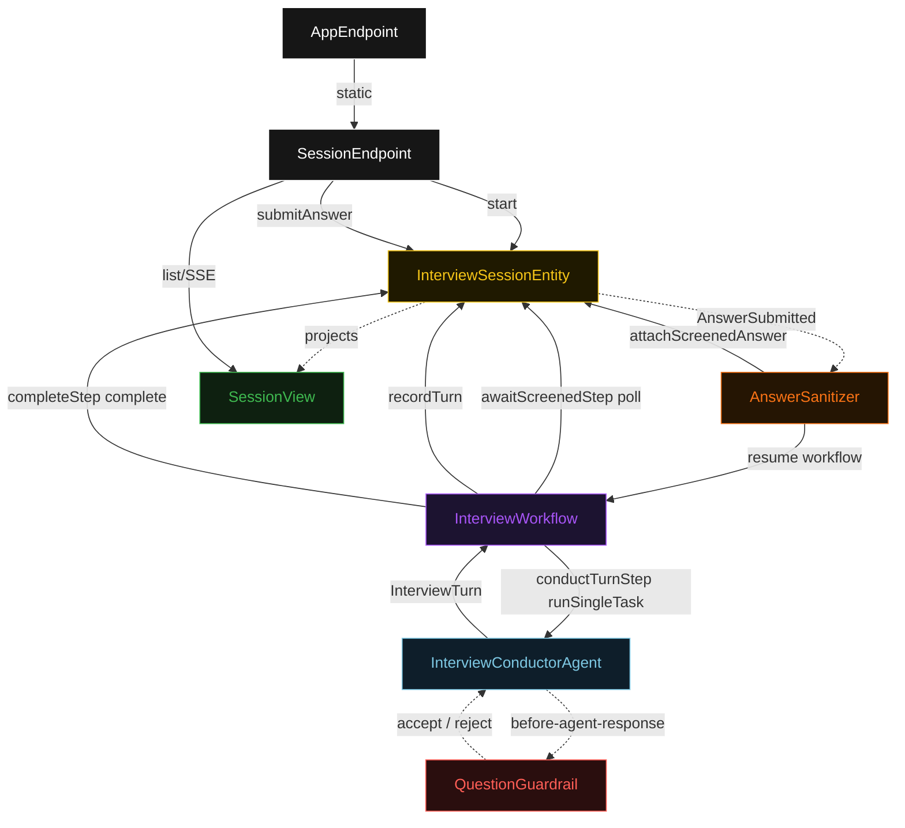
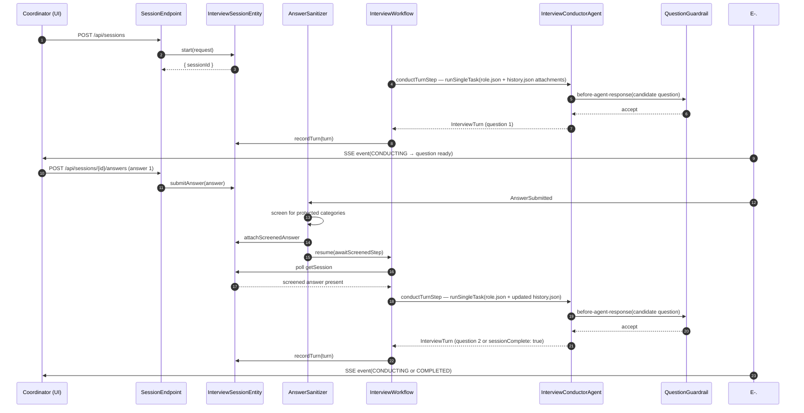
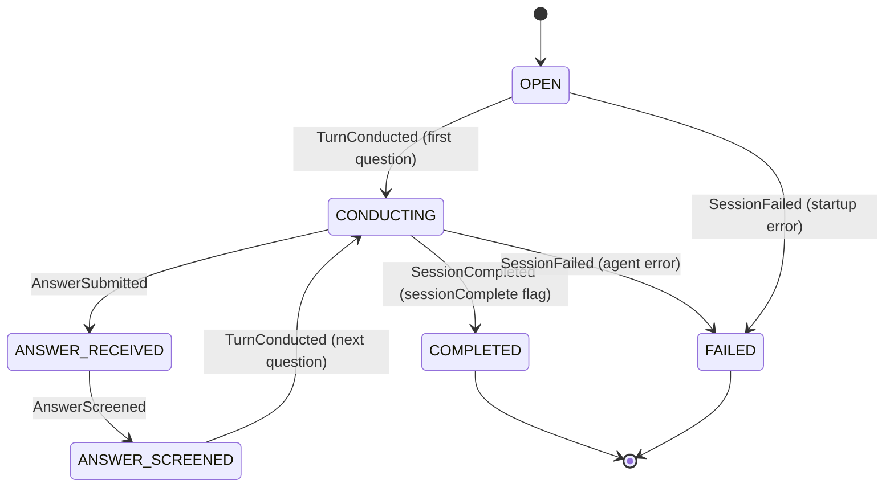
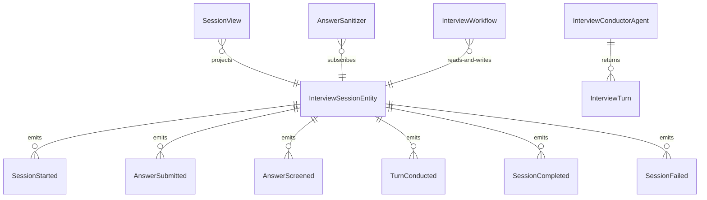

# PLAN — conversational-interview

Architectural sketch consumed by `/akka:plan` and rendered on the generated system's Architecture tab. The four mermaid diagrams below carry the theme variables and CSS overrides from Lesson 24; without them, state names render black-on-black and edge labels clip.

---

## Component graph

## Interaction sequence — J1 (happy path, first turn)

## State machine — `InterviewSessionEntity`

## Entity model

## Component table — Java file targets

| Component | Path (generated) |
|---|---|
| `SessionEndpoint` | `api/SessionEndpoint.java` |
| `AppEndpoint` | `api/AppEndpoint.java` |
| `InterviewSessionEntity` | `application/InterviewSessionEntity.java` (state in `domain/InterviewSession.java`, events in `domain/SessionEvent.java`) |
| `AnswerSanitizer` | `application/AnswerSanitizer.java` |
| `InterviewWorkflow` | `application/InterviewWorkflow.java` |
| `InterviewConductorAgent` | `application/InterviewConductorAgent.java` (tasks in `application/InterviewTasks.java`) |
| `QuestionGuardrail` | `application/QuestionGuardrail.java` |
| `SessionView` | `application/SessionView.java` |
| `MockModelProvider` (option-a only) | `application/MockModelProvider.java` |
| Bootstrap | `Bootstrap.java` |

## Concurrency notes

- **Per-step timeout**: `conductTurnStep` 60 s, `awaitScreenedStep` 15 s, `completeStep` 5 s, `error` 5 s. Default step recovery `maxRetries(2).failoverTo(InterviewWorkflow::error)`. The 60 s on `conductTurnStep` accommodates LLM latency (Lesson 4).
- **Idempotency**: every workflow uses `"interview-" + sessionId` as the workflow id; the `AnswerSanitizer` Consumer is allowed to redeliver `AnswerSubmitted` events because `InterviewSessionEntity.attachScreenedAnswer` is event-version-guarded — a second screen attempt against an already-screened turn is a no-op.
- **One agent per session**: the AutonomousAgent instance id is `"conductor-" + sessionId`, giving each session its own conversation context. The agent's `capability(...).maxIterationsPerTask(3)` caps guardrail-triggered retries at 3.
- **Guardrail-driven retry**: when `QuestionGuardrail` rejects a candidate response, the rejection is returned as a structured error to the agent loop. The loop counts toward `maxIterationsPerTask`; if all 3 iterations fail validation, the workflow's `conductTurnStep` fails over to `error` and the entity transitions to `FAILED`.
- **Turn loop**: after recording a turn with `sessionComplete: false`, the workflow waits for the next `AnswerSubmitted` event (triggered when the coordinator submits the candidate's answer). `AnswerSanitizer` screens the answer and resumes the workflow to `awaitScreenedStep`. This cycle repeats until `sessionComplete: true`.
- **No saga / no compensation**: every step is either a pure read, an append-only event write, or a single-task agent call. There is nothing external to roll back.
