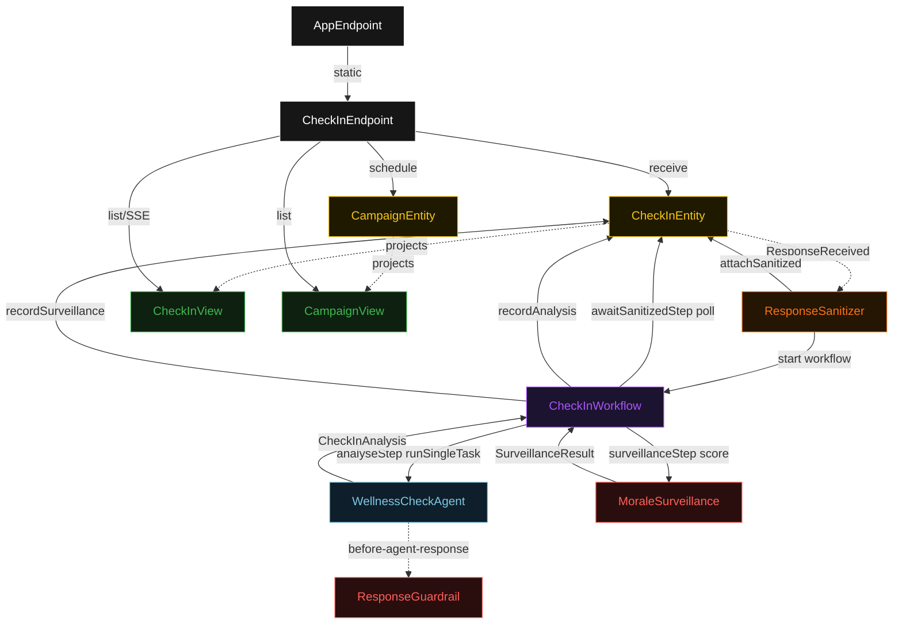
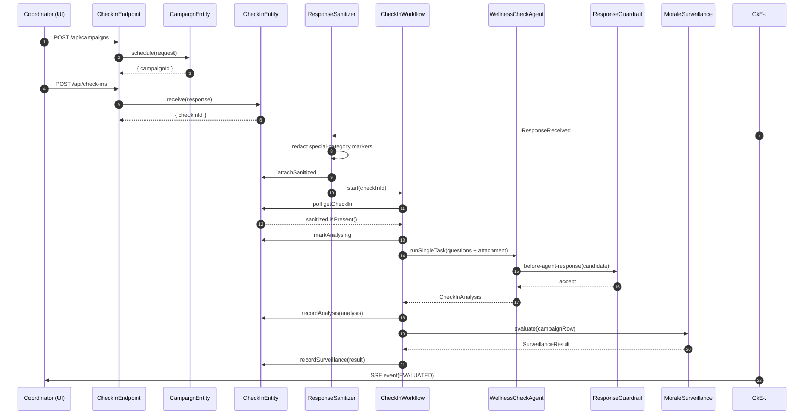
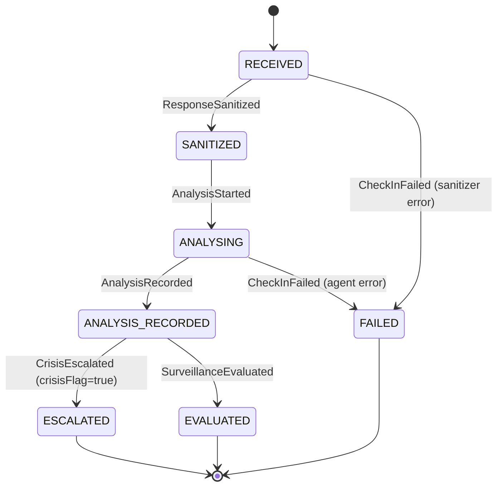
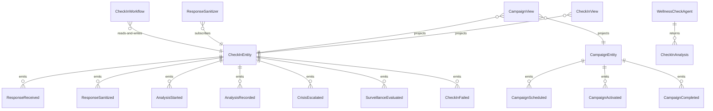

# PLAN — wellness-check-agent

Architectural sketch consumed by `/akka:plan` and rendered on the generated system's Architecture tab. The four mermaid diagrams below carry the theme variables and CSS overrides from Lesson 24; without them, state names render black-on-black and edge labels clip.

---

## Component graph

## Interaction sequence — J1 (happy path)

## State machine — `CheckInEntity`

## Entity model

## Component table — Java file targets

| Component | Path (generated) |
|---|---|
| `CheckInEndpoint` | `api/CheckInEndpoint.java` |
| `AppEndpoint` | `api/AppEndpoint.java` |
| `CampaignEntity` | `application/CampaignEntity.java` (state in `domain/Campaign.java`, events in `domain/CampaignEvent.java`) |
| `CheckInEntity` | `application/CheckInEntity.java` (state in `domain/CheckIn.java`, events in `domain/CheckInEvent.java`) |
| `ResponseSanitizer` | `application/ResponseSanitizer.java` |
| `CheckInWorkflow` | `application/CheckInWorkflow.java` |
| `WellnessCheckAgent` | `application/WellnessCheckAgent.java` (tasks in `application/CheckInTasks.java`) |
| `ResponseGuardrail` | `application/ResponseGuardrail.java` |
| `MoraleSurveillance` | `application/MoraleSurveillance.java` |
| `CheckInView` | `application/CheckInView.java` |
| `CampaignView` | `application/CampaignView.java` |
| `MockModelProvider` (option-a only) | `application/MockModelProvider.java` |
| Bootstrap | `Bootstrap.java` |

## Concurrency notes

- **Per-step timeout**: `awaitSanitizedStep` 15 s, `analyseStep` 60 s, `surveillanceStep` 5 s, `error` 5 s. Default step recovery `maxRetries(2).failoverTo(CheckInWorkflow::error)`. The 60 s on `analyseStep` accommodates LLM latency (Lesson 4).
- **Idempotency**: every workflow uses `"checkin-" + checkInId` as the workflow id; `ResponseSanitizer` Consumer is allowed to redeliver `ResponseReceived` events because `CheckInEntity.attachSanitized` is event-version-guarded — a second sanitize attempt against an already-sanitized check-in is a no-op.
- **One agent per check-in**: the AutonomousAgent instance id is `"wellness-" + checkInId`, giving each task its own conversation context. The agent's `capability(...).maxIterationsPerTask(3)` caps guardrail-triggered retries at 3.
- **Crisis at the guardrail boundary**: when `ResponseGuardrail` detects `crisisFlag == true`, it emits `CrisisEscalated` on `CheckInEntity` before returning `Guardrail.accept()`. The check-in transitions to `ESCALATED` and is removed from normal morale aggregation. The workflow still proceeds to `surveillanceStep` so the campaign's crisis count is incremented.
- **Surveillance is synchronous and deterministic**: `MoraleSurveillance` runs in-process inside `surveillanceStep`. No LLM call. The same campaign ratio always produces the same flag.
- **No saga / no compensation**: each step is either pure read, append-only event write, or a single-task agent call. Nothing external to roll back.
