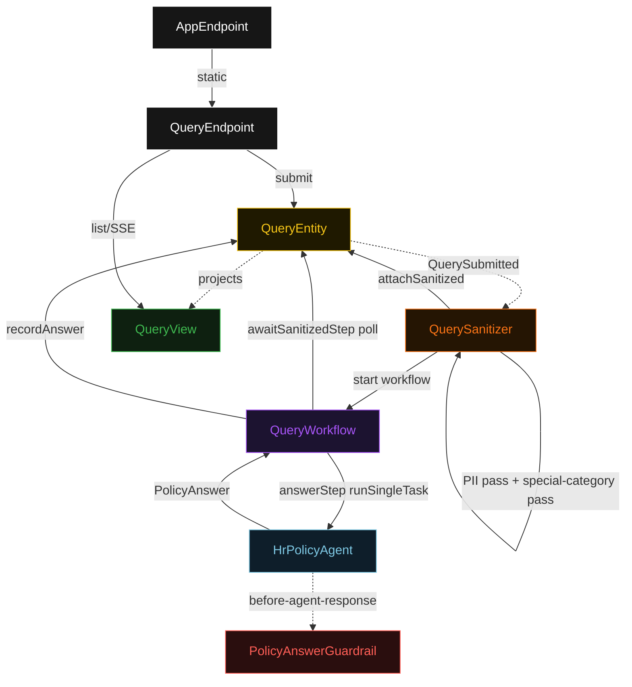
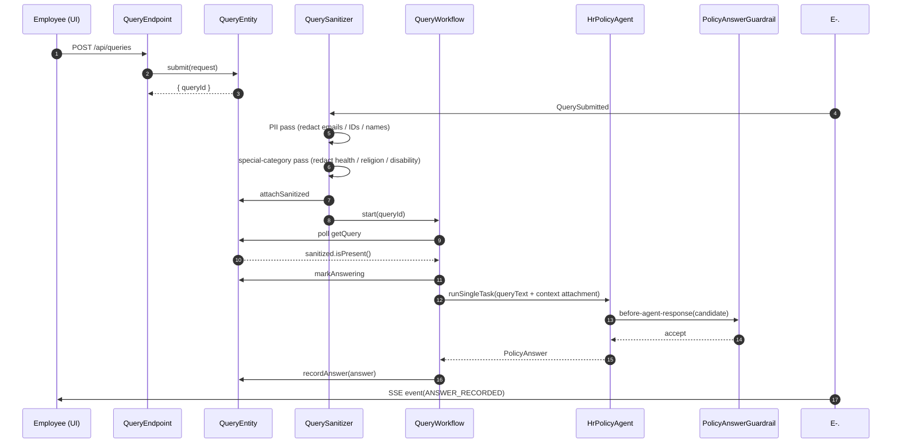
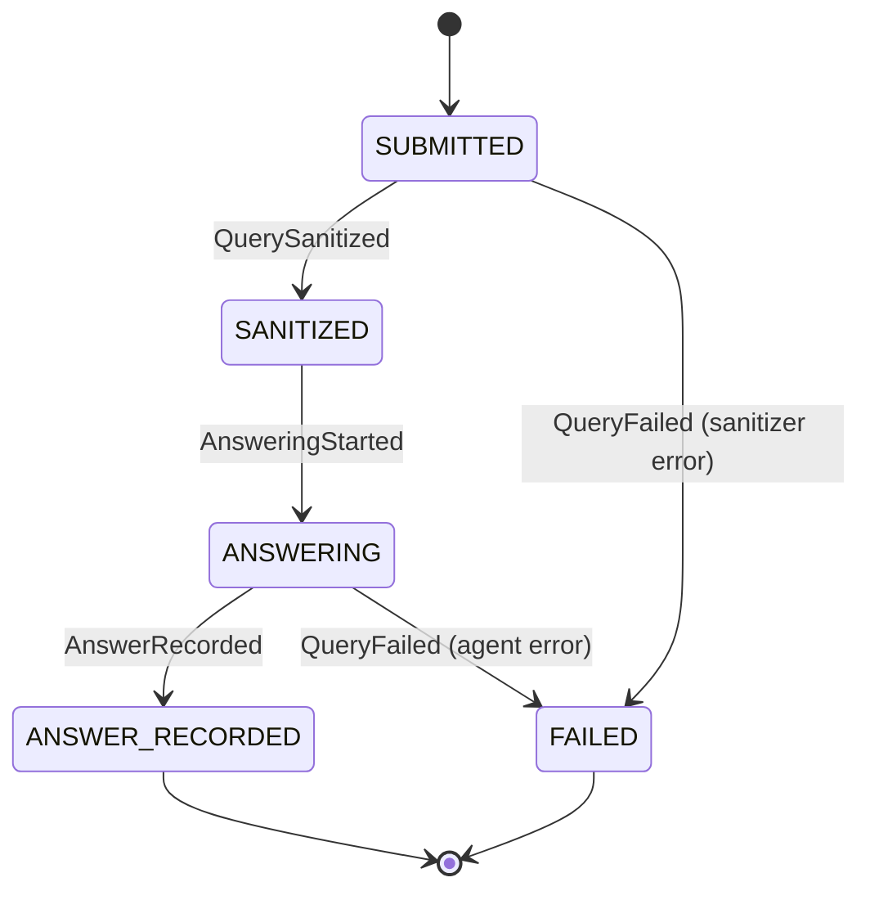
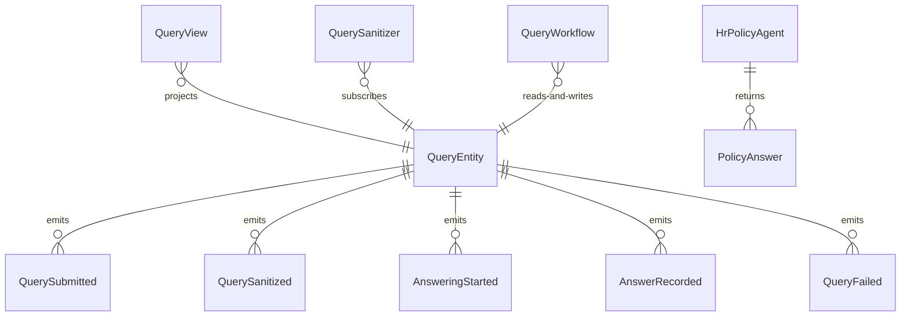

# PLAN — hr-assistant

Architectural sketch consumed by `/akka:plan` and rendered on the generated system's Architecture tab. The four mermaid diagrams below carry the theme variables and CSS overrides from Lesson 24; without them, state names render black-on-black and edge labels clip.

---

## Component graph

## Interaction sequence — J1 (happy path)

## State machine — `QueryEntity`

## Entity model

## Component table — Java file targets

| Component | Path (generated) |
|---|---|
| `QueryEndpoint` | `api/QueryEndpoint.java` |
| `AppEndpoint` | `api/AppEndpoint.java` |
| `QueryEntity` | `application/QueryEntity.java` (state in `domain/HrQuery.java`, events in `domain/QueryEvent.java`) |
| `QuerySanitizer` | `application/QuerySanitizer.java` |
| `QueryWorkflow` | `application/QueryWorkflow.java` |
| `HrPolicyAgent` | `application/HrPolicyAgent.java` (tasks in `application/HrQueryTasks.java`) |
| `PolicyAnswerGuardrail` | `application/PolicyAnswerGuardrail.java` |
| `QueryView` | `application/QueryView.java` |
| `MockModelProvider` (option-a only) | `application/MockModelProvider.java` |
| Bootstrap | `Bootstrap.java` |

## Concurrency notes

- **Per-step timeout**: `awaitSanitizedStep` 15 s, `answerStep` 60 s, `error` 5 s. Default step recovery `maxRetries(2).failoverTo(QueryWorkflow::error)`. The 60 s on `answerStep` accommodates LLM latency (Lesson 4).
- **Idempotency**: every workflow uses `"query-" + queryId` as the workflow id; the `QuerySanitizer` Consumer is idempotent because `QueryEntity.attachSanitized` is event-version-guarded — a second sanitize attempt against an already-sanitized query is a no-op.
- **One agent per query**: the AutonomousAgent instance id is `"agent-" + queryId`, giving each task its own conversation context. The agent's `capability(...).maxIterationsPerTask(3)` caps guardrail-triggered retries at 3.
- **Guardrail-driven retry**: when `PolicyAnswerGuardrail` rejects a candidate response, the rejection is returned as a structured error to the agent loop. If all 3 iterations fail validation, the workflow's `answerStep` fails over to `error` and the entity transitions to `FAILED`.
- **Two-pass sanitizer in one Consumer**: both the PII pass and the special-category pass execute synchronously inside the same `QuerySanitizer.onEvent` handler, in order. There is no intermediate event between the two passes — `QuerySanitized` is emitted only once the combined `SanitizedQueryContext` is assembled.
- **No saga / no compensation**: every step is either a pure read, an append-only event write, or a single-task agent call. There is nothing external to roll back.
