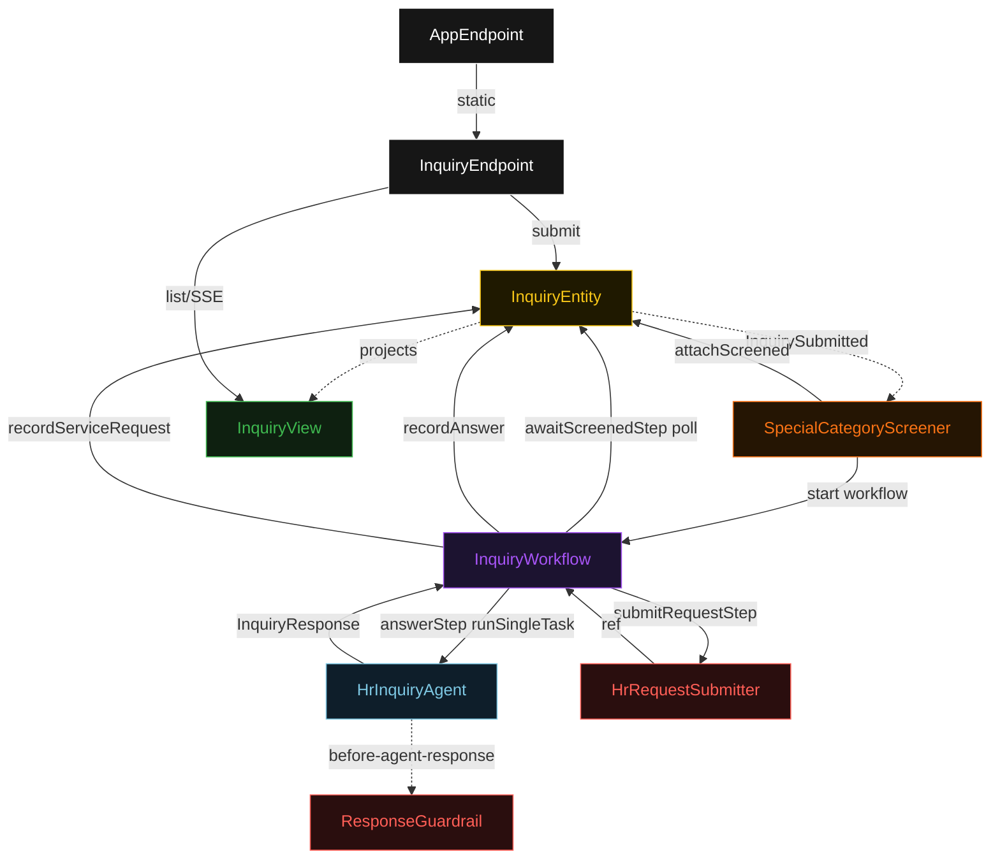
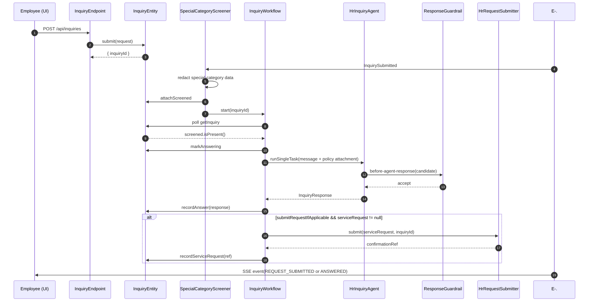
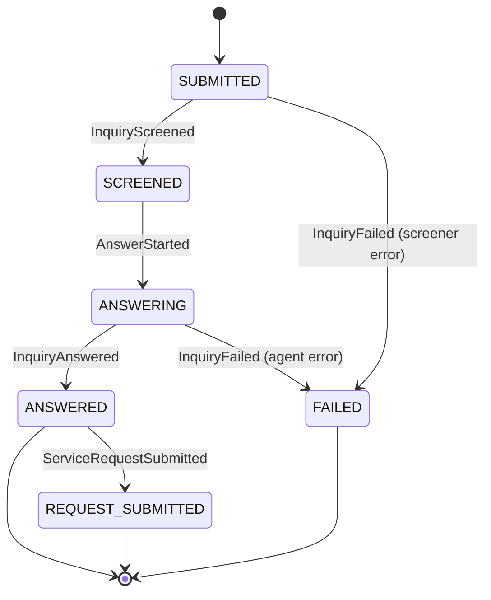
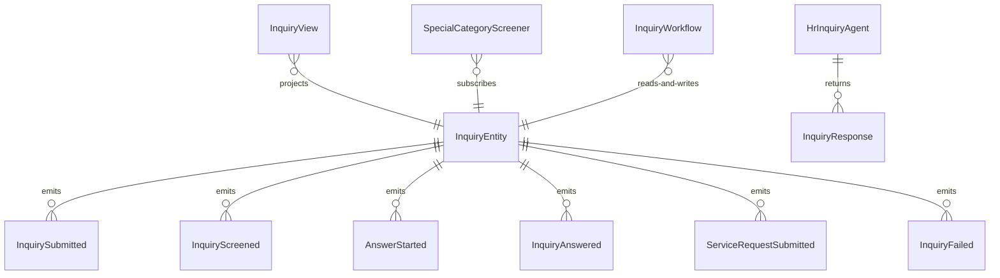

# PLAN — hrsd-inquiry

Architectural sketch consumed by `/akka:plan` and rendered on the generated system's Architecture tab. The four mermaid diagrams below carry the theme variables and CSS overrides from Lesson 24; without them, state names render black-on-black and edge labels clip.

---

## Component graph

## Interaction sequence — J1 (happy path)

## State machine — `InquiryEntity`

## Entity model

## Component table — Java file targets

| Component | Path (generated) |
|---|---|
| `InquiryEndpoint` | `api/InquiryEndpoint.java` |
| `AppEndpoint` | `api/AppEndpoint.java` |
| `InquiryEntity` | `application/InquiryEntity.java` (state in `domain/Inquiry.java`, events in `domain/InquiryEvent.java`) |
| `SpecialCategoryScreener` | `application/SpecialCategoryScreener.java` |
| `InquiryWorkflow` | `application/InquiryWorkflow.java` |
| `HrInquiryAgent` | `application/HrInquiryAgent.java` (tasks in `application/InquiryTasks.java`) |
| `ResponseGuardrail` | `application/ResponseGuardrail.java` |
| `HrRequestSubmitter` | `application/HrRequestSubmitter.java` |
| `PolicyCatalogLoader` | `application/PolicyCatalogLoader.java` |
| `InquiryView` | `application/InquiryView.java` |
| `MockModelProvider` (option-a only) | `application/MockModelProvider.java` |
| Bootstrap | `Bootstrap.java` |

## Concurrency notes

- **Per-step timeout**: `awaitScreenedStep` 15 s, `answerStep` 60 s, `submitRequestStep` 10 s, `error` 5 s. Default step recovery `maxRetries(2).failoverTo(InquiryWorkflow::error)`. The 60 s on `answerStep` accommodates LLM latency (Lesson 4).
- **Idempotency**: every workflow uses `"inquiry-" + inquiryId` as the workflow id; the `SpecialCategoryScreener` Consumer is allowed to redeliver `InquirySubmitted` events because `InquiryEntity.attachScreened` is event-version-guarded — a second screen attempt against an already-screened inquiry is a no-op.
- **One agent per inquiry**: the AutonomousAgent instance id is `"inquirer-" + inquiryId`, giving each task its own conversation context. The agent's `capability(...).maxIterationsPerTask(3)` caps guardrail-triggered retries at 3.
- **Guardrail-driven retry**: when `ResponseGuardrail` rejects a candidate response, the rejection is returned as a structured error to the agent loop. The loop counts toward `maxIterationsPerTask`; if all 3 iterations fail validation, the workflow's `answerStep` fails over to `error` and the entity transitions to `FAILED`.
- **Request submission is synchronous and deterministic**: `HrRequestSubmitter` runs in-process inside `submitRequestStep`. No LLM call, no external service — the same inquiryId always produces the same reference number format.
- **No saga / no compensation**: every step is either pure read, append-only event write, or a single-task agent call. There is nothing external to roll back.
