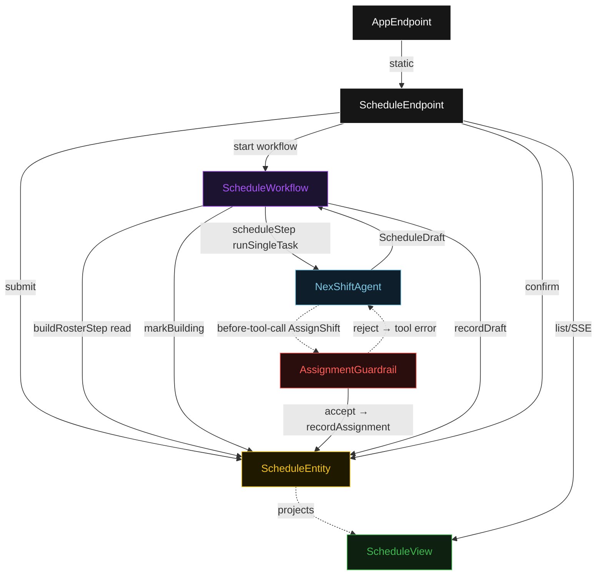
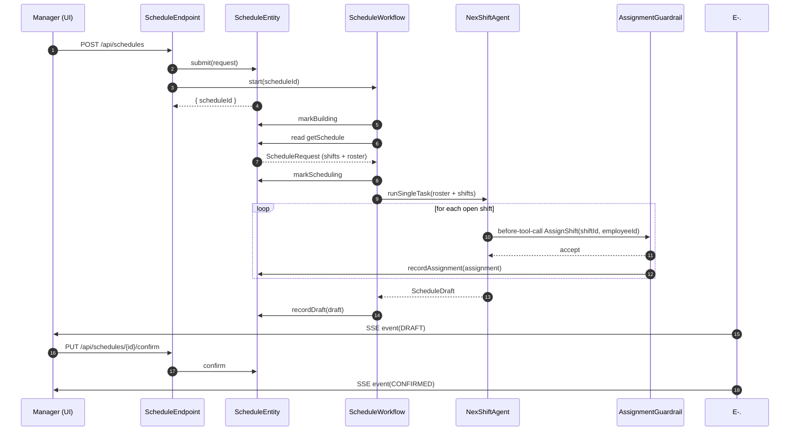
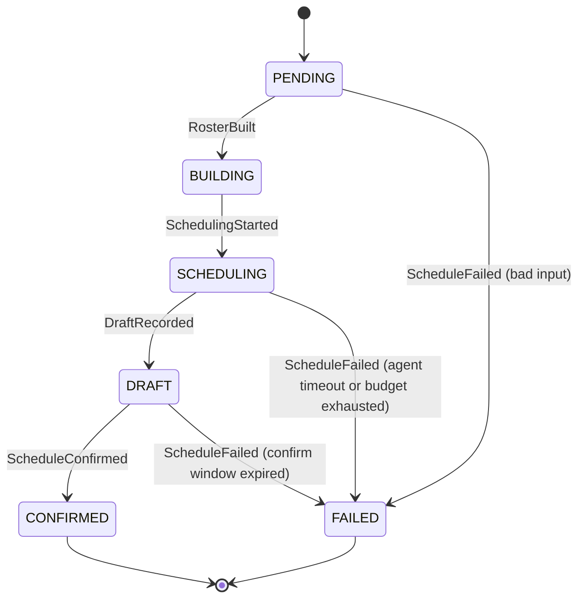
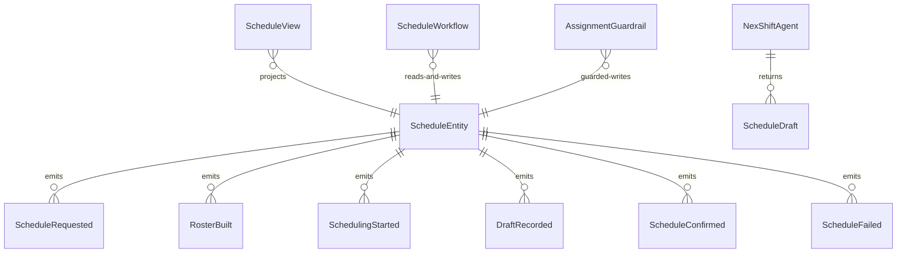

# PLAN — nexshift

Architectural sketch consumed by `/akka:plan` and rendered on the generated system's Architecture tab. The four mermaid diagrams below carry the theme variables and CSS overrides from Lesson 24; without them, state names render black-on-black and edge labels clip.

---

## Component graph

## Interaction sequence — J1 (happy path)

## State machine — `ScheduleEntity`

## Entity model

## Component table — Java file targets

| Component | Path (generated) |
|---|---|
| `ScheduleEndpoint` | `api/ScheduleEndpoint.java` |
| `AppEndpoint` | `api/AppEndpoint.java` |
| `ScheduleEntity` | `application/ScheduleEntity.java` (state in `domain/Schedule.java`, events in `domain/ScheduleEvent.java`) |
| `ScheduleWorkflow` | `application/ScheduleWorkflow.java` |
| `NexShiftAgent` | `application/NexShiftAgent.java` (tasks in `application/ScheduleTasks.java`) |
| `AssignmentGuardrail` | `application/AssignmentGuardrail.java` |
| `ScheduleView` | `application/ScheduleView.java` |
| `MockModelProvider` (option-a only) | `application/MockModelProvider.java` |
| Bootstrap | `Bootstrap.java` |

## Concurrency notes

- **Per-step timeout**: `buildRosterStep` 10 s, `scheduleStep` 120 s, `confirmStep` 3600 s, `error` 5 s. Default step recovery `maxRetries(1).failoverTo(ScheduleWorkflow::error)`. The 120 s on `scheduleStep` accommodates multi-shift LLM iteration (Lesson 4).
- **Idempotency**: every workflow uses `"schedule-" + scheduleId` as the workflow id; the `ScheduleEndpoint` submits idempotently — a duplicate POST with the same request returns the existing `scheduleId`.
- **One agent per run**: the AutonomousAgent instance id is `"scheduler-" + scheduleId`, which gives each run its own conversation context. The agent's `capability(...).maxIterationsPerTask(20)` supports large rosters requiring many tool calls.
- **Guardrail-driven retry**: when `AssignmentGuardrail` rejects a tool call, the rejection is returned as the tool's result to the agent loop. The agent reads the rejection reason and retries with a different employee within its iteration budget. The entity receives no write for the rejected call.
- **Manager confirm window**: `confirmStep` has a 3600 s timeout. If the manager does not confirm within 1 hour, the workflow fails over to `error` and the entity transitions to `FAILED`. The draft data is preserved for audit.
- **No saga / no compensation**: assignments are append-only within a run. If the run fails, the entity's draft (partial or empty) is preserved; a new run must be submitted.
