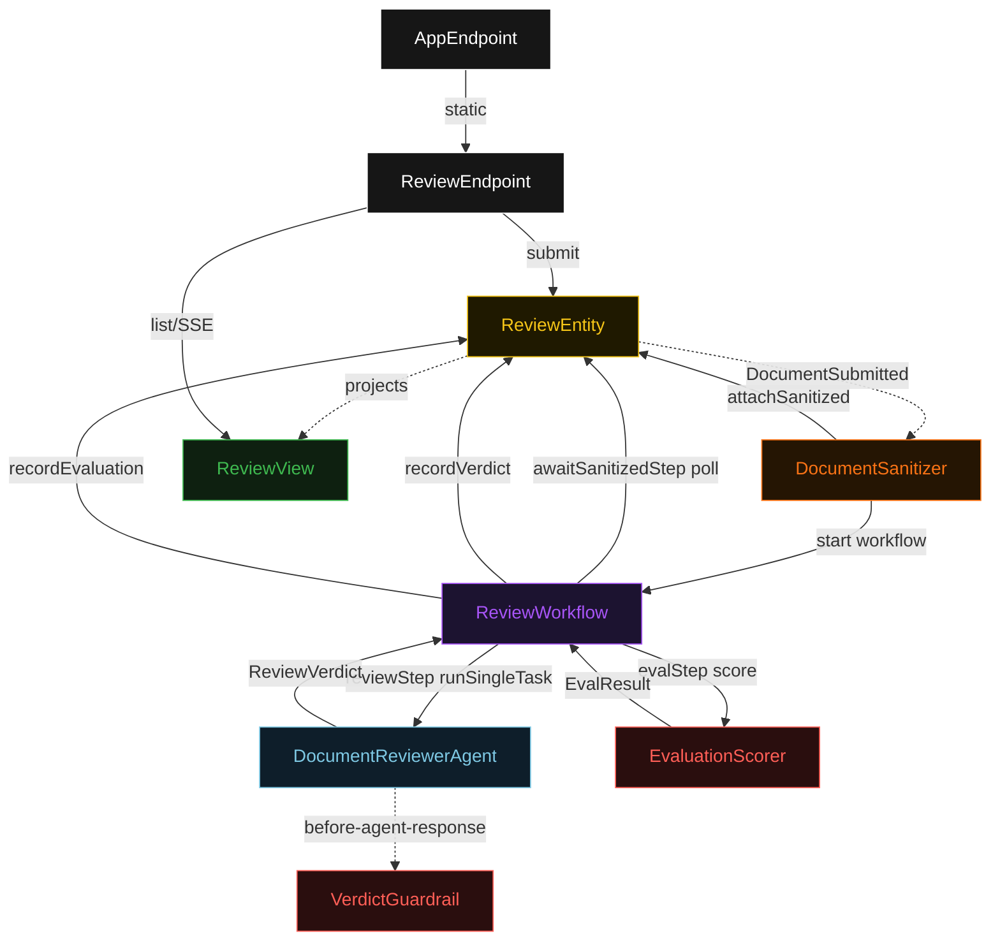
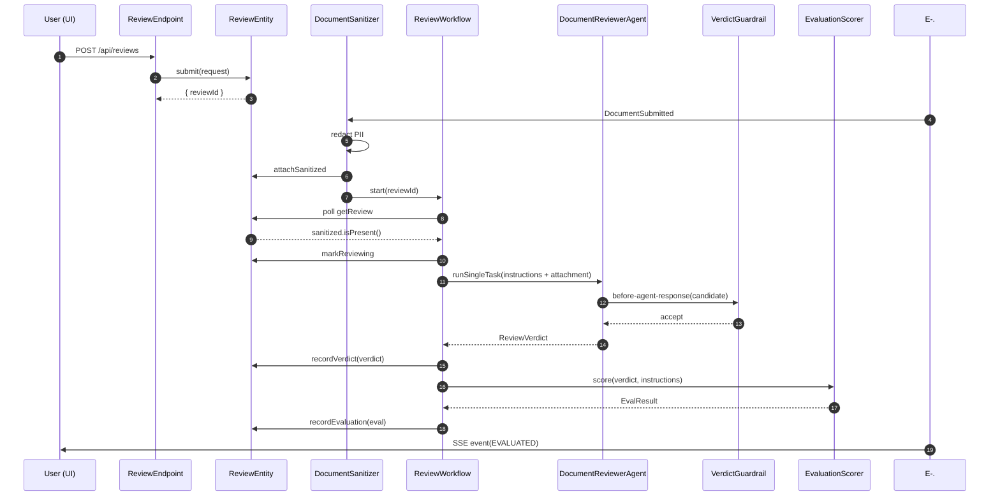
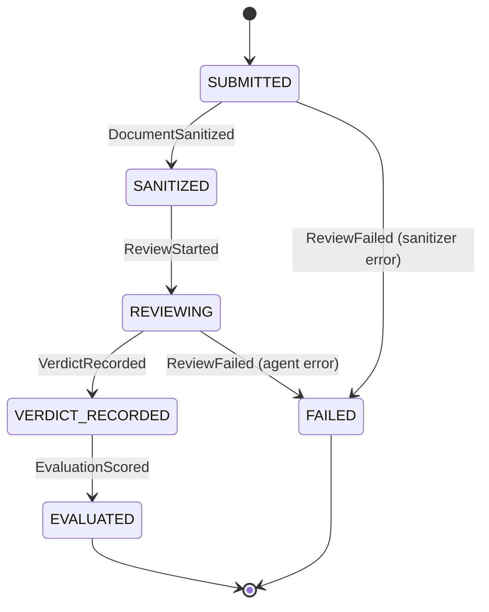
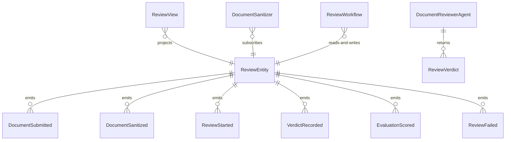

# PLAN — docreview

Architectural sketch consumed by `/akka:plan` and rendered on the generated system's Architecture tab. The four mermaid diagrams below carry the theme variables and CSS overrides from Lesson 24; without them, state names render black-on-black and edge labels clip.

---

## Component graph

## Interaction sequence — J1 (happy path)

## State machine — `ReviewEntity`

## Entity model

## Component table — Java file targets

| Component | Path (generated) |
|---|---|
| `ReviewEndpoint` | `api/ReviewEndpoint.java` |
| `AppEndpoint` | `api/AppEndpoint.java` |
| `ReviewEntity` | `application/ReviewEntity.java` (state in `domain/Review.java`, events in `domain/ReviewEvent.java`) |
| `DocumentSanitizer` | `application/DocumentSanitizer.java` |
| `ReviewWorkflow` | `application/ReviewWorkflow.java` |
| `DocumentReviewerAgent` | `application/DocumentReviewerAgent.java` (tasks in `application/ReviewTasks.java`) |
| `VerdictGuardrail` | `application/VerdictGuardrail.java` |
| `EvaluationScorer` | `application/EvaluationScorer.java` |
| `ReviewView` | `application/ReviewView.java` |
| `MockModelProvider` (option-a only) | `application/MockModelProvider.java` |
| Bootstrap | `Bootstrap.java` |

## Concurrency notes

- **Per-step timeout**: `awaitSanitizedStep` 15 s, `reviewStep` 60 s, `evalStep` 5 s, `error` 5 s. Default step recovery `maxRetries(2).failoverTo(ReviewWorkflow::error)`. The 60 s on `reviewStep` accommodates LLM latency (Lesson 4).
- **Idempotency**: every workflow uses `"review-" + reviewId` as the workflow id; the `DocumentSanitizer` Consumer is allowed to redeliver `DocumentSubmitted` events because `ReviewEntity.attachSanitized` is event-version-guarded — a second sanitize attempt against an already-sanitized review is a no-op.
- **One agent per review**: the AutonomousAgent instance id is `"reviewer-" + reviewId`, which gives each task its own conversation context. The agent's `capability(...).maxIterationsPerTask(3)` caps guardrail-triggered retries at 3.
- **Guardrail-driven retry**: when `VerdictGuardrail` rejects a candidate response, the rejection is returned as a structured error to the agent loop. The loop counts toward `maxIterationsPerTask`; if all 3 iterations fail validation, the workflow's `reviewStep` fails over to `error` and the entity transitions to `FAILED`.
- **Eval is synchronous and deterministic**: `EvaluationScorer` runs in-process inside `evalStep`. No LLM call, no external service — the same verdict always scores the same. This is a deliberate single-agent guarantee.
- **No saga / no compensation**: every step is either pure read, append-only event write, or a single-task agent call. There is nothing external to roll back.
