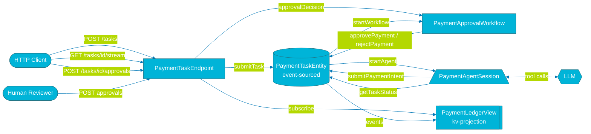
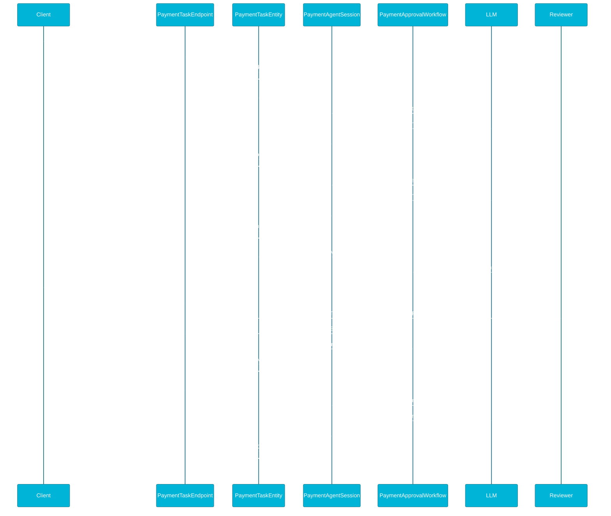
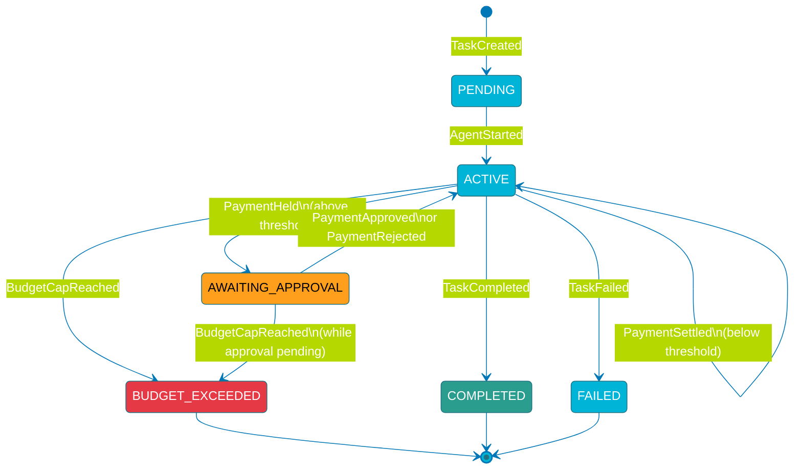
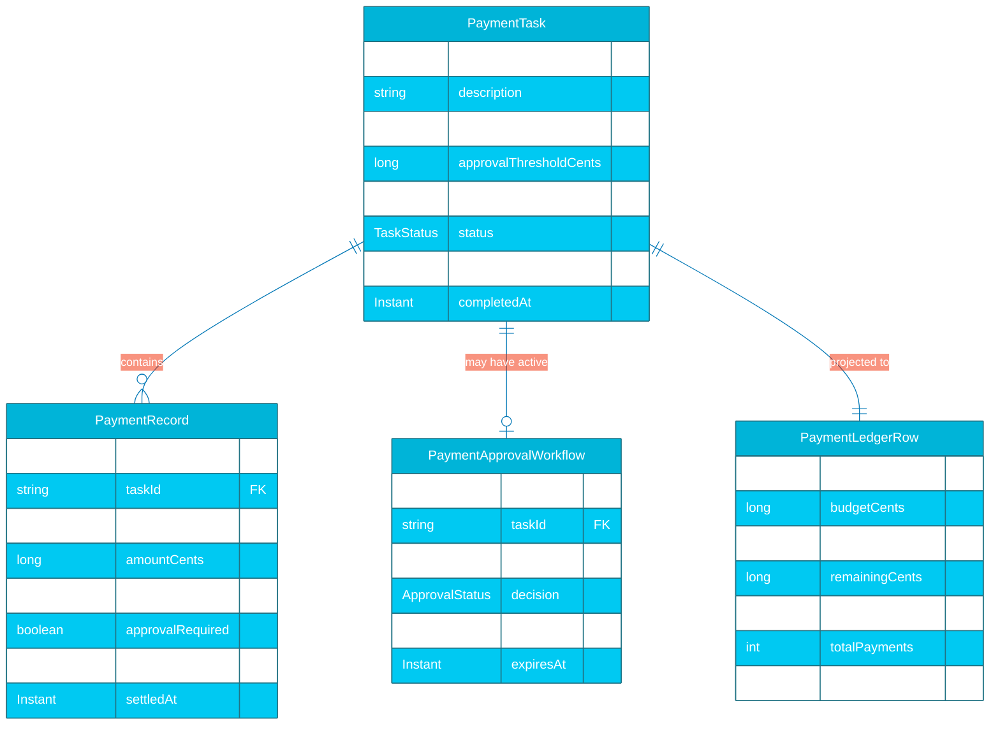

# PLAN: Agent-Initiated Payment Settlement

## 1. Component graph

---

## 2. Interaction sequence — happy path (J1)

---

## 3. State machine — PaymentTaskEntity

---

## 4. Entity model (ER)

---

## 5. Concurrency and timing notes

**Approval timeout:** `PaymentApprovalWorkflow` uses `workflow.timer().createSingleTimer(timeout, "approval-timeout")` (Lesson 4). On expiry, the workflow emits a soft rejection — the task does not fail; the agent can proceed with a lower-cost alternative.

**Idempotency:** Submitting the same `paymentId` twice to `PaymentTaskEntity` is a no-op after the first `PaymentIntentSubmitted` event (Lesson 10). The workflow is keyed on `paymentId`.

**Budget cap atomicity:** The cap check (`accumulatedSpentCents + amountCents >= budgetCents`) runs synchronously inside the entity command handler before emitting any event. There is no race window where two concurrent intents could both slip past the cap (Lesson 9).

**Agent-per-task isolation:** Each `PaymentAgentSession` is scoped to a single `taskId`. Concurrent tasks run independent agent sessions with no shared state.

**SSE backpressure:** The `PaymentLedgerView` is a key-value projection. The SSE subscription in `PaymentTaskEndpoint` uses `streamUpdatesForKey(taskId)` — no polling, no timer (Lesson 11).
