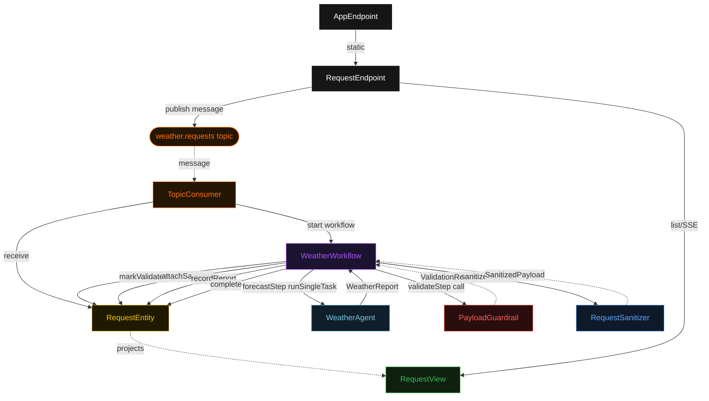
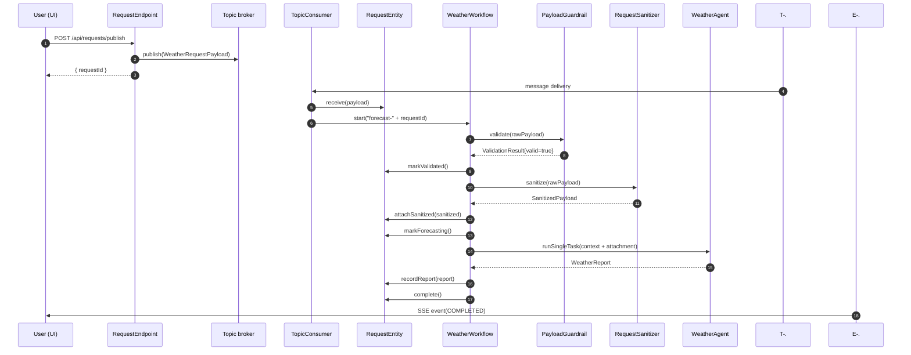
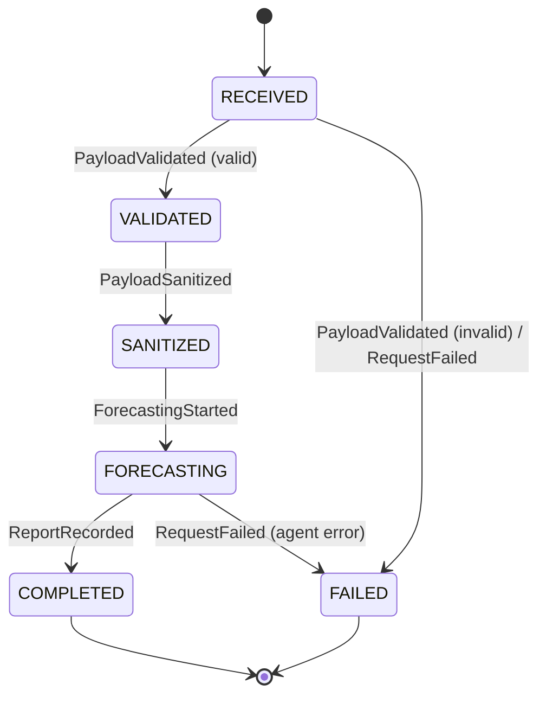
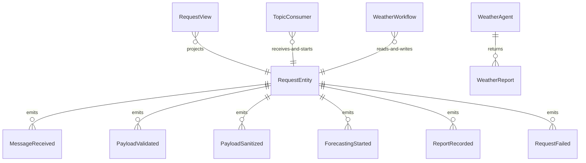

# PLAN — ambient-durable-agent-pubsub

Architectural sketch consumed by `/akka:plan` and rendered on the generated system's Architecture tab. The four mermaid diagrams below carry the theme variables and CSS overrides from Lesson 24; without them, state names render black-on-black and edge labels clip.

---

## Component graph

## Interaction sequence — J1 (happy path)

## State machine — `RequestEntity`

## Entity model

## Component table — Java file targets

| Component | Path (generated) |
|---|---|
| `RequestEndpoint` | `api/RequestEndpoint.java` |
| `AppEndpoint` | `api/AppEndpoint.java` |
| `RequestEntity` | `application/RequestEntity.java` (state in `domain/Request.java`, events in `domain/RequestEvent.java`) |
| `TopicConsumer` | `application/TopicConsumer.java` |
| `WeatherWorkflow` | `application/WeatherWorkflow.java` |
| `WeatherAgent` | `application/WeatherAgent.java` (tasks in `application/ForecastTasks.java`) |
| `PayloadGuardrail` | `application/PayloadGuardrail.java` |
| `RequestSanitizer` | `application/RequestSanitizer.java` |
| `RequestView` | `application/RequestView.java` |
| `MockModelProvider` (option-a only) | `application/MockModelProvider.java` |
| Bootstrap | `Bootstrap.java` |

## Concurrency notes

- **Per-step timeout**: `validateStep` 5 s, `sanitizeStep` 5 s, `forecastStep` 60 s, `recordStep` 5 s, `error` 5 s. Default step recovery `maxRetries(1).failoverTo(WeatherWorkflow::error)`. The 60 s on `forecastStep` accommodates LLM latency (Lesson 4).
- **Per-message isolation**: each topic message is processed by an independent `WeatherWorkflow` instance keyed to `"forecast-" + requestId`. There is no shared state between concurrent workflow executions.
- **Idempotency**: `TopicConsumer` may redeliver the same message if the broker retries. `RequestEntity.receive()` is event-version-guarded — a second `MessageReceived` event for an already-received `requestId` is a no-op.
- **Validation-first invariant**: `PayloadGuardrail.validate()` runs as the very first workflow step. If it returns `valid == false`, the workflow transitions the entity to FAILED and calls `thenEnd()` without ever reaching `forecastStep`. The agent task is never started.
- **Sanitize-before-agent invariant**: `forecastStep` receives only the `SanitizedPayload` produced in `sanitizeStep`. The raw `WeatherRequestPayload` is never passed to the agent. This is structurally enforced — `forecastStep` does not have access to the raw payload in its input type.
- **One agent per request**: the AutonomousAgent instance id is `"weather-" + requestId`, giving each task its own conversation context. `maxIterationsPerTask(2)` caps the agent loop.
- **No saga / no compensation**: every step either validates, sanitizes (pure function), calls the agent (single task), or writes to the entity. Nothing external to roll back.
