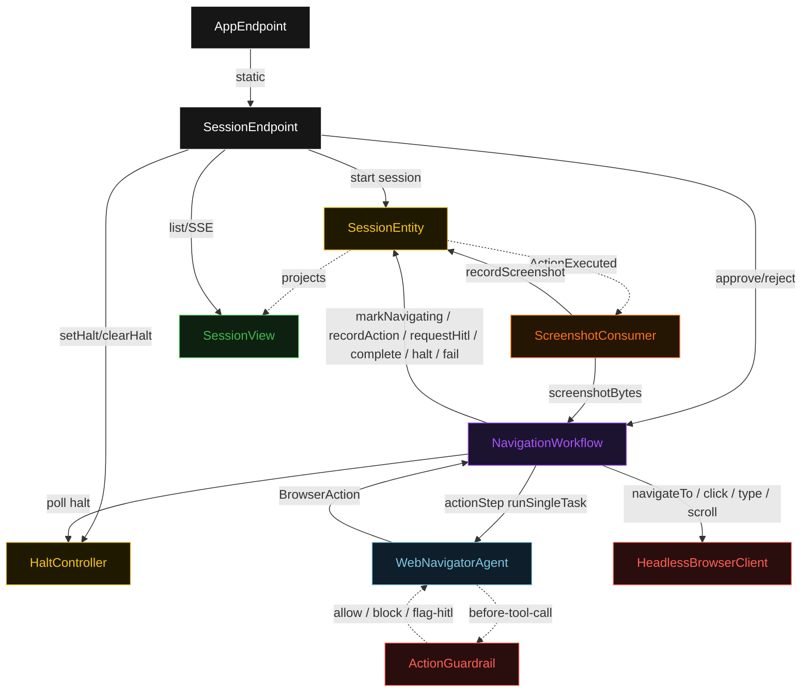
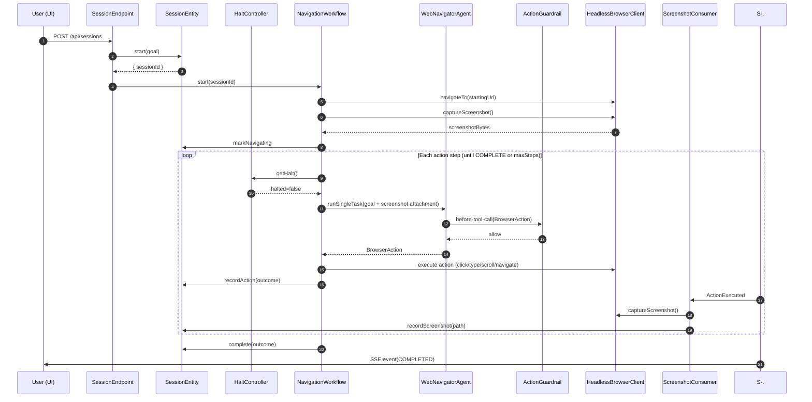
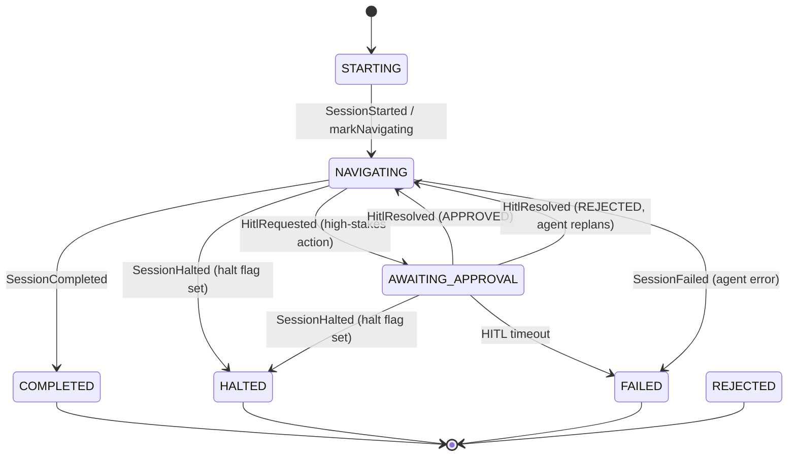
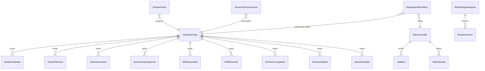

# PLAN — web-navigation-agent

Architectural sketch consumed by `/akka:plan` and rendered on the generated system's Architecture tab. The four mermaid diagrams below carry the theme variables and CSS overrides from Lesson 24; without them, state names render black-on-black and edge labels clip.

---

## Component graph

## Interaction sequence — J1 (happy path, no HITL)

## State machine — `SessionEntity`

## Entity model

## Component table — Java file targets

| Component | Path (generated) |
|---|---|
| `SessionEndpoint` | `api/SessionEndpoint.java` |
| `AppEndpoint` | `api/AppEndpoint.java` |
| `SessionEntity` | `application/SessionEntity.java` (state in `domain/Session.java`, events in `domain/SessionEvent.java`) |
| `HaltController` | `application/HaltController.java` (state in `domain/HaltState.java`, events in `domain/HaltEvent.java`) |
| `ScreenshotConsumer` | `application/ScreenshotConsumer.java` |
| `NavigationWorkflow` | `application/NavigationWorkflow.java` |
| `WebNavigatorAgent` | `application/WebNavigatorAgent.java` (tasks in `application/NavigationTasks.java`) |
| `ActionGuardrail` | `application/ActionGuardrail.java` |
| `HeadlessBrowserClient` | `application/HeadlessBrowserClient.java` |
| `SessionView` | `application/SessionView.java` |
| `MockModelProvider` (option-a only) | `application/MockModelProvider.java` |
| Bootstrap | `Bootstrap.java` |

## Concurrency notes

- **Per-step timeout**: `initStep` 30 s, `actionStep` 90 s, `hitlStep` 300 s, `completeStep` 10 s, `haltedStep` 5 s, `failedStep` 5 s. Default step recovery `maxRetries(2).failoverTo(NavigationWorkflow::failedStep)`. The 90 s on `actionStep` accommodates LLM vision latency plus browser execution time (Lesson 4).
- **Halt semantics**: the `HaltController` entity is global (single id `"global"`). Any concurrent session's workflow reads it before each step. The halt flag is set with `HaltSet` and cleared with `HaltCleared`; the entity persists across restarts so a crash-and-restart does not inadvertently un-halt an active operator halt.
- **HITL resume**: the workflow's `hitlStep` suspends until `SessionEndpoint` calls `NavigationWorkflow.resume(HitlDecision)`. No polling; the workflow is woken by the external signal. If the timeout expires first, the workflow's default step recovery fires and transitions to `failedStep`.
- **One agent per session**: the AutonomousAgent instance id is `"navigator-" + sessionId`, giving each navigation its own conversation context. `maxIterationsPerTask(5)` caps guardrail-triggered retries per action step.
- **Screenshot loop**: the `ScreenshotConsumer` is at-least-once; it checks the latest `ActionOutcome.screenshotPath` before re-capturing to avoid duplicate screenshots on redelivery.
- **No saga / no compensation**: browser actions are not transactional. A `CLICK` that submits a form cannot be rolled back. This is precisely why HITL approval exists for high-stakes actions — the workflow requires explicit human confirmation before any irreversible action executes.
