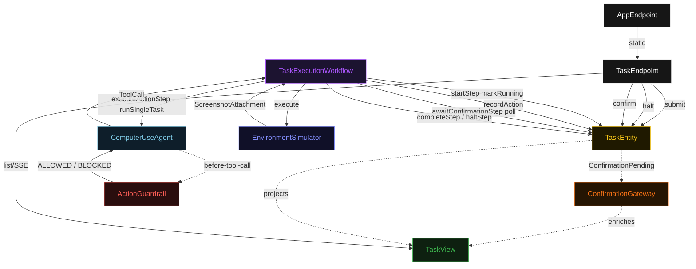
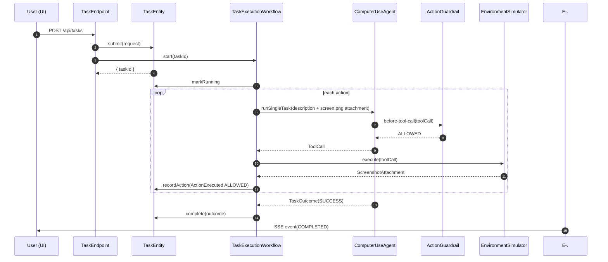
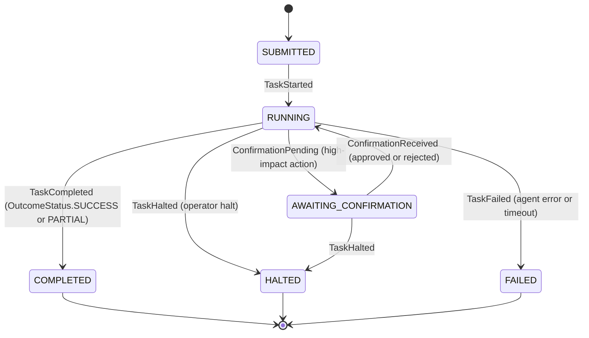
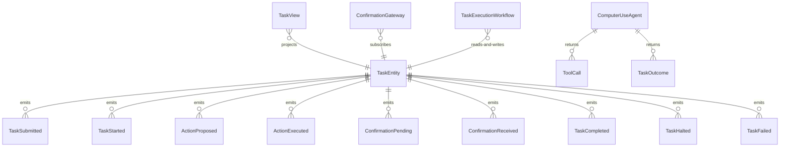

# PLAN — computer-use-agent

Architectural sketch consumed by `/akka:plan` and rendered on the generated system's Architecture tab. The four mermaid diagrams below carry the theme variables and CSS overrides from Lesson 24; without them, state names render black-on-black and edge labels clip.

---

## Component graph

## Interaction sequence — J1 (happy path: fill-web-form)

## State machine — `TaskEntity`

## Entity model

## Component table — Java file targets

| Component | Path (generated) |
|---|---|
| `TaskEndpoint` | `api/TaskEndpoint.java` |
| `AppEndpoint` | `api/AppEndpoint.java` |
| `TaskEntity` | `application/TaskEntity.java` (state in `domain/Task.java`, events in `domain/TaskEvent.java`) |
| `ConfirmationGateway` | `application/ConfirmationGateway.java` |
| `TaskExecutionWorkflow` | `application/TaskExecutionWorkflow.java` |
| `ComputerUseAgent` | `application/ComputerUseAgent.java` (tasks in `application/TasksTasks.java`) |
| `ActionGuardrail` | `application/ActionGuardrail.java` |
| `EnvironmentSimulator` | `application/EnvironmentSimulator.java` |
| `TaskView` | `application/TaskView.java` |
| `MockModelProvider` (option-a only) | `application/MockModelProvider.java` |
| Bootstrap | `Bootstrap.java` |

## Concurrency notes

- **Per-step timeout**: `startStep` 5 s, `executeActionStep` 30 s, `awaitConfirmationStep` 300 s, `completeStep` 5 s, `haltStep` 5 s, `errorStep` 5 s. The 30 s on `executeActionStep` accommodates LLM latency including screenshot processing (Lesson 4). The 300 s on `awaitConfirmationStep` gives the human 5 minutes to respond.
- **Halt-first check**: `executeActionStep` reads `task.haltRequested` before invoking the agent. If the halt flag is set, the step transitions immediately to `haltStep` — no agent call is made after a halt request.
- **Idempotency**: every workflow uses `"task-" + taskId` as the workflow id. `TaskEntity.recordAction` is event-version-guarded — a redelivered `ActionExecuted` event for a call id already in `actionHistory` is a no-op.
- **One agent per task**: the AutonomousAgent instance id is `"agent-" + taskId`, giving each task its own conversation context and iteration budget (20 max). The guardrail consumes one iteration on rejection; if all 20 are exhausted, `executeActionStep` fails over to `errorStep`.
- **Confirmation timeout**: if the user does not respond within 300 s, `awaitConfirmationStep` times out and fails over to `errorStep`; the entity transitions to `FAILED`. The pending action does NOT execute on timeout.
- **No saga / no compensation**: the environment simulator is in-process. There is nothing external to roll back. A task that fails or halts preserves its partial `actionHistory` for audit.
