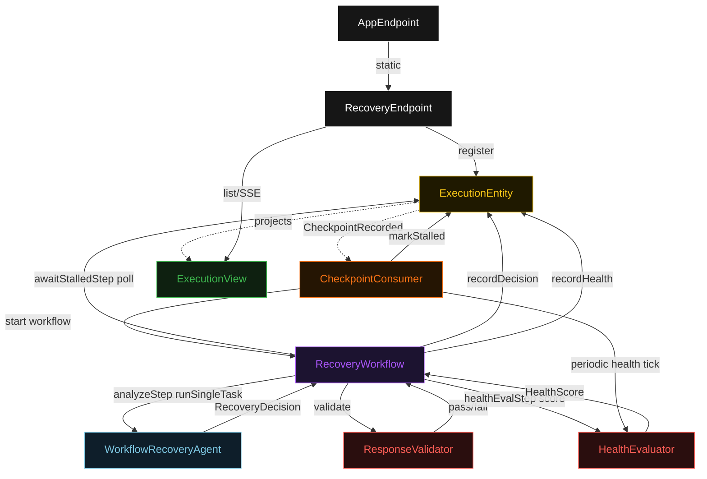
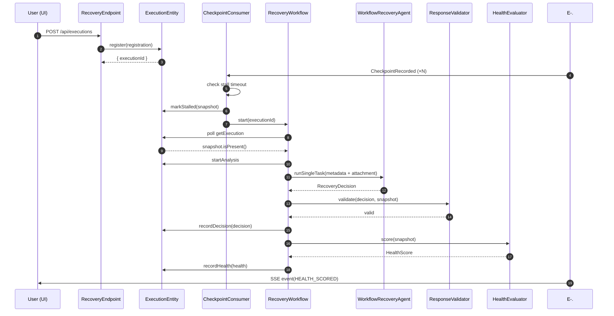
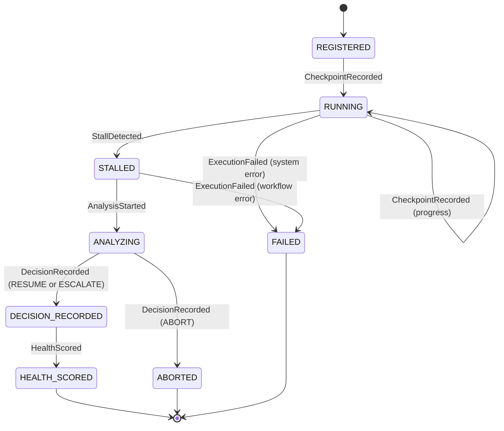
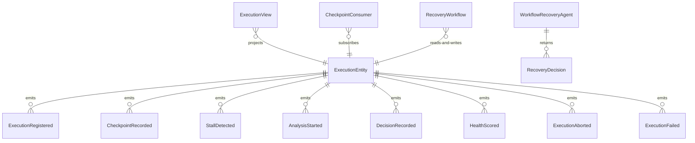

# PLAN — durable-workflow-recovery

Architectural sketch consumed by `/akka:plan` and rendered on the generated system's Architecture tab. The four mermaid diagrams below carry the theme variables and CSS overrides from Lesson 24; without them, state names render black-on-black and edge labels clip.

---

## Component graph

## Interaction sequence — J1 (happy path)

## State machine — `ExecutionEntity`

## Entity model

## Component table — Java file targets

| Component | Path (generated) |
|---|---|
| `RecoveryEndpoint` | `api/RecoveryEndpoint.java` |
| `AppEndpoint` | `api/AppEndpoint.java` |
| `ExecutionEntity` | `application/ExecutionEntity.java` (state in `domain/Execution.java`, events in `domain/ExecutionEvent.java`) |
| `CheckpointConsumer` | `application/CheckpointConsumer.java` |
| `RecoveryWorkflow` | `application/RecoveryWorkflow.java` |
| `WorkflowRecoveryAgent` | `application/WorkflowRecoveryAgent.java` (tasks in `application/RecoveryTasks.java`) |
| `ResponseValidator` | `application/ResponseValidator.java` |
| `HealthEvaluator` | `application/HealthEvaluator.java` |
| `ExecutionView` | `application/ExecutionView.java` |
| `MockModelProvider` (option-a only) | `application/MockModelProvider.java` |
| Bootstrap | `Bootstrap.java` |

## Concurrency notes

- **Per-step timeout**: `awaitStalledStep` 30 s, `analyzeStep` 60 s, `healthEvalStep` 5 s, `error` 5 s. Default step recovery `maxRetries(2).failoverTo(RecoveryWorkflow::error)`. The 60 s on `analyzeStep` accommodates LLM latency (Lesson 4).
- **Idempotency**: every workflow uses `"recovery-" + executionId` as the workflow id; the `CheckpointConsumer` is allowed to redeliver `CheckpointRecorded` events because `ExecutionEntity.markStalled` is event-version-guarded — a second stall attempt against an already-stalled execution is a no-op.
- **One agent per execution**: the AutonomousAgent instance id is `"recovery-" + executionId`, which gives each task its own conversation context. The agent's `capability(...).maxIterationsPerTask(3)` caps retry budget.
- **Validation failover**: when `ResponseValidator` rejects a candidate decision, `analyzeStep` fails over to the `error` step rather than silently discarding the result. The entity transitions to FAILED and the UI card shows the partial state.
- **Health eval is synchronous and deterministic**: `HealthEvaluator` runs in-process inside `healthEvalStep`. No LLM call, no external service — the same snapshot always scores the same. This is a deliberate single-agent guarantee.
- **Graceful degradation**: the halt mechanism means a RESUME verdict only dispatches a restart command after the agent has inspected the partial state. An ABORT verdict suppresses the restart entirely, preventing cascading failures on corrupted state.
- **Periodic health tick**: `CheckpointConsumer` runs a 60 s timer pass over all RUNNING and STALLED executions via `ExecutionView`. Each tick calls `HealthEvaluator.score(snapshot)` and emits `HealthScored` only if the score changed by more than 1 point since the previous evaluation.
