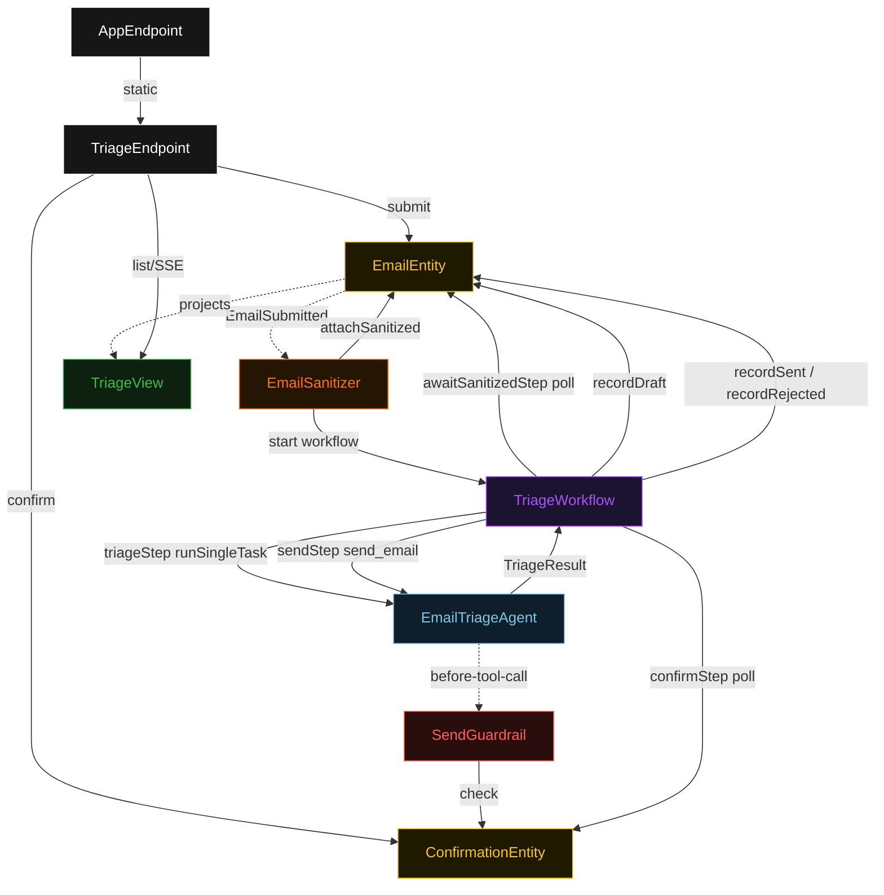
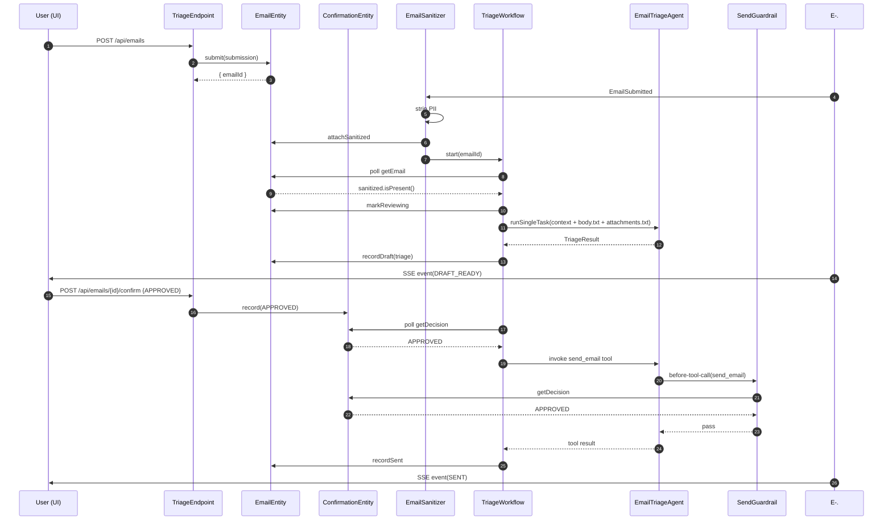
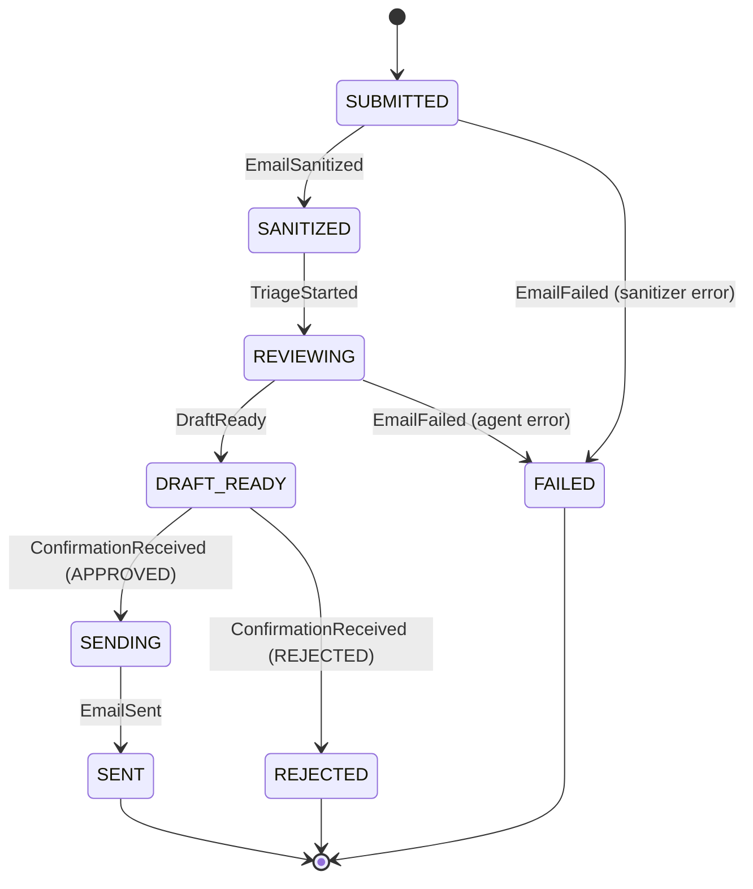
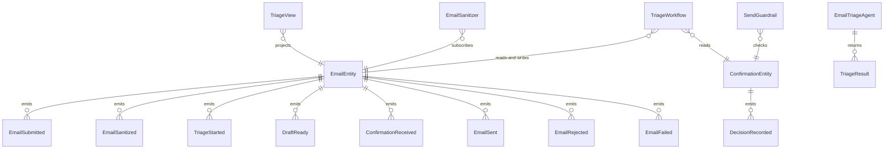

# PLAN — email-triage-assistant

Architectural sketch consumed by `/akka:plan` and rendered on the generated system's Architecture tab. The four mermaid diagrams below carry the theme variables and CSS overrides from Lesson 24; without them, state names render black-on-black and edge labels clip.

---

## Component graph

## Interaction sequence — J2 (approve path)

## State machine — `EmailEntity`

## Entity model

## Component table — Java file targets

| Component | Path (generated) |
|---|---|
| `TriageEndpoint` | `api/TriageEndpoint.java` |
| `AppEndpoint` | `api/AppEndpoint.java` |
| `EmailEntity` | `application/EmailEntity.java` (state in `domain/Email.java`, events in `domain/EmailEvent.java`) |
| `ConfirmationEntity` | `application/ConfirmationEntity.java` (state in `domain/ConfirmationState.java`, event in `domain/ConfirmationEvent.java`) |
| `EmailSanitizer` | `application/EmailSanitizer.java` |
| `TriageWorkflow` | `application/TriageWorkflow.java` |
| `EmailTriageAgent` | `application/EmailTriageAgent.java` (tasks in `application/EmailTasks.java`) |
| `SendGuardrail` | `application/SendGuardrail.java` |
| `TriageView` | `application/TriageView.java` |
| `MockModelProvider` (option-a only) | `application/MockModelProvider.java` |
| Bootstrap | `Bootstrap.java` |

## Concurrency notes

- **Per-step timeout**: `awaitSanitizedStep` 15 s, `triageStep` 90 s, `confirmStep` 300 s, `sendStep` 15 s, `error` 5 s. Default step recovery `maxRetries(2).failoverTo(TriageWorkflow::error)`. The 90 s on `triageStep` accommodates LLM latency on multi-attachment emails (Lesson 4).
- **confirmStep timeout**: 300 s gives the user 5 minutes to read the draft and decide. If the timer expires with no decision, the workflow fails over to `error` and the entity transitions to `FAILED`.
- **Idempotency**: every workflow uses `"triage-" + emailId` as the workflow id. `EmailSanitizer` is allowed to redeliver `EmailSubmitted` events; `EmailEntity.attachSanitized` is event-version-guarded — a second sanitize attempt on an already-sanitized email is a no-op.
- **One agent per email**: the AutonomousAgent instance id is `"triage-" + emailId`. Each email gets its own conversation context. `maxIterationsPerTask(3)` caps guardrail-triggered retries.
- **Guardrail-driven block**: when `SendGuardrail` blocks a `send_email` invocation, the block is returned as a structured error to the agent loop; the loop counts toward `maxIterationsPerTask`. The workflow's `confirmStep` is the correct synchronisation point; the guardrail is a defence-in-depth check, not the primary gate.
- **Two entities, one workflow**: `EmailEntity` owns the email lifecycle; `ConfirmationEntity` is a separate entity so the user's approve/reject action does not contend with the workflow's event-write path on `EmailEntity`.
- **No saga / no compensation**: the send is simulated in-process. A deployer wiring a real SMTP or API call would add compensation logic here; the blueprint defers that complexity.
