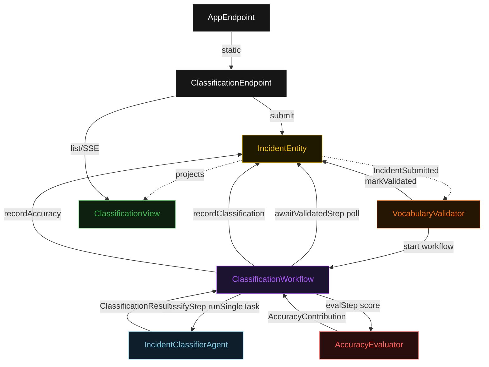
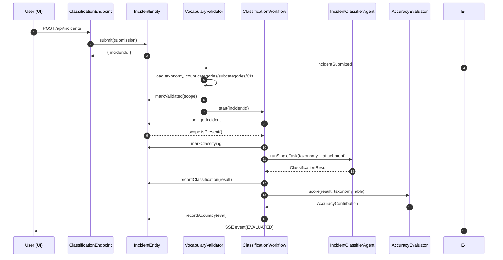
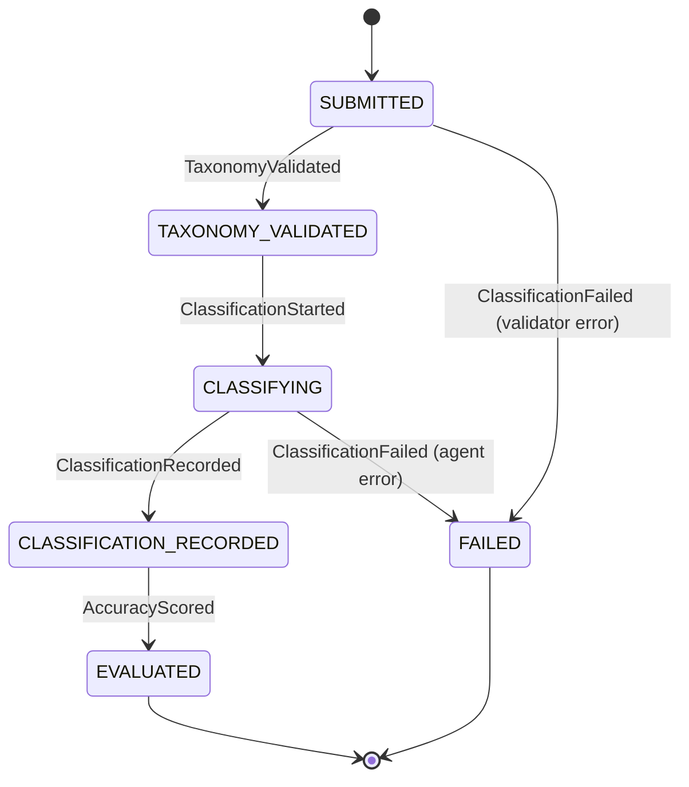
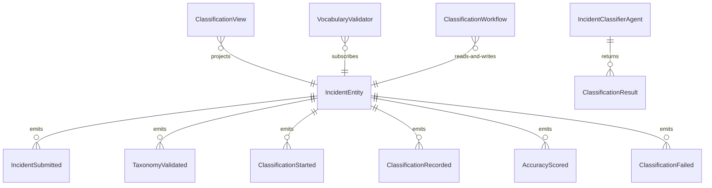

# PLAN — incident-classifier

Architectural sketch consumed by `/akka:plan` and rendered on the generated system's Architecture tab. The four mermaid diagrams below carry the theme variables and CSS overrides from Lesson 24; without them, state names render black-on-black and edge labels clip.

---

## Component graph

## Interaction sequence — J1 (happy path)

## State machine — `IncidentEntity`

## Entity model

## Component table — Java file targets

| Component | Path (generated) |
|---|---|
| `ClassificationEndpoint` | `api/ClassificationEndpoint.java` |
| `AppEndpoint` | `api/AppEndpoint.java` |
| `IncidentEntity` | `application/IncidentEntity.java` (state in `domain/Incident.java`, events in `domain/IncidentEvent.java`) |
| `VocabularyValidator` | `application/VocabularyValidator.java` |
| `ClassificationWorkflow` | `application/ClassificationWorkflow.java` |
| `IncidentClassifierAgent` | `application/IncidentClassifierAgent.java` (tasks in `application/IncidentTasks.java`) |
| `AccuracyEvaluator` | `application/AccuracyEvaluator.java` |
| `TaxonomyTable` | `application/TaxonomyTable.java` |
| `ClassificationView` | `application/ClassificationView.java` |
| `MockModelProvider` (option-a only) | `application/MockModelProvider.java` |
| Bootstrap | `Bootstrap.java` |

## Concurrency notes

- **Per-step timeout**: `awaitValidatedStep` 15 s, `classifyStep` 60 s, `evalStep` 5 s, `error` 5 s. Default step recovery `maxRetries(2).failoverTo(ClassificationWorkflow::error)`. The 60 s on `classifyStep` accommodates LLM latency (Lesson 4).
- **Idempotency**: every workflow uses `"classification-" + incidentId` as the workflow id; `VocabularyValidator` is idempotent because `IncidentEntity.markValidated` is event-version-guarded — a second validation attempt against an already-validated incident is a no-op.
- **One agent per incident**: the AutonomousAgent instance id is `"classifier-" + incidentId`, giving each task its own conversation context. `capability(...).maxIterationsPerTask(3)` caps retries.
- **Rolling accuracy**: every `AccuracyScored` event contributes to the ClassificationView's rolling window. The view stores `eval.score` per row; the endpoint aggregates the 50 most recent contributions into a percentage.
- **Eval is synchronous and deterministic**: `AccuracyEvaluator` runs in-process inside `evalStep`. No LLM call — the same classification always scores the same against the same taxonomy. This is a deliberate single-agent guarantee.
- **No saga / no compensation**: every step is either a pure read, an append-only event write, or a single-task agent call. There is nothing external to roll back.
