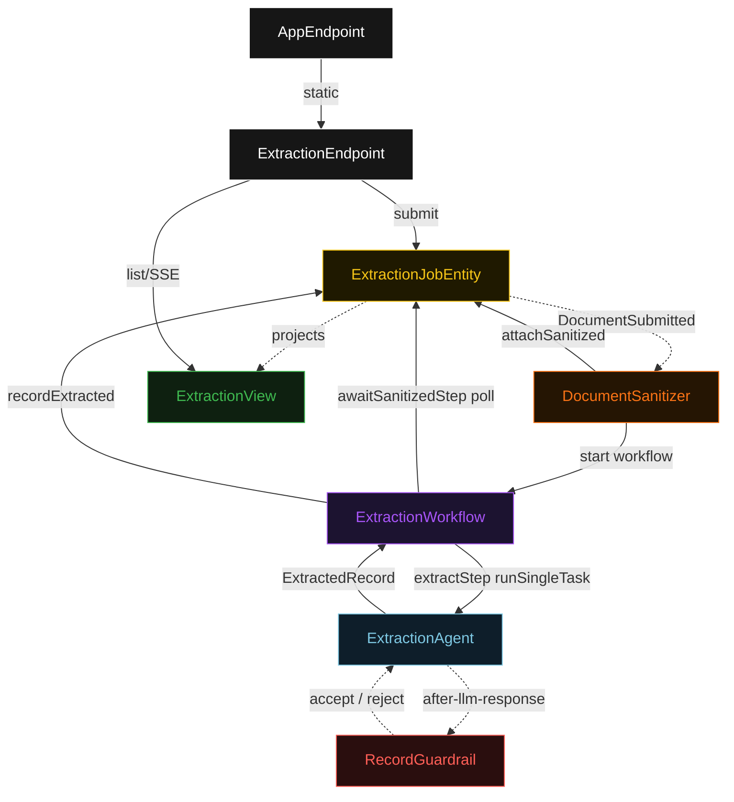
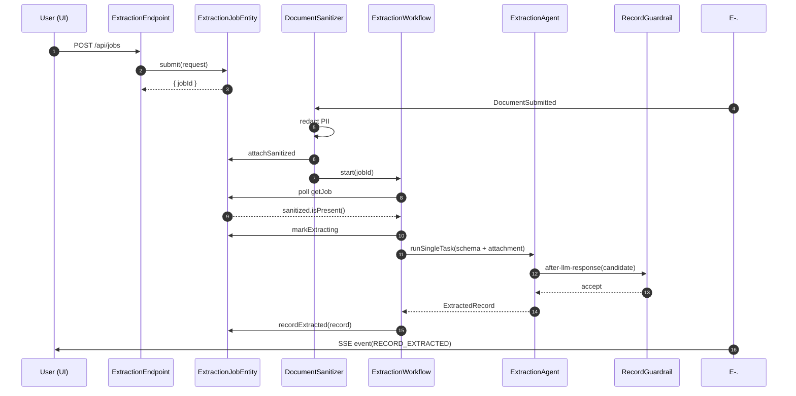
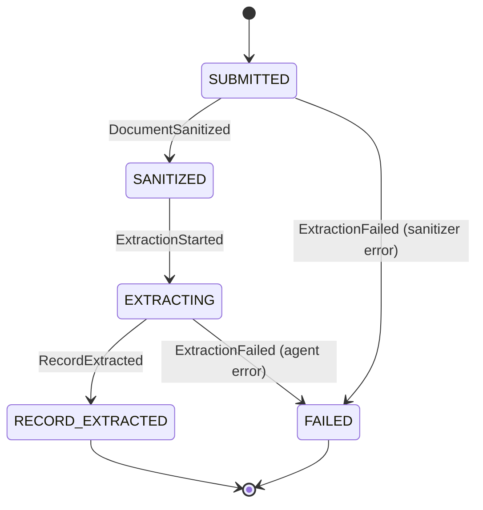
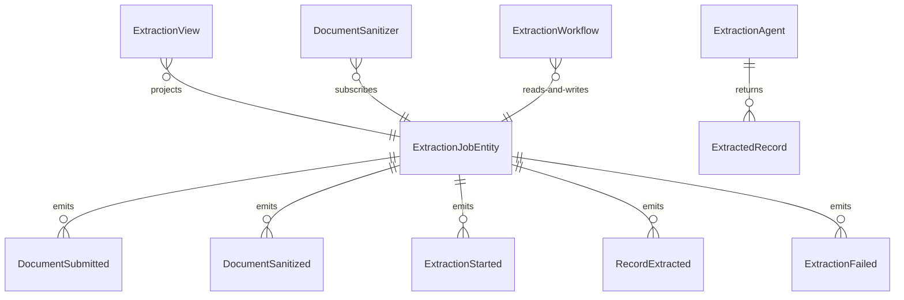

# PLAN — schema-extractor

Architectural sketch consumed by `/akka:plan` and rendered on the generated system's Architecture tab. The four mermaid diagrams below carry the theme variables and CSS overrides from Lesson 24; without them, state names render black-on-black and edge labels clip.

---

## Component graph

## Interaction sequence — J1 (happy path)

## State machine — `ExtractionJobEntity`

## Entity model

## Component table — Java file targets

| Component | Path (generated) |
|---|---|
| `ExtractionEndpoint` | `api/ExtractionEndpoint.java` |
| `AppEndpoint` | `api/AppEndpoint.java` |
| `ExtractionJobEntity` | `application/ExtractionJobEntity.java` (state in `domain/ExtractionJob.java`, events in `domain/ExtractionEvent.java`) |
| `DocumentSanitizer` | `application/DocumentSanitizer.java` |
| `ExtractionWorkflow` | `application/ExtractionWorkflow.java` |
| `ExtractionAgent` | `application/ExtractionAgent.java` (tasks in `application/ExtractionTasks.java`) |
| `RecordGuardrail` | `application/RecordGuardrail.java` |
| `ExtractionView` | `application/ExtractionView.java` |
| `MockModelProvider` (option-a only) | `application/MockModelProvider.java` |
| Bootstrap | `Bootstrap.java` |

## Concurrency notes

- **Per-step timeout**: `awaitSanitizedStep` 15 s, `extractStep` 60 s, `error` 5 s. Default step recovery `maxRetries(2).failoverTo(ExtractionWorkflow::error)`. The 60 s on `extractStep` accommodates LLM latency (Lesson 4).
- **Idempotency**: every workflow uses `"extraction-" + jobId` as the workflow id; the `DocumentSanitizer` Consumer is allowed to redeliver `DocumentSubmitted` events because `ExtractionJobEntity.attachSanitized` is event-version-guarded — a second sanitize attempt against an already-sanitized job is a no-op.
- **One agent per job**: the AutonomousAgent instance id is `"extractor-" + jobId`, which gives each task its own conversation context. The agent's `capability(...).maxIterationsPerTask(3)` caps guardrail-triggered retries at 3.
- **Guardrail-driven retry**: when `RecordGuardrail` rejects a candidate response, the rejection is returned as a structured error to the agent loop. The loop counts toward `maxIterationsPerTask`; if all 3 iterations fail validation, the workflow's `extractStep` fails over to `error` and the entity transitions to `FAILED`.
- **No saga / no compensation**: every step is either pure read, append-only event write, or a single-task agent call. There is nothing external to roll back.
