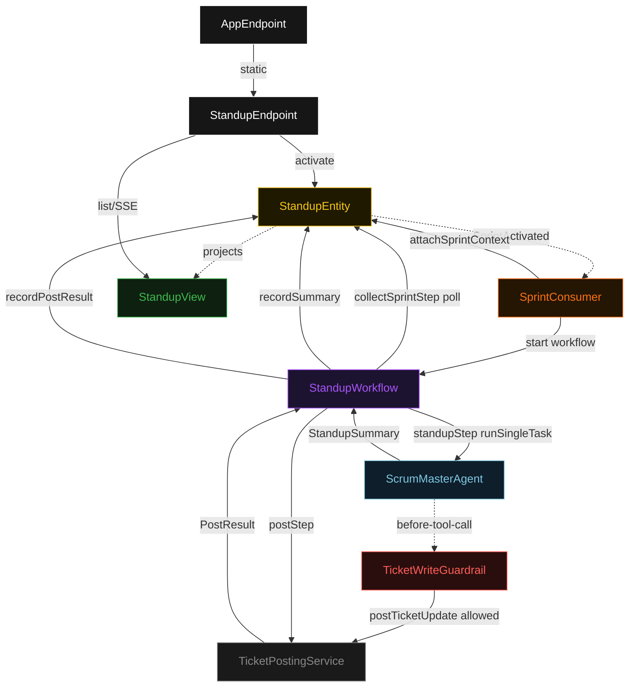
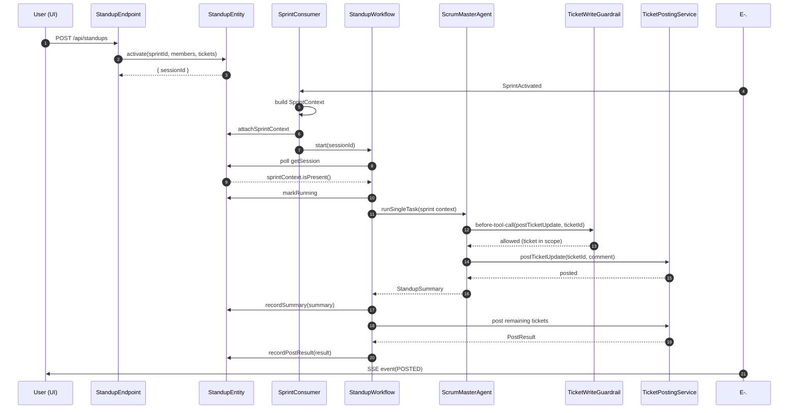
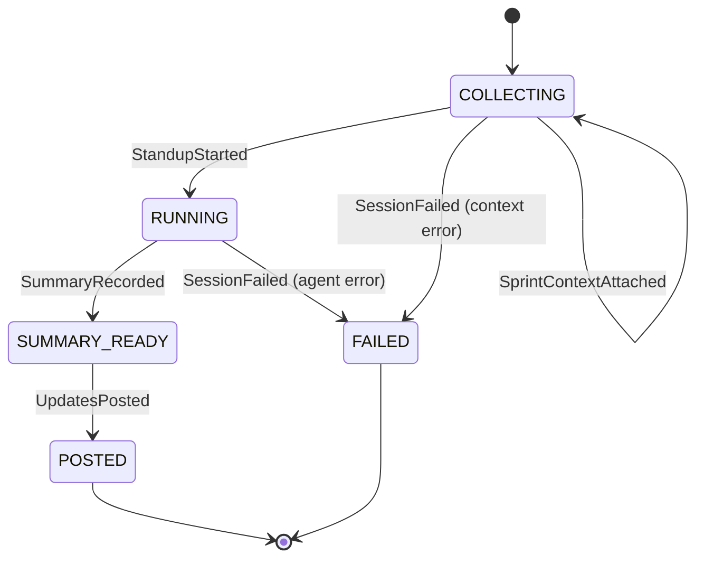
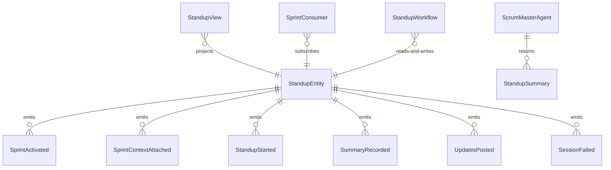

# PLAN — scrum-master-bot

Architectural sketch consumed by `/akka:plan` and rendered on the generated system's Architecture tab. The four mermaid diagrams below carry the theme variables and CSS overrides from Lesson 24; without them, state names render black-on-black and edge labels clip.

---

## Component graph

## Interaction sequence — J1 (happy path)

## State machine — `StandupEntity`

## Entity model

## Component table — Java file targets

| Component | Path (generated) |
|---|---|
| `StandupEndpoint` | `api/StandupEndpoint.java` |
| `AppEndpoint` | `api/AppEndpoint.java` |
| `StandupEntity` | `application/StandupEntity.java` (state in `domain/StandupSession.java`, events in `domain/SessionEvent.java`) |
| `SprintConsumer` | `application/SprintConsumer.java` |
| `StandupWorkflow` | `application/StandupWorkflow.java` |
| `ScrumMasterAgent` | `application/ScrumMasterAgent.java` (tasks in `application/StandupTasks.java`) |
| `TicketWriteGuardrail` | `application/TicketWriteGuardrail.java` |
| `TicketPostingService` | `application/TicketPostingService.java` |
| `StandupView` | `application/StandupView.java` |
| `MockModelProvider` (option-a only) | `application/MockModelProvider.java` |
| Bootstrap | `Bootstrap.java` |

## Concurrency notes

- **Per-step timeout**: `collectSprintStep` 15 s, `standupStep` 120 s, `postStep` 30 s, `error` 5 s. Default step recovery `maxRetries(2).failoverTo(StandupWorkflow::error)`. The 120 s on `standupStep` accommodates LLM latency and multiple tool-call iterations (Lesson 4).
- **Idempotency**: every workflow uses `"standup-" + sessionId` as the workflow id; the `SprintConsumer` Consumer is allowed to redeliver `SprintActivated` because `StandupEntity.attachSprintContext` is event-version-guarded — a second attach against an already-context-bearing session is a no-op.
- **One agent per session**: the AutonomousAgent instance id is `"scrum-" + sessionId`, giving each task its own conversation context. The agent's `capability(...).maxIterationsPerTask(4)` caps guardrail-triggered write attempts at 4.
- **Guardrail-driven skip**: when `TicketWriteGuardrail` rejects a `postTicketUpdate` call, the rejection is returned as a structured error to the agent loop. The agent counts it as a used iteration and must either select a valid ticket or produce its summary without that update.
- **Post step is synchronous and deterministic**: `TicketPostingService` runs in-process inside `postStep`. No LLM call — it is a plain service class. The same inputs always produce the same (simulated) output.
- **No saga / no compensation**: every step is either pure read, append-only event write, or a single-task agent call. There is nothing external to roll back.
