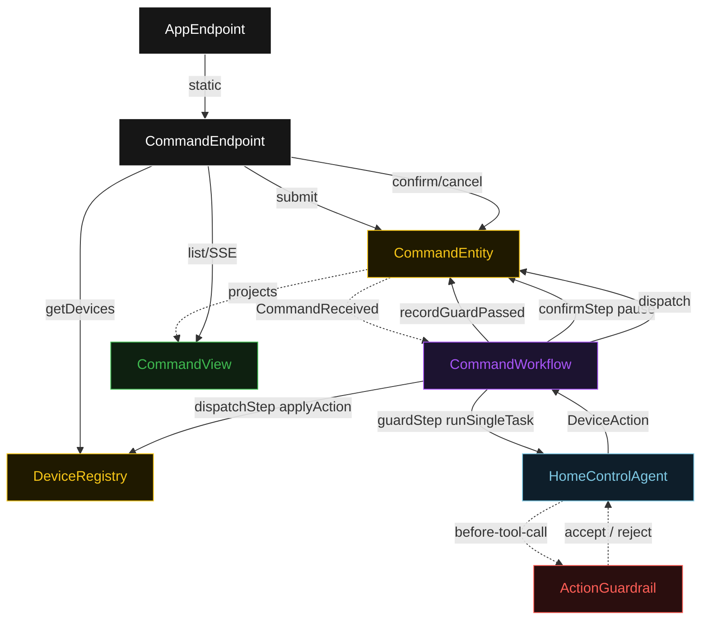
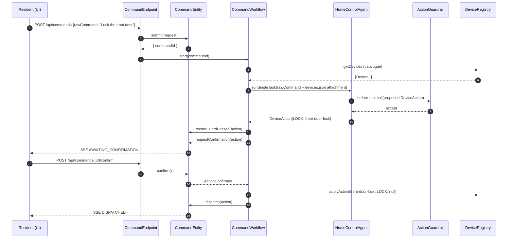
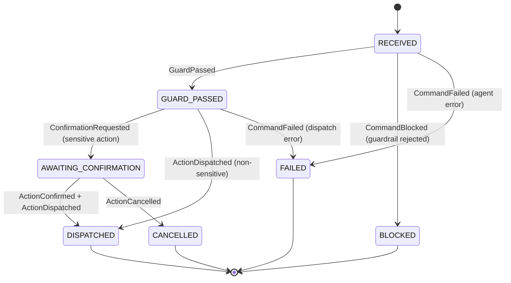
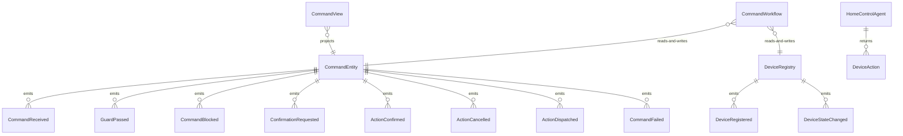

# PLAN — smart-home-agent

Architectural sketch consumed by `/akka:plan` and rendered on the generated system's Architecture tab. The four mermaid diagrams below carry the theme variables and CSS overrides from Lesson 24; without them, state names render black-on-black and edge labels clip.

---

## Component graph

## Interaction sequence — J2 (lock with HITL)

## State machine — `CommandEntity`

## Entity model

## Component table — Java file targets

| Component | Path (generated) |
|---|---|
| `CommandEndpoint` | `api/CommandEndpoint.java` |
| `AppEndpoint` | `api/AppEndpoint.java` |
| `CommandEntity` | `application/CommandEntity.java` (state in `domain/Command.java`, events in `domain/CommandEvent.java`) |
| `DeviceRegistry` | `application/DeviceRegistry.java` (state in `domain/DeviceRegistryState.java`, events in `domain/DeviceRegistryEvent.java`) |
| `CommandWorkflow` | `application/CommandWorkflow.java` |
| `HomeControlAgent` | `application/HomeControlAgent.java` (tasks in `application/CommandTasks.java`) |
| `ActionGuardrail` | `application/ActionGuardrail.java` |
| `CommandView` | `application/CommandView.java` |
| `MockModelProvider` (option-a only) | `application/MockModelProvider.java` |
| Bootstrap | `Bootstrap.java` |

## Concurrency notes

- **Per-step timeout**: `guardStep` 60 s, `confirmStep` 300 s, `dispatchStep` 10 s, `error` 5 s. Default step recovery `maxRetries(2).failoverTo(CommandWorkflow::error)`. The 60 s on `guardStep` accommodates LLM latency (Lesson 4).
- **HITL pause**: `confirmStep` waits up to 300 s for an explicit confirm or cancel from the resident. If the timeout elapses without a response, the workflow's step timeout fires and transitions to `error`, which calls `CommandEntity.fail("confirmation-timeout")`.
- **Idempotency**: the workflow id is `"cmd-" + commandId`; `CommandEntity.submit` is idempotent via event-version guard.
- **Guardrail-driven retry**: `ActionGuardrail` rejection returns a structured error to the agent loop. The loop counts toward `maxIterationsPerTask(3)`; if all 3 iterations fail validation, the workflow's `guardStep` fails over to `error`.
- **Single-agent invariant**: exactly one component (`HomeControlAgent`) talks to a model. The HITL confirmation is a workflow step interacting with `CommandEntity` — no second LLM call, no second agent.
- **DeviceRegistry seeding**: `Bootstrap.java` calls `registerDevice` for each of the 4 seeded devices on first startup if the registry is empty, ensuring the UI displays a non-empty device grid without any setup step.
