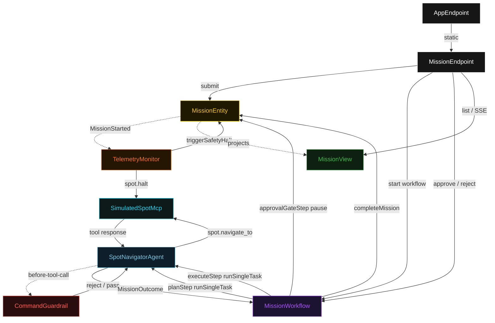
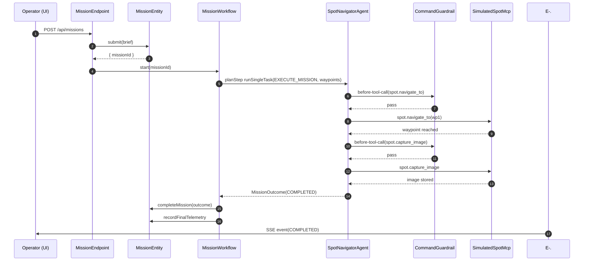
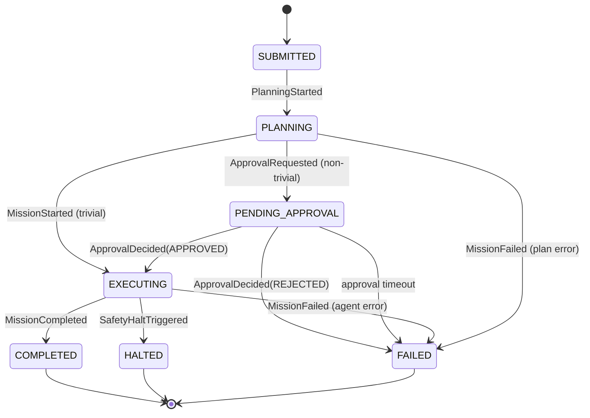
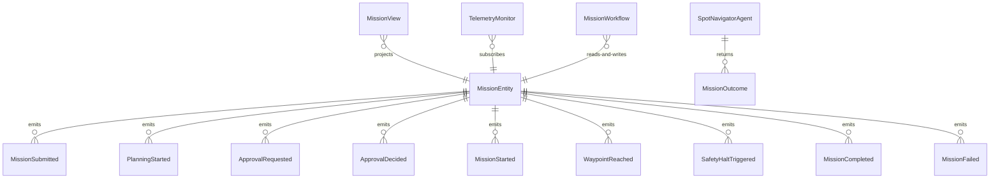

# PLAN — spot-edge-agent

Architectural sketch consumed by `/akka:plan` and rendered on the generated system's Architecture tab. The four mermaid diagrams below carry the theme variables and CSS overrides from Lesson 24; without them, state names render black-on-black and edge labels clip.

---

## Component graph

## Interaction sequence — J1 (happy path, trivial mission)

## State machine — `MissionEntity`

## Entity model

## Component table — Java file targets

| Component | Path (generated) |
|---|---|
| `MissionEndpoint` | `api/MissionEndpoint.java` |
| `AppEndpoint` | `api/AppEndpoint.java` |
| `MissionEntity` | `application/MissionEntity.java` (state in `domain/Mission.java`, events in `domain/MissionEvent.java`) |
| `TelemetryMonitor` | `application/TelemetryMonitor.java` |
| `MissionWorkflow` | `application/MissionWorkflow.java` |
| `SpotNavigatorAgent` | `application/SpotNavigatorAgent.java` (tasks in `application/MissionTasks.java`) |
| `CommandGuardrail` | `application/CommandGuardrail.java` |
| `SimulatedSpotMcp` | `application/SimulatedSpotMcp.java` |
| `MissionView` | `application/MissionView.java` |
| `MockModelProvider` (option-a only) | `application/MockModelProvider.java` |
| Bootstrap | `Bootstrap.java` |

## Concurrency notes

- **Per-step timeout**: `planStep` 30 s, `approvalGateStep` 600 s, `executeStep` 120 s, `telemetryStep` 10 s, `error` 10 s. Default step recovery `maxRetries(2).failoverTo(MissionWorkflow::error)`. The 120 s on `executeStep` accommodates multi-waypoint traversal latency (Lesson 4).
- **Idempotency**: every workflow uses `"mission-" + missionId` as the workflow id; `TelemetryMonitor` guards against double-halt by checking the entity's current status before writing `SafetyHaltTriggered`.
- **One agent per mission**: the AutonomousAgent instance id is `"navigator-" + missionId`, giving each mission its own conversation context. `maxIterationsPerTask(5)` caps guardrail-triggered replans.
- **Guardrail-driven replan**: when `CommandGuardrail` rejects a proposed command, the rejection is a structured error returned to the agent loop. The agent must propose an alternative command on the next iteration; each rejection consumes one iteration toward the cap of 5.
- **Halt independence**: `TelemetryMonitor` is a Consumer, not part of the workflow. The halt path fires even if `executeStep` is mid-await. The workflow's `executeStep` detects that the mission reached HALTED status when it polls the entity and terminates without writing `MissionCompleted`.
- **Approval gate is a pause, not a poll**: `approvalGateStep` uses `Workflow.pause()` and a resume callback tied to `MissionEndpoint.approve/reject`. It does not loop or sleep.
- **No saga / no compensation**: every step is append-only event writes plus single-task agent calls. The in-process `SimulatedSpotMcp` has no external state to roll back.
