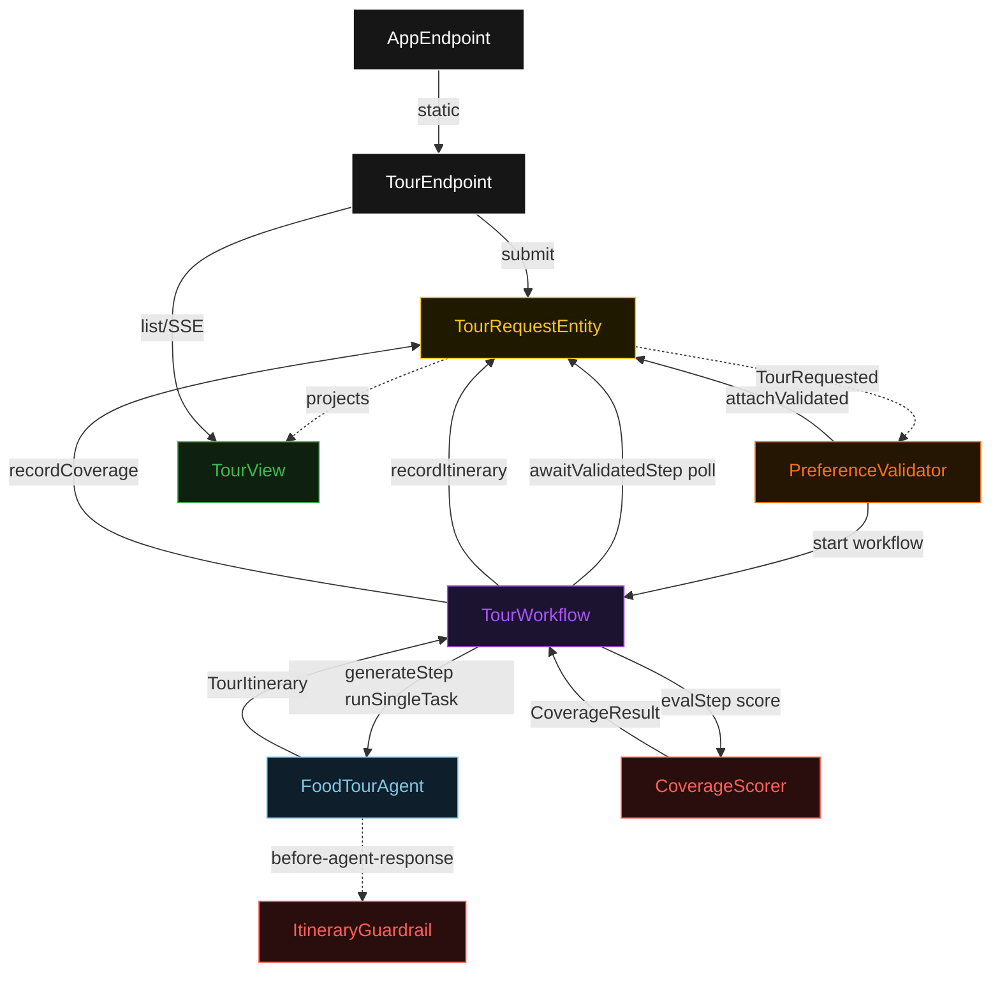
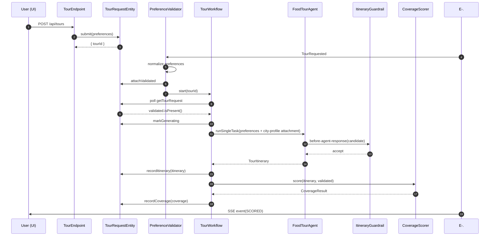
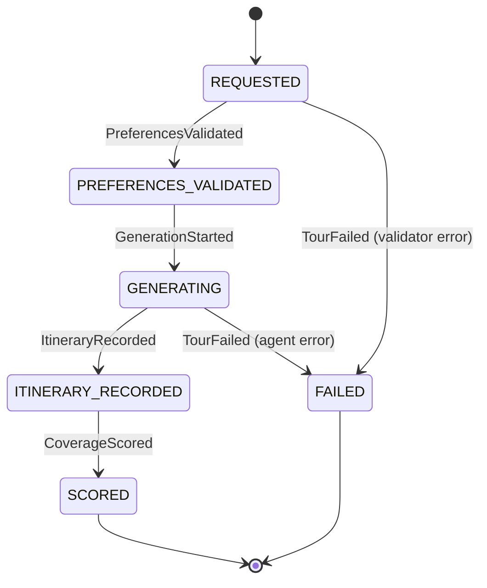
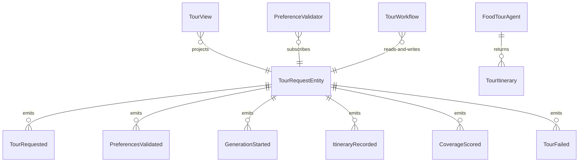

# PLAN — gemma-food-tour-guide

Architectural sketch consumed by `/akka:plan` and rendered on the generated system's Architecture tab. The four mermaid diagrams below carry the theme variables and CSS overrides from Lesson 24; without them, state names render black-on-black and edge labels clip.

---

## Component graph

## Interaction sequence — J1 (happy path)

## State machine — `TourRequestEntity`

## Entity model

## Component table — Java file targets

| Component | Path (generated) |
|---|---|
| `TourEndpoint` | `api/TourEndpoint.java` |
| `AppEndpoint` | `api/AppEndpoint.java` |
| `TourRequestEntity` | `application/TourRequestEntity.java` (state in `domain/TourRequest.java`, events in `domain/TourEvent.java`) |
| `PreferenceValidator` | `application/PreferenceValidator.java` |
| `TourWorkflow` | `application/TourWorkflow.java` |
| `FoodTourAgent` | `application/FoodTourAgent.java` (tasks in `application/TourTasks.java`) |
| `ItineraryGuardrail` | `application/ItineraryGuardrail.java` |
| `CoverageScorer` | `application/CoverageScorer.java` |
| `TourView` | `application/TourView.java` |
| `MockModelProvider` (option-a only) | `application/MockModelProvider.java` |
| Bootstrap | `Bootstrap.java` |

## Concurrency notes

- **Per-step timeout**: `awaitValidatedStep` 15 s, `generateStep` 60 s, `evalStep` 5 s, `error` 5 s. Default step recovery `maxRetries(2).failoverTo(TourWorkflow::error)`. The 60 s on `generateStep` accommodates LLM latency (Lesson 4).
- **Idempotency**: every workflow uses `"tour-" + tourId` as the workflow id; the `PreferenceValidator` Consumer is allowed to redeliver `TourRequested` events because `TourRequestEntity.attachValidated` is event-version-guarded — a second normalize attempt against an already-validated request is a no-op.
- **One agent per request**: the AutonomousAgent instance id is `"tour-agent-" + tourId`, giving each task its own conversation context. The agent's `capability(...).maxIterationsPerTask(3)` caps guardrail-triggered retries at 3.
- **Guardrail-driven retry**: when `ItineraryGuardrail` rejects a candidate response, the rejection is returned as a structured error to the agent loop. The loop counts toward `maxIterationsPerTask`; if all 3 iterations fail validation, the workflow's `generateStep` fails over to `error` and the entity transitions to `FAILED`.
- **Eval is synchronous and deterministic**: `CoverageScorer` runs in-process inside `evalStep`. No LLM call, no external service — the same itinerary always scores the same.
- **No saga / no compensation**: every step is either a pure read, an append-only event write, or a single-task agent call. There is nothing external to roll back.
