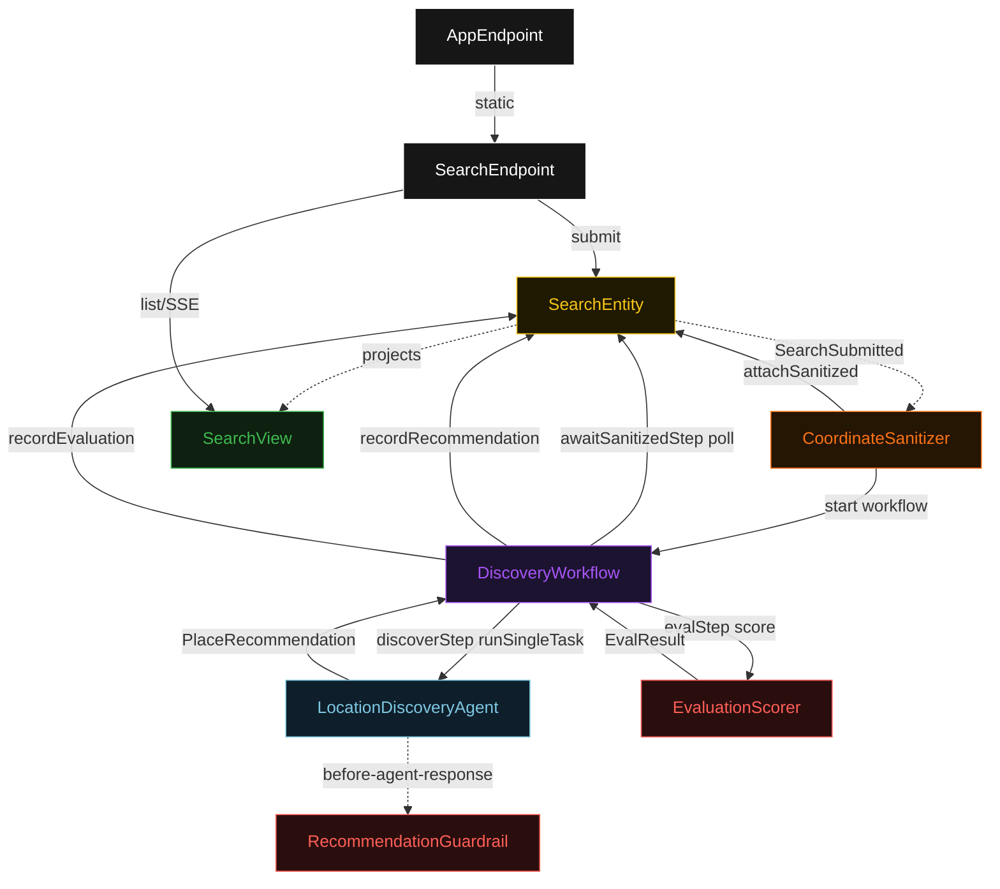
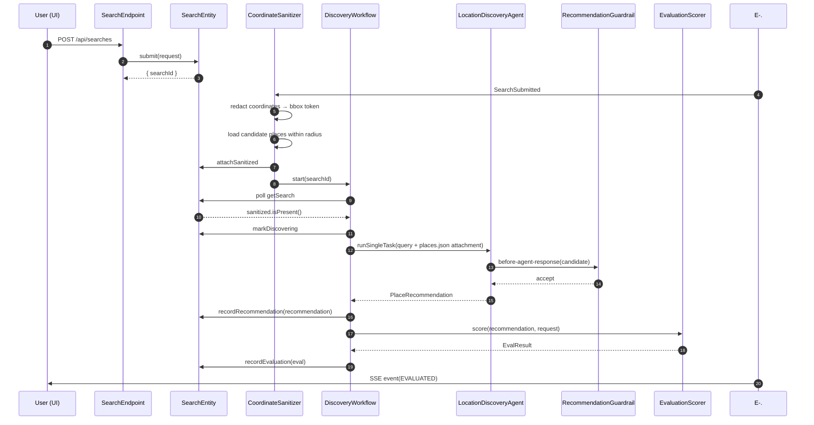
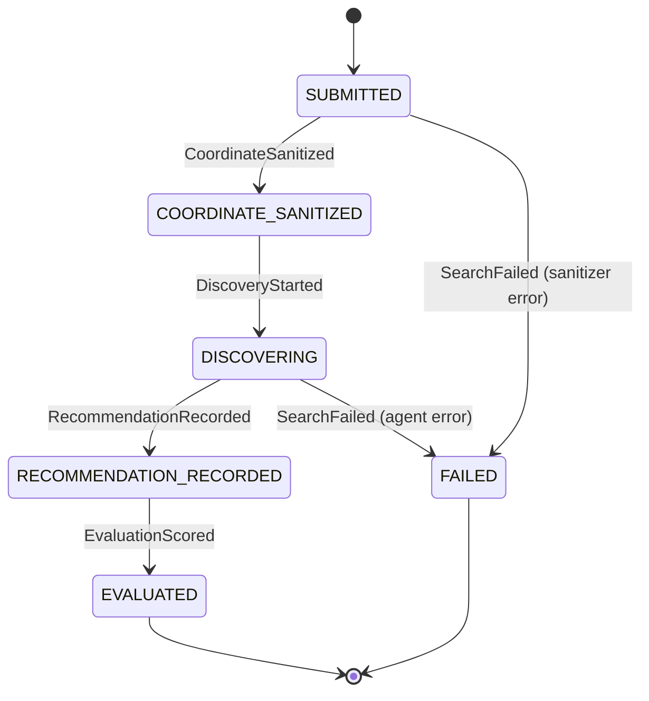
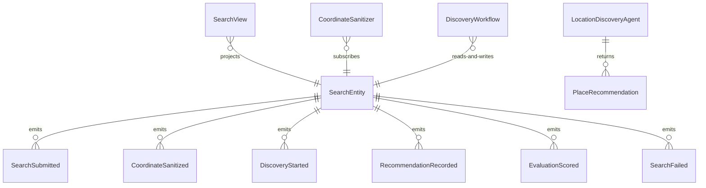

# PLAN — location-discovery-agent

Architectural sketch consumed by `/akka:plan` and rendered on the generated system's Architecture tab. The four mermaid diagrams below carry the theme variables and CSS overrides from Lesson 24; without them, state names render black-on-black and edge labels clip.

---

## Component graph

## Interaction sequence — J1 (happy path)

## State machine — `SearchEntity`

## Entity model

## Component table — Java file targets

| Component | Path (generated) |
|---|---|
| `SearchEndpoint` | `api/SearchEndpoint.java` |
| `AppEndpoint` | `api/AppEndpoint.java` |
| `SearchEntity` | `application/SearchEntity.java` (state in `domain/Search.java`, events in `domain/SearchEvent.java`) |
| `CoordinateSanitizer` | `application/CoordinateSanitizer.java` |
| `DiscoveryWorkflow` | `application/DiscoveryWorkflow.java` |
| `LocationDiscoveryAgent` | `application/LocationDiscoveryAgent.java` (tasks in `application/SearchTasks.java`) |
| `RecommendationGuardrail` | `application/RecommendationGuardrail.java` |
| `EvaluationScorer` | `application/EvaluationScorer.java` |
| `SearchView` | `application/SearchView.java` |
| `MockModelProvider` (option-a only) | `application/MockModelProvider.java` |
| Bootstrap | `Bootstrap.java` |

## Concurrency notes

- **Per-step timeout**: `awaitSanitizedStep` 15 s, `discoverStep` 60 s, `evalStep` 5 s, `error` 5 s. Default step recovery `maxRetries(2).failoverTo(DiscoveryWorkflow::error)`. The 60 s on `discoverStep` accommodates LLM latency (Lesson 4).
- **Idempotency**: every workflow uses `"discovery-" + searchId` as the workflow id; the `CoordinateSanitizer` Consumer is allowed to redeliver `SearchSubmitted` events because `SearchEntity.attachSanitized` is event-version-guarded — a second sanitize attempt against an already-sanitized search is a no-op.
- **One agent per search**: the AutonomousAgent instance id is `"discoverer-" + searchId`, which gives each task its own conversation context. The agent's `capability(...).maxIterationsPerTask(3)` caps guardrail-triggered retries at 3.
- **Guardrail-driven retry**: when `RecommendationGuardrail` rejects a candidate response, the rejection is returned as a structured error to the agent loop. The loop counts toward `maxIterationsPerTask`; if all 3 iterations fail validation, the workflow's `discoverStep` fails over to `error` and the entity transitions to `FAILED`.
- **Eval is synchronous and deterministic**: `EvaluationScorer` runs in-process inside `evalStep`. No LLM call, no external service — the same recommendation always scores the same. This is a deliberate single-agent guarantee.
- **No saga / no compensation**: every step is either pure read, append-only event write, or a single-task agent call. There is nothing external to roll back.
