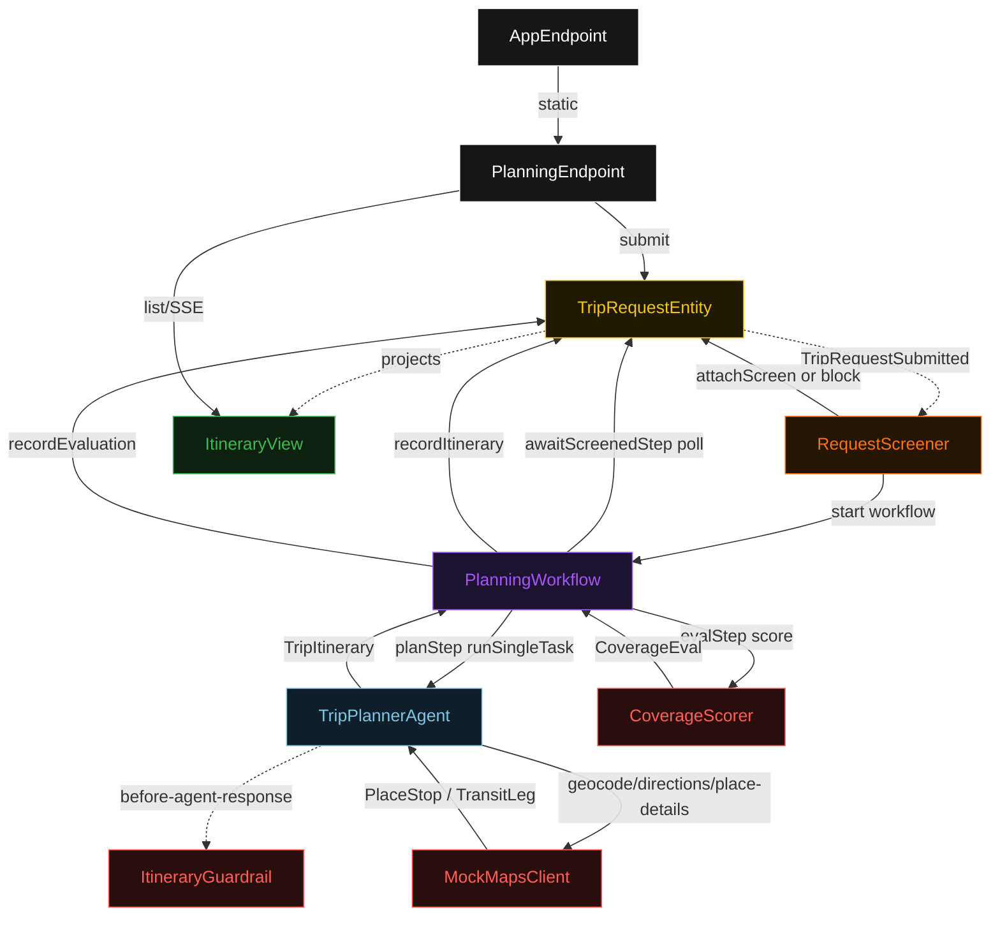
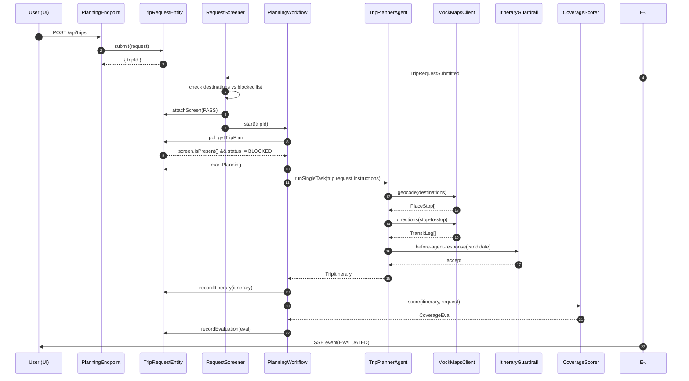
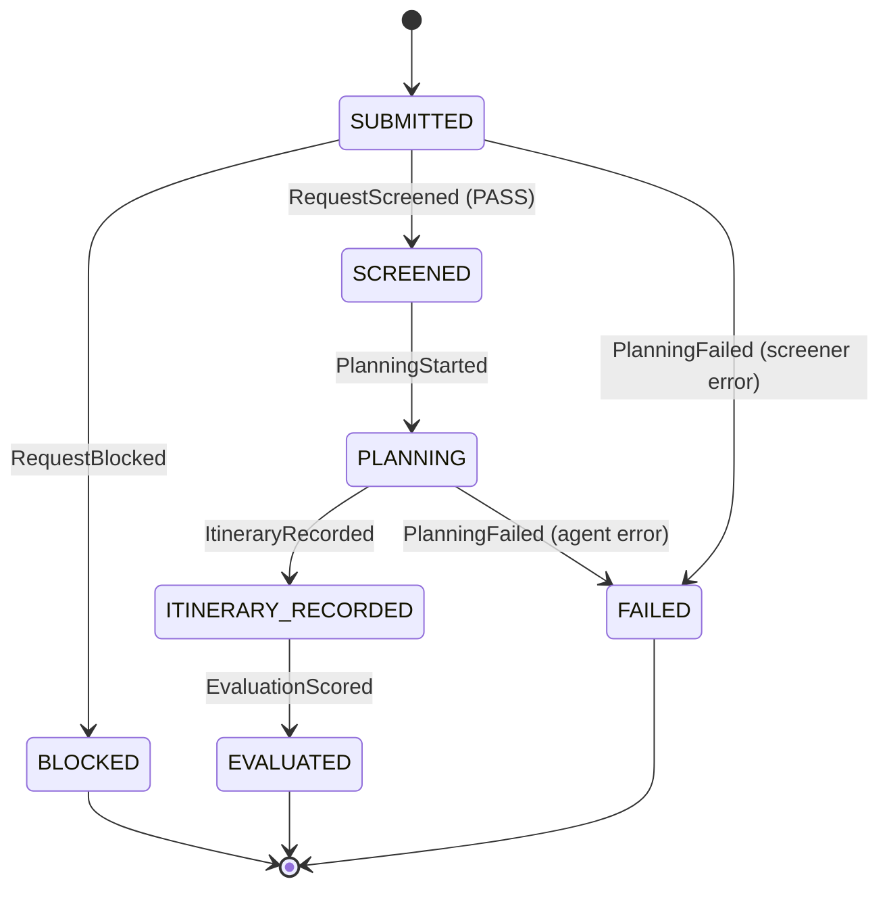
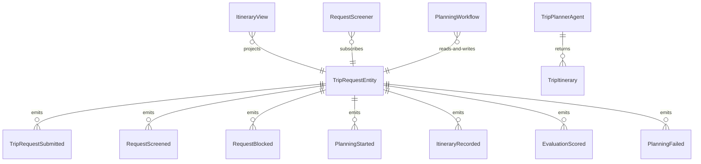

# PLAN — maps-trip-planner

Architectural sketch consumed by `/akka:plan` and rendered on the generated system's Architecture tab. The four mermaid diagrams below carry the theme variables and CSS overrides from Lesson 24; without them, state names render black-on-black and edge labels clip.

---

## Component graph

## Interaction sequence — J1 (happy path)

## State machine — `TripRequestEntity`

## Entity model

## Component table — Java file targets

| Component | Path (generated) |
|---|---|
| `PlanningEndpoint` | `api/PlanningEndpoint.java` |
| `AppEndpoint` | `api/AppEndpoint.java` |
| `TripRequestEntity` | `application/TripRequestEntity.java` (state in `domain/TripPlan.java`, events in `domain/TripEvent.java`) |
| `RequestScreener` | `application/RequestScreener.java` |
| `PlanningWorkflow` | `application/PlanningWorkflow.java` |
| `TripPlannerAgent` | `application/TripPlannerAgent.java` (tasks in `application/TripTasks.java`) |
| `ItineraryGuardrail` | `application/ItineraryGuardrail.java` |
| `CoverageScorer` | `application/CoverageScorer.java` |
| `MockMapsClient` | `application/MockMapsClient.java` |
| `ItineraryView` | `application/ItineraryView.java` |
| `MockModelProvider` (option-a only) | `application/MockModelProvider.java` |
| Bootstrap | `Bootstrap.java` |

## Concurrency notes

- **Per-step timeout**: `awaitScreenedStep` 15 s, `planStep` 90 s, `evalStep` 5 s, `error` 5 s. Default step recovery `maxRetries(2).failoverTo(PlanningWorkflow::error)`. The 90 s on `planStep` accommodates LLM latency plus simulated Maps tool round-trips (Lesson 4).
- **Blocked path**: when `RequestScreener` calls `TripRequestEntity.block(reason)`, the entity emits `RequestBlocked` and transitions to BLOCKED. The `awaitScreenedStep` in the workflow detects `status == BLOCKED` and transitions the workflow to its terminal no-op path; no agent call is made.
- **Idempotency**: every workflow uses `"plan-" + tripId` as the workflow id; the `RequestScreener` Consumer is allowed to redeliver `TripRequestSubmitted` events because `TripRequestEntity.attachScreen` is event-version-guarded — a second screen attempt against an already-screened trip is a no-op.
- **One agent per trip**: the AutonomousAgent instance id is `"planner-" + tripId`, which gives each task its own conversation context. The agent's `capability(...).maxIterationsPerTask(3)` caps guardrail-triggered retries at 3.
- **Guardrail-driven retry**: when `ItineraryGuardrail` rejects a candidate response, the rejection is returned as a structured error to the agent loop. The loop counts toward `maxIterationsPerTask`; if all 3 iterations fail validation, the workflow's `planStep` fails over to `error` and the entity transitions to `FAILED`.
- **Eval is synchronous and deterministic**: `CoverageScorer` runs in-process inside `evalStep`. No LLM call, no external service.
- **No saga / no compensation**: every step is either pure read, append-only event write, or a single-task agent call with in-process tool stubs.
