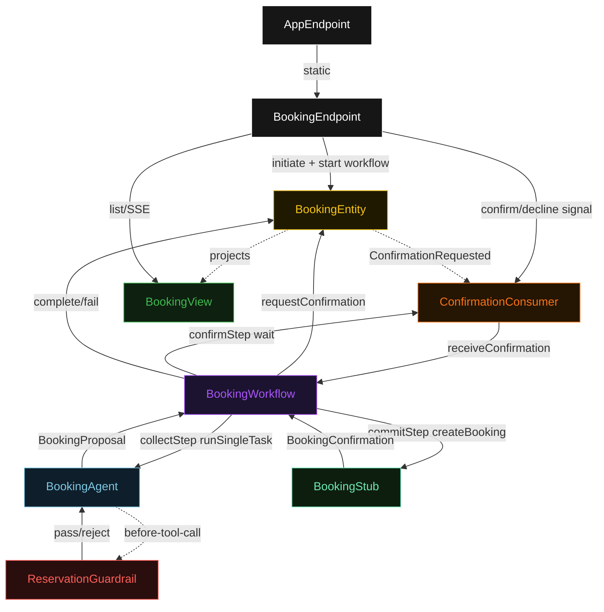
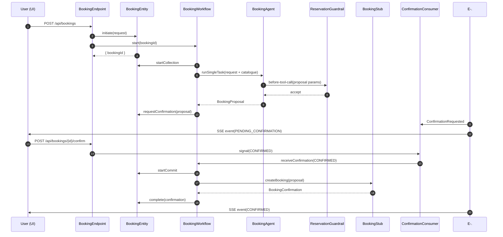
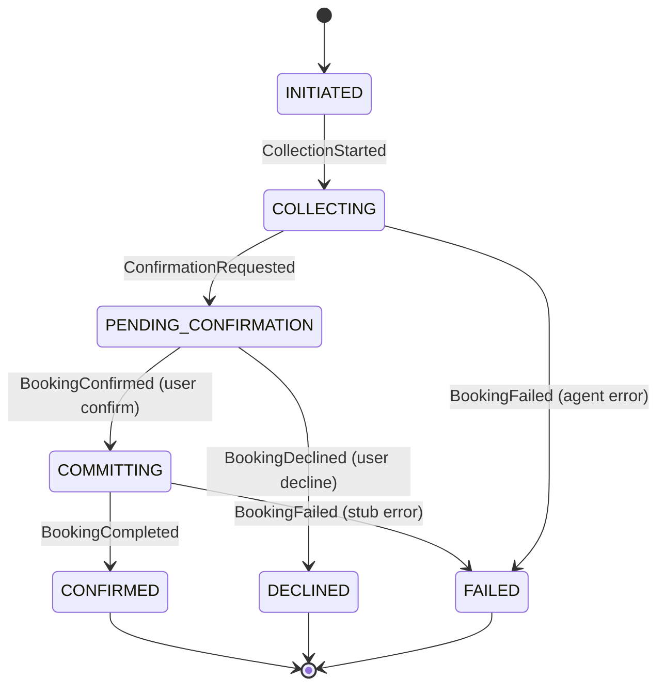
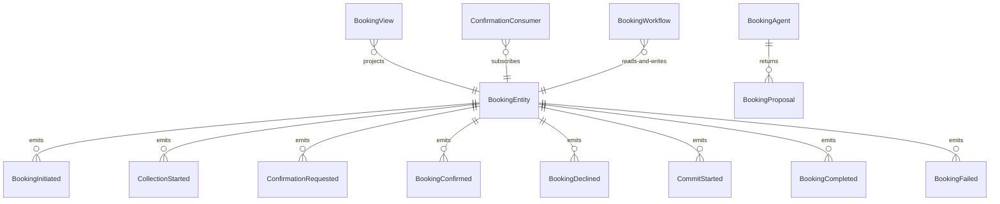

# PLAN — restaurant-booking-agent

Architectural sketch consumed by `/akka:plan` and rendered on the generated system's Architecture tab. The four mermaid diagrams below carry the theme variables and CSS overrides from Lesson 24; without them, state names render black-on-black and edge labels clip.

---

## Component graph

## Interaction sequence — J1 (happy path)

## State machine — `BookingEntity`

## Entity model

## Component table — Java file targets

| Component | Path (generated) |
|---|---|
| `BookingEndpoint` | `api/BookingEndpoint.java` |
| `AppEndpoint` | `api/AppEndpoint.java` |
| `BookingEntity` | `application/BookingEntity.java` (state in `domain/Booking.java`, events in `domain/BookingEvent.java`) |
| `ConfirmationConsumer` | `application/ConfirmationConsumer.java` |
| `BookingWorkflow` | `application/BookingWorkflow.java` |
| `BookingAgent` | `application/BookingAgent.java` (tasks in `application/BookingTasks.java`) |
| `ReservationGuardrail` | `application/ReservationGuardrail.java` |
| `BookingStub` | `application/BookingStub.java` |
| `BookingView` | `application/BookingView.java` |
| `MockModelProvider` (option-a only) | `application/MockModelProvider.java` |
| Bootstrap | `Bootstrap.java` |

## Concurrency notes

- **Per-step timeout**: `collectStep` 60 s, `confirmStep` 300 s, `commitStep` 15 s, `error` 5 s. Default step recovery `maxRetries(2).failoverTo(BookingWorkflow::error)`. The 300 s on `confirmStep` gives the user a 5-minute window to confirm or decline before the workflow times out and fails.
- **Idempotency**: every workflow uses `"booking-" + bookingId` as the workflow id. `BookingEntity.initiate` is event-version-guarded — a duplicate POST to `/api/bookings` for the same bookingId is a no-op.
- **One agent per booking**: the AutonomousAgent instance id is `"booker-" + bookingId`, giving each task its own conversation context. The agent's `capability(...).maxIterationsPerTask(4)` caps guardrail-triggered retries at 4.
- **Guardrail-driven retry**: when `ReservationGuardrail` rejects a tool-call candidate, the rejection is returned as a structured error to the agent loop. The loop counts toward `maxIterationsPerTask`; if all 4 iterations fail validation, the workflow's `collectStep` fails over to `error` and the entity transitions to `FAILED`.
- **Confirmation window**: `confirmStep` holds the workflow open for up to 300 s. If neither confirm nor decline arrives, the step times out and the workflow transitions to `error`, which calls `BookingEntity.fail("confirmation-timeout")`.
- **No saga / no compensation**: `commitStep` either returns a `BookingConfirmation` or fails. There is no external resource to roll back — the booking stub is the only write.
