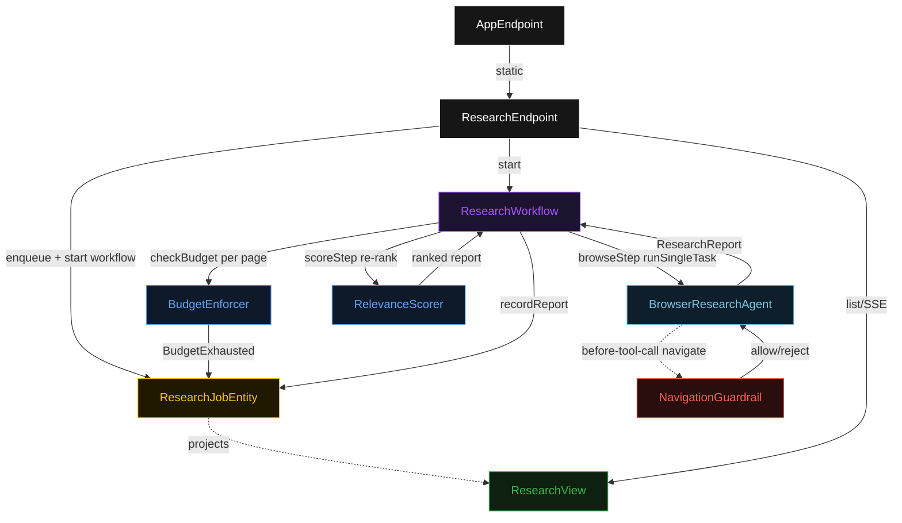
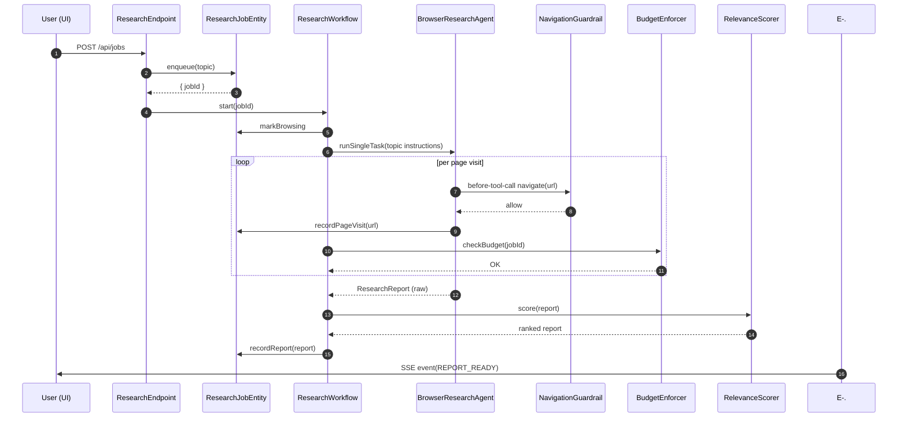
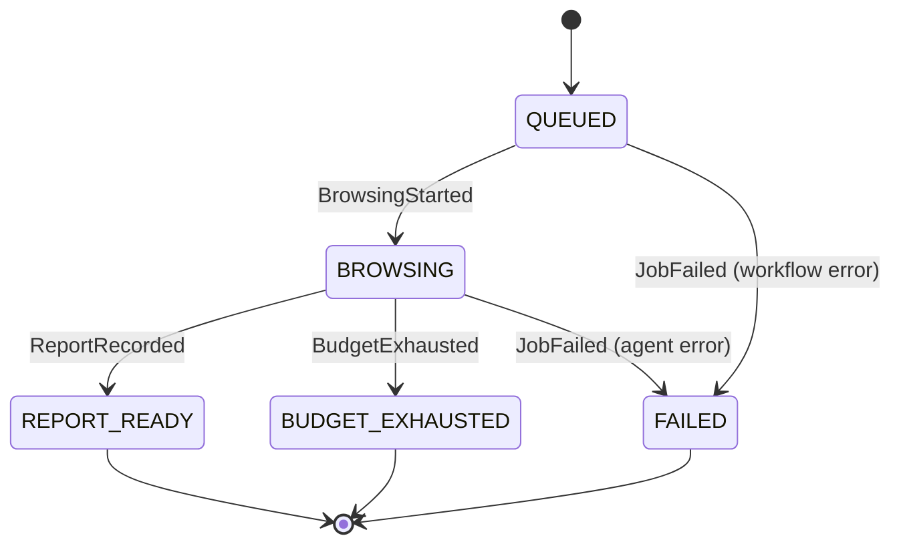
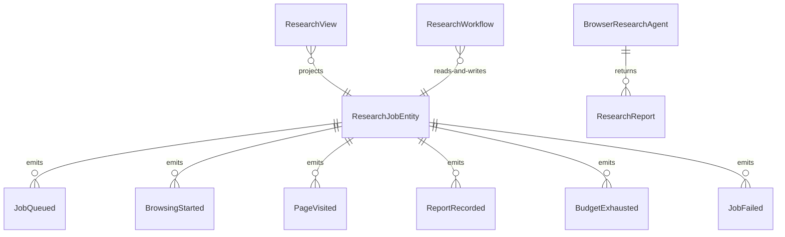

# PLAN — reddit-search

Architectural sketch consumed by `/akka:plan` and rendered on the generated system's Architecture tab. The four mermaid diagrams below carry the theme variables and CSS overrides from Lesson 24; without them, state names render black-on-black and edge labels clip.

---

## Component graph

## Interaction sequence — J1 (happy path)

## State machine — `ResearchJobEntity`

## Entity model

## Component table — Java file targets

| Component | Path (generated) |
|---|---|
| `ResearchEndpoint` | `api/ResearchEndpoint.java` |
| `AppEndpoint` | `api/AppEndpoint.java` |
| `ResearchJobEntity` | `application/ResearchJobEntity.java` (state in `domain/ResearchJob.java`, events in `domain/ResearchJobEvent.java`) |
| `ResearchWorkflow` | `application/ResearchWorkflow.java` |
| `BrowserResearchAgent` | `application/BrowserResearchAgent.java` (tasks in `application/ResearchTasks.java`) |
| `NavigationGuardrail` | `application/NavigationGuardrail.java` |
| `BudgetEnforcer` | `application/BudgetEnforcer.java` |
| `RelevanceScorer` | `application/RelevanceScorer.java` |
| `ResearchView` | `application/ResearchView.java` |
| `MockModelProvider` (option-a only) | `application/MockModelProvider.java` |
| Bootstrap | `Bootstrap.java` |

## Concurrency notes

- **Per-step timeout**: `browseStep` 180 s (accommodates LLM latency plus multiple page loads), `scoreStep` 10 s, `error` 5 s. Default step recovery `maxRetries(1).failoverTo(ResearchWorkflow::error)`. The 180 s on `browseStep` reflects that a 20-page session with real browser round-trips can approach 2–3 minutes (Lesson 4).
- **Idempotency**: every workflow uses `"research-" + jobId` as the workflow id. `ResearchJobEntity.recordPageVisit` is guarded by a URL dedup set on the entity so a redelivered `PageVisited` event with the same URL is a no-op.
- **One agent per job**: the AutonomousAgent instance id is `"researcher-" + jobId`, giving each task its own conversation context. The agent's `capability(...).maxIterationsPerTask(5)` caps navigation retries at 5.
- **Budget halt path**: when `BudgetEnforcer` returns EXCEEDED, `browseStep` stops the agent task immediately via a workflow transition to a `budgetExhausted` terminal step, which calls `ResearchJobEntity.recordBudgetExhausted(pagesVisited)`. The partial ResearchReport is preserved as the final output — not discarded.
- **Guardrail-driven retry**: when `NavigationGuardrail` rejects a URL, the rejection is a structured error returned to the agent loop. The loop counts toward `maxIterationsPerTask`; the agent is expected to propose an alternative URL rather than retrying the blocked one.
- **Scorer is synchronous and deterministic**: `RelevanceScorer` runs in-process inside `scoreStep`. No LLM call, no external service.
- **No saga / no compensation**: steps are append-only entity writes plus a single-task agent call. Nothing external to roll back.
