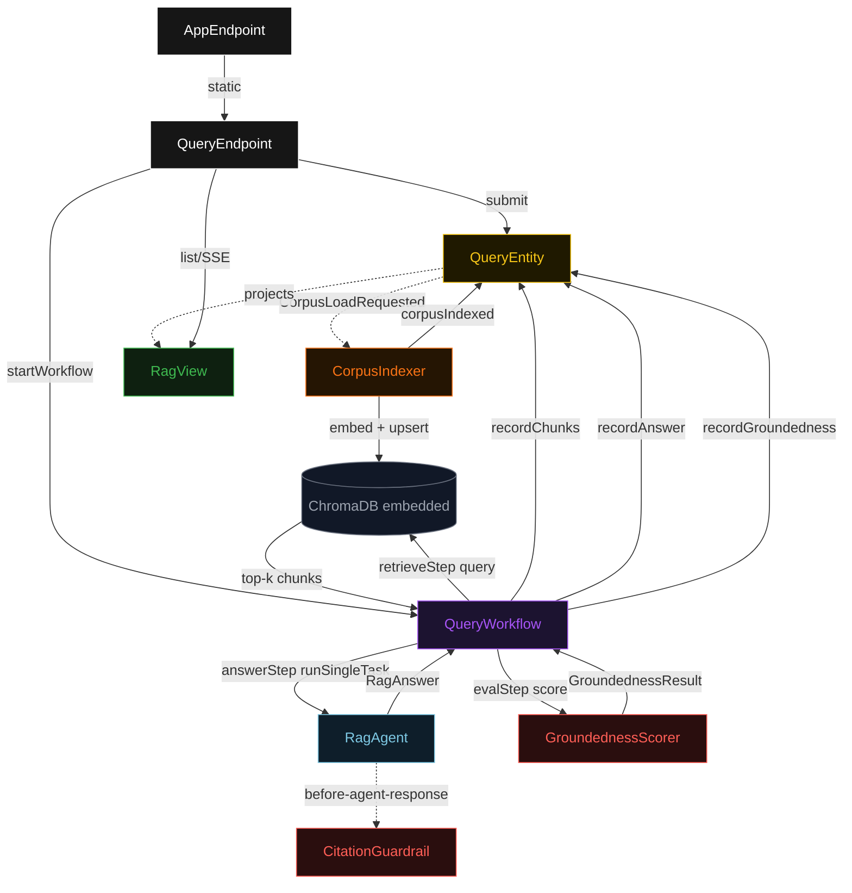
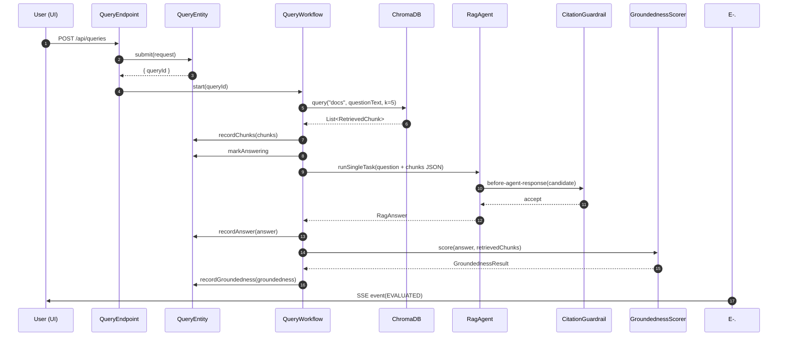
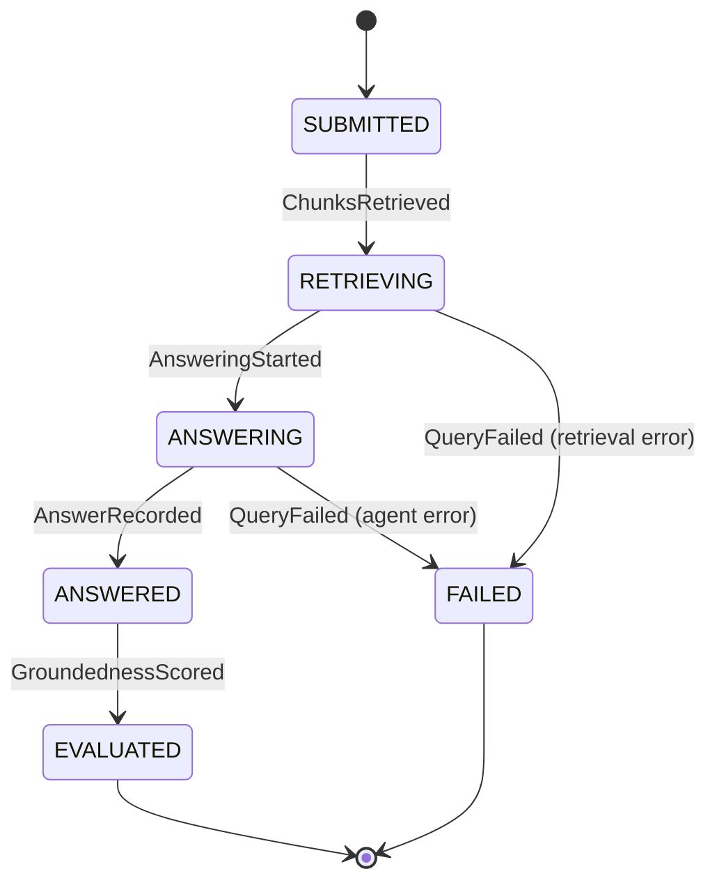
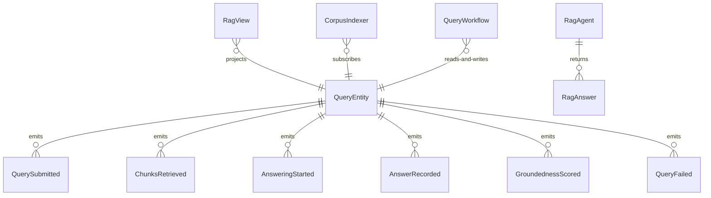

# PLAN — chroma-rag-agent

Architectural sketch consumed by `/akka:plan` and rendered on the generated system's Architecture tab. The four mermaid diagrams below carry the theme variables and CSS overrides from Lesson 24; without them, state names render black-on-black and edge labels clip.

---

## Component graph

## Interaction sequence — J1 (happy path)

## State machine — `QueryEntity`

## Entity model

## Component table — Java file targets

| Component | Path (generated) |
|---|---|
| `QueryEndpoint` | `api/QueryEndpoint.java` |
| `AppEndpoint` | `api/AppEndpoint.java` |
| `QueryEntity` | `application/QueryEntity.java` (state in `domain/Query.java`, events in `domain/QueryEvent.java`) |
| `CorpusIndexer` | `application/CorpusIndexer.java` |
| `QueryWorkflow` | `application/QueryWorkflow.java` |
| `RagAgent` | `application/RagAgent.java` (tasks in `application/RagTasks.java`) |
| `CitationGuardrail` | `application/CitationGuardrail.java` |
| `GroundednessScorer` | `application/GroundednessScorer.java` |
| `ChromaDbClient` | `application/ChromaDbClient.java` |
| `RagView` | `application/RagView.java` |
| `MockModelProvider` (option-a only) | `application/MockModelProvider.java` |
| Bootstrap | `Bootstrap.java` |

## Concurrency notes

- **Per-step timeout**: `retrieveStep` 20 s, `answerStep` 60 s, `evalStep` 5 s, `error` 5 s. Default step recovery `maxRetries(2).failoverTo(QueryWorkflow::error)`. The 60 s on `answerStep` accommodates LLM latency (Lesson 4).
- **Idempotency**: every workflow uses `"query-" + queryId` as the workflow id; the `QueryEndpoint` starts the workflow immediately after `submit`; duplicate submissions from the UI are prevented by the entity's command guard on `SUBMITTED` status.
- **One agent per query**: the AutonomousAgent instance id is `"rag-" + queryId`, giving each task its own conversation context. The agent's `capability(...).maxIterationsPerTask(3)` caps guardrail-triggered retries at 3.
- **Guardrail-driven retry**: when `CitationGuardrail` rejects a candidate response, the rejection is returned as a structured error to the agent loop. The loop counts toward `maxIterationsPerTask`; if all 3 iterations fail validation, the workflow's `answerStep` fails over to `error` and the entity transitions to `FAILED`.
- **Eval is synchronous and deterministic**: `GroundednessScorer` runs in-process inside `evalStep`. No LLM call, no external service — the same answer always scores the same. This is a deliberate single-agent guarantee.
- **ChromaDB is embedded**: `ChromaDbClient` wraps the in-process Java client; no network hop, no external daemon. The corpus is indexed once at startup via `CorpusIndexer`.
- **No saga / no compensation**: every step is either a ChromaDB read, append-only event write, or a single-task agent call. There is nothing external to roll back.
