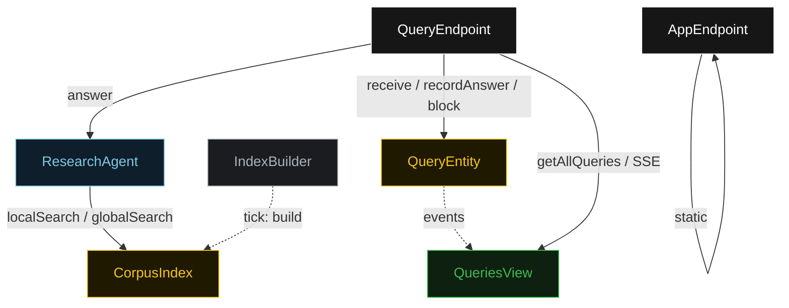
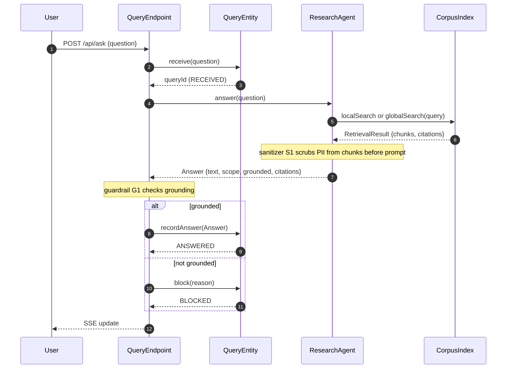
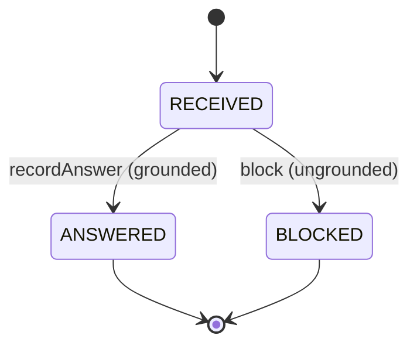
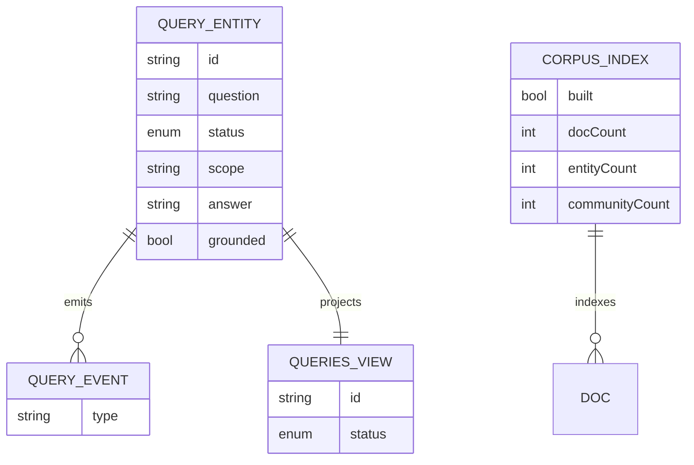

# PLAN — graphrag-assistant

Architectural sketch. All four mermaid diagrams + the component table.

---

## Component graph

## Interaction sequence

## State machine

## Entity model

## Component table

| Component | Path (generated) |
|---|---|
| ResearchAgent | `application/ResearchAgent.java` |
| CorpusIndex | `application/CorpusIndex.java` |
| QueryEntity | `application/QueryEntity.java` |
| QueriesView | `application/QueriesView.java` |
| IndexBuilder | `application/IndexBuilder.java` |
| QueryEndpoint | `api/QueryEndpoint.java` |
| AppEndpoint | `api/AppEndpoint.java` |
| Query / Answer / RetrievalResult / IndexState | `domain/*.java` |

## Concurrency notes

- The `QueryEndpoint.ask` handler calls `ResearchAgent.answer`, which makes an
  LLM call; set the component-client invoke timeout to at least 60 seconds so the
  call does not hit the 5-second default (Lesson 4).
- `queryId` is the idempotency key: `ask` generates a fresh UUID; re-posting the
  same question creates a distinct query, so duplicate submissions are isolated.
- No saga / compensation: the flow is request/response with a single terminal
  transition (`ANSWERED` or `BLOCKED`). The guardrail decides which.
- `IndexBuilder` is idempotent: it checks `CorpusIndex.getStatus().built` before
  rebuilding, so repeated ticks do not re-index.
