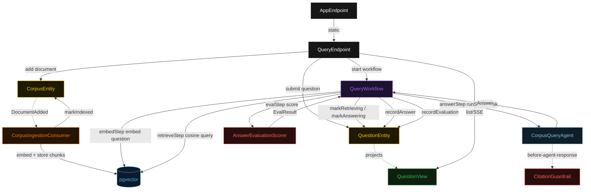
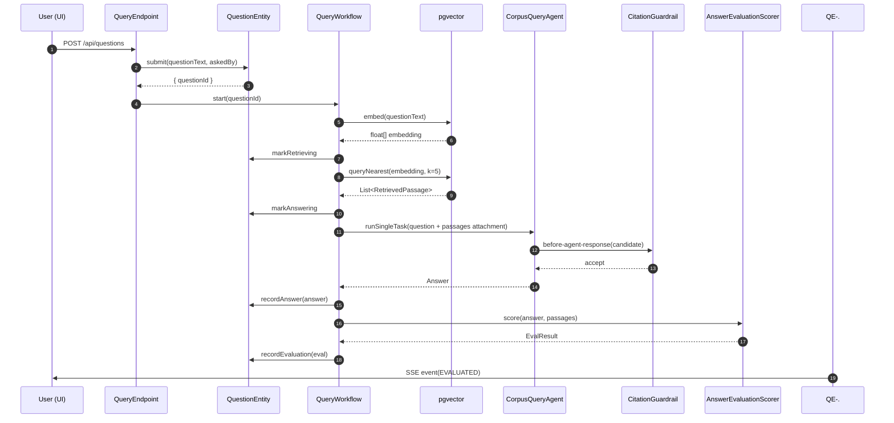
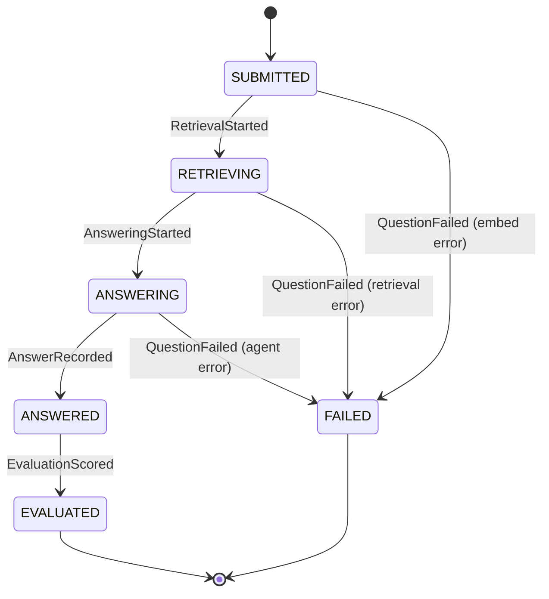
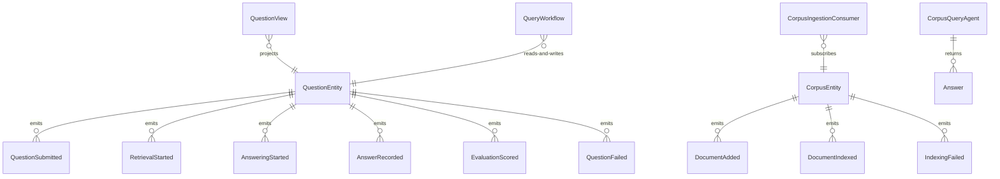

# PLAN — pgvector-rag-agent

Architectural sketch consumed by `/akka:plan` and rendered on the generated system's Architecture tab. The four mermaid diagrams below carry the theme variables and CSS overrides from Lesson 24; without them, state names render black-on-black and edge labels clip.

---

## Component graph

## Interaction sequence — J1 (happy path)

## State machine — `QuestionEntity`

## Entity model

## Component table — Java file targets

| Component | Path (generated) |
|---|---|
| `QueryEndpoint` | `api/QueryEndpoint.java` |
| `AppEndpoint` | `api/AppEndpoint.java` |
| `QuestionEntity` | `application/QuestionEntity.java` (state in `domain/Question.java`, events in `domain/QuestionEvent.java`) |
| `CorpusEntity` | `application/CorpusEntity.java` (state in `domain/CorpusDocument.java`, events in `domain/CorpusEvent.java`) |
| `CorpusIngestionConsumer` | `application/CorpusIngestionConsumer.java` |
| `QueryWorkflow` | `application/QueryWorkflow.java` |
| `CorpusQueryAgent` | `application/CorpusQueryAgent.java` (tasks in `application/QueryTasks.java`) |
| `CitationGuardrail` | `application/CitationGuardrail.java` |
| `AnswerEvaluationScorer` | `application/AnswerEvaluationScorer.java` |
| `EmbeddingService` | `application/EmbeddingService.java` |
| `PgVectorStore` | `application/PgVectorStore.java` |
| `ChunkSplitter` | `application/ChunkSplitter.java` |
| `QuestionView` | `application/QuestionView.java` |
| `MockModelProvider` (option-a only) | `application/MockModelProvider.java` |
| Bootstrap | `Bootstrap.java` |

## Concurrency notes

- **Per-step timeout**: `embedStep` 10 s, `retrieveStep` 15 s, `answerStep` 60 s, `evalStep` 5 s, `error` 5 s. Default step recovery `maxRetries(2).failoverTo(QueryWorkflow::error)`. The 60 s on `answerStep` accommodates LLM latency (Lesson 4).
- **Idempotency**: every workflow uses `"query-" + questionId` as the workflow id. `CorpusIngestionConsumer` may redeliver `DocumentAdded` events; `CorpusEntity.markIndexed` is event-version-guarded — a second indexing attempt against an already-indexed document is a no-op.
- **One agent per question**: the AutonomousAgent instance id is `"querier-" + questionId`, which gives each task its own conversation context. The agent's `capability(...).maxIterationsPerTask(3)` caps guardrail-triggered retries at 3.
- **Guardrail-driven retry**: when `CitationGuardrail` rejects a candidate response, the rejection is returned as a structured error to the agent loop. The loop counts toward `maxIterationsPerTask`; if all 3 iterations fail validation, the workflow's `answerStep` fails over to `error` and the entity transitions to `FAILED`.
- **Eval is synchronous and deterministic**: `AnswerEvaluationScorer` runs in-process inside `evalStep`. No LLM call, no external service — the same answer always scores the same. This is a deliberate single-agent guarantee.
- **pgvector connectivity**: the `PgVectorStore` acquires a connection from a `HikariCP` pool configured in `application.conf`. If pgvector is not reachable during `retrieveStep`, the step returns a failure and the workflow transitions the entity to `FAILED` — it does not hang indefinitely.
- **No saga / no compensation**: every step is either a pure compute, a pgvector read/write, or a single-task agent call. There is nothing external to roll back beyond what pgvector manages transactionally.
