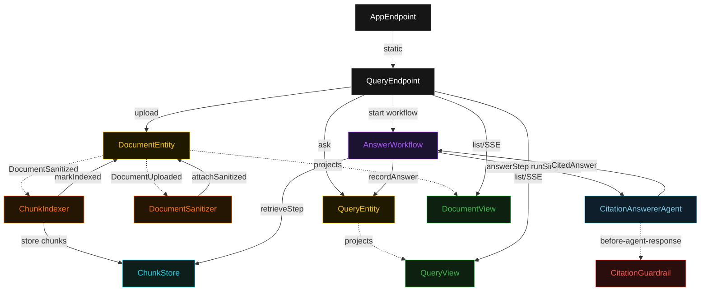
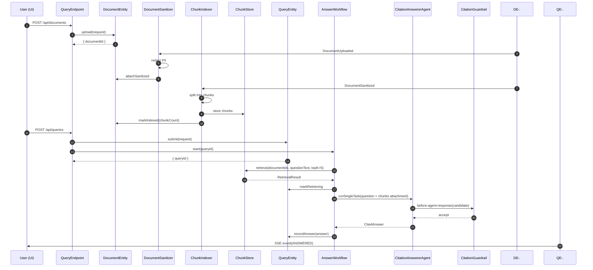
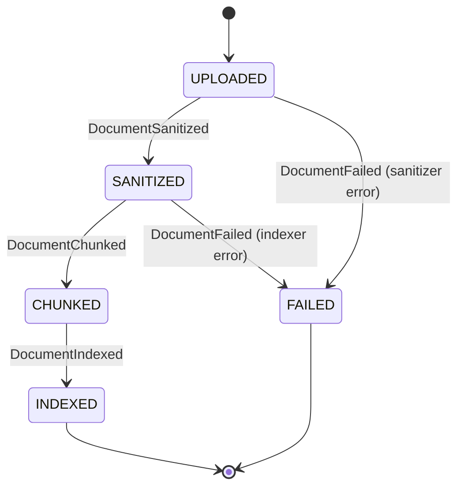
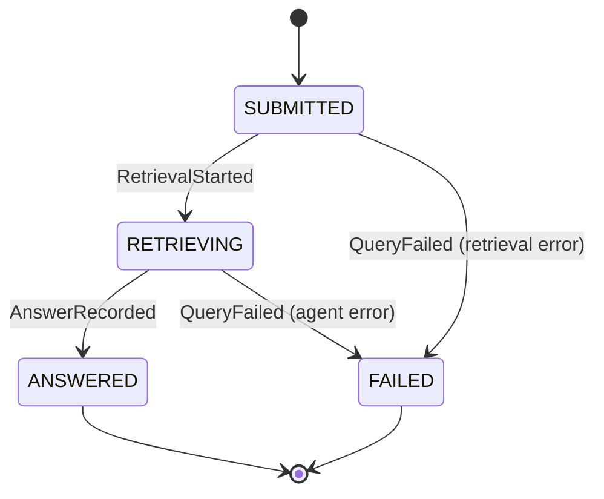
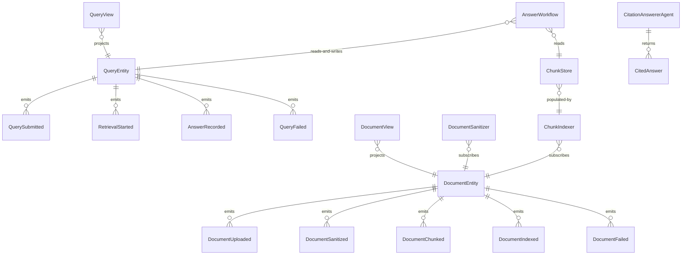

# PLAN — rag-citation-answerer

Architectural sketch consumed by `/akka:plan` and rendered on the generated system's Architecture tab. The four mermaid diagrams below carry the theme variables and CSS overrides from Lesson 24; without them, state names render black-on-black and edge labels clip.

---

## Component graph

## Interaction sequence — J1 (happy path)

## State machine — `DocumentEntity`

## State machine — `QueryEntity`

## Entity model

## Component table — Java file targets

| Component | Path (generated) |
|---|---|
| `QueryEndpoint` | `api/QueryEndpoint.java` |
| `AppEndpoint` | `api/AppEndpoint.java` |
| `DocumentEntity` | `application/DocumentEntity.java` (state in `domain/Document.java`, events in `domain/DocumentEvent.java`) |
| `QueryEntity` | `application/QueryEntity.java` (state in `domain/Query.java`, events in `domain/QueryEvent.java`) |
| `DocumentSanitizer` | `application/DocumentSanitizer.java` |
| `ChunkIndexer` | `application/ChunkIndexer.java` |
| `ChunkStore` | `application/ChunkStore.java` |
| `AnswerWorkflow` | `application/AnswerWorkflow.java` |
| `CitationAnswererAgent` | `application/CitationAnswererAgent.java` (tasks in `application/QueryTasks.java`) |
| `CitationGuardrail` | `application/CitationGuardrail.java` |
| `DocumentView` | `application/DocumentView.java` |
| `QueryView` | `application/QueryView.java` |
| `MockModelProvider` (option-a only) | `application/MockModelProvider.java` |
| Bootstrap | `Bootstrap.java` |

## Concurrency notes

- **Per-step timeout**: `retrieveStep` 10 s, `answerStep` 90 s, `error` 5 s. Default step recovery `maxRetries(2).failoverTo(AnswerWorkflow::error)`. The 90 s on `answerStep` accommodates LLM latency at the upper tail (Lesson 4).
- **Document readiness**: `AnswerWorkflow` starts only after the query is submitted; it does not wait for all selected documents to be indexed. If a selected `documentId` has no indexed chunks, `ChunkStore.retrieve` returns an empty list for that document — the workflow proceeds with whatever chunks are available, and the answer's `confidence` reflects the sparse retrieval.
- **Idempotency**: `DocumentSanitizer` is allowed to redeliver `DocumentUploaded` events; `DocumentEntity.attachSanitized` is event-version-guarded. `ChunkIndexer` re-indexing the same document overwrites existing chunk entries in `ChunkStore` (same chunkIds, same content — idempotent).
- **One agent per query**: the AutonomousAgent instance id is `"answerer-" + queryId`. Each task has its own conversation context. `maxIterationsPerTask(3)` caps guardrail-triggered retries.
- **Guardrail-driven retry**: when `CitationGuardrail` rejects a candidate, the agent loop counts one iteration toward `maxIterationsPerTask`. All 3 failing means the workflow's `answerStep` fails over to `error` and the entity transitions to `FAILED`.
- **No LLM retrieval**: `ChunkStore` uses keyword-TF scoring — no embedding model call, no external vector database. This is intentional for the out-of-the-box tier; a deployer wires a real embedding-based retriever by replacing `ChunkStore.retrieve` internals.
- **Raw text isolation**: `DocumentEntity` retains `upload.rawText` for audit. `ChunkStore` stores only chunks derived from `sanitized.redactedText`. The retrieval path can never return raw PII text.
