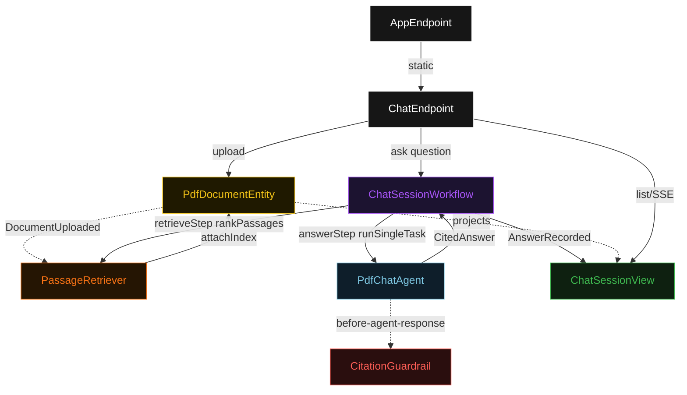
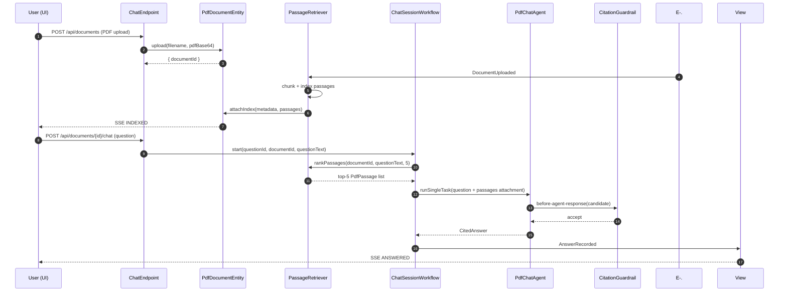
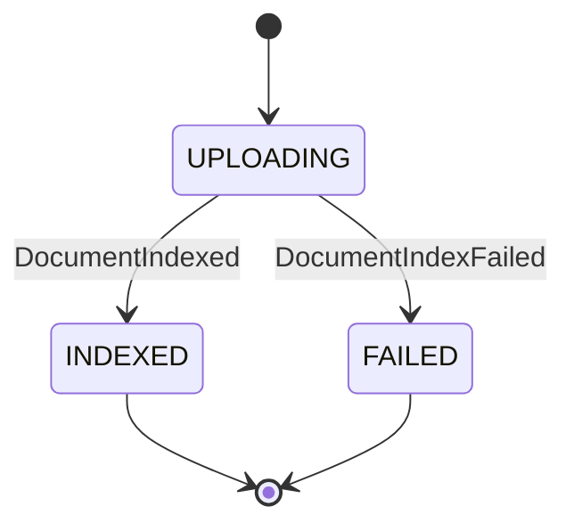
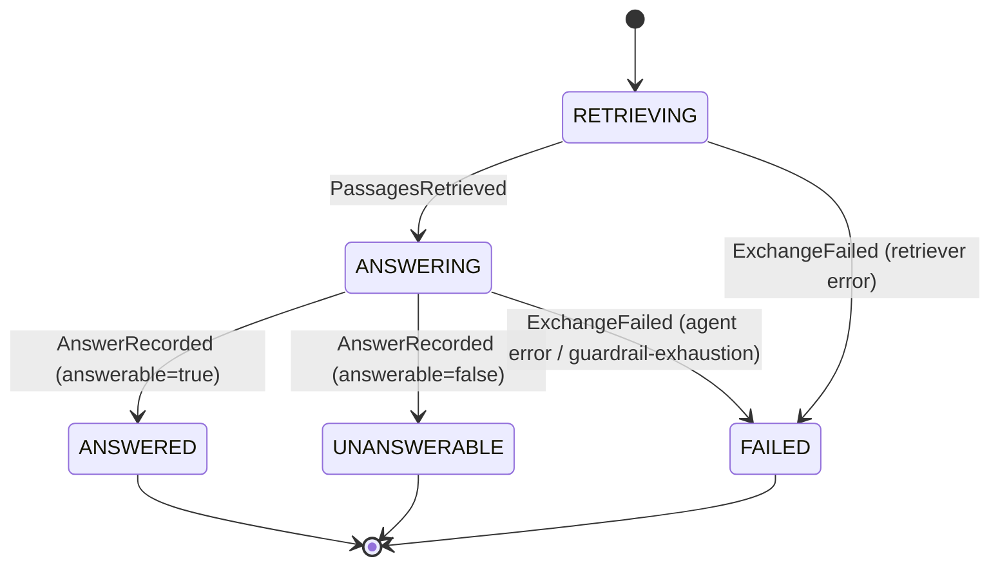
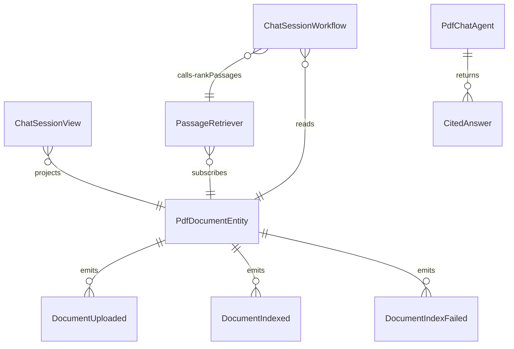

# PLAN — rag-pdf-chat

Architectural sketch consumed by `/akka:plan` and rendered on the generated system's Architecture tab. The four mermaid diagrams below carry the theme variables and CSS overrides from Lesson 24; without them, state names render black-on-black and edge labels clip.

---

## Component graph

## Interaction sequence — J1 (happy path)

## State machine — `PdfDocumentEntity`

## Exchange state machine — `ChatSessionWorkflow`

## Entity model

## Component table — Java file targets

| Component | Path (generated) |
|---|---|
| `ChatEndpoint` | `api/ChatEndpoint.java` |
| `AppEndpoint` | `api/AppEndpoint.java` |
| `PdfDocumentEntity` | `application/PdfDocumentEntity.java` (state in `domain/PdfDocument.java`, events in `domain/PdfDocumentEvent.java`) |
| `PassageRetriever` | `application/PassageRetriever.java` |
| `ChatSessionWorkflow` | `application/ChatSessionWorkflow.java` |
| `PdfChatAgent` | `application/PdfChatAgent.java` (tasks in `application/PdfChatTasks.java`) |
| `CitationGuardrail` | `application/CitationGuardrail.java` |
| `ChatSessionView` | `application/ChatSessionView.java` |
| `MockModelProvider` (option-a only) | `application/MockModelProvider.java` |
| Bootstrap | `Bootstrap.java` |

## Concurrency notes

- **Per-step timeout**: `retrieveStep` 10 s, `answerStep` 60 s, `error` 5 s. Default step recovery `maxRetries(2).failoverTo(ChatSessionWorkflow::error)`. The 60 s on `answerStep` accommodates LLM latency (Lesson 4).
- **Idempotency**: every workflow uses `"chat-" + questionId` as the workflow id; the `PassageRetriever` Consumer is allowed to redeliver `DocumentUploaded` events because `PdfDocumentEntity.attachIndex` is event-version-guarded — a second indexing attempt against an already-indexed document is a no-op.
- **One agent per question**: the AutonomousAgent instance id is `"chat-" + questionId`, which gives each question its own conversation context. The agent's `capability(...).maxIterationsPerTask(3)` caps guardrail-triggered retries at 3.
- **Guardrail-driven retry**: when `CitationGuardrail` rejects a candidate response, the rejection is returned as a structured error to the agent loop. The loop counts toward `maxIterationsPerTask`; if all 3 iterations fail validation, the workflow's `answerStep` fails over to `error` and the exchange transitions to `FAILED`.
- **Retriever is synchronous and deterministic**: `PassageRetriever.rankPassages` runs in-process. No LLM call, no external service. This is a deliberate single-agent guarantee.
- **No saga / no compensation**: every step is either a pure read, an append-only event write, or a single-task agent call. There is nothing external to roll back.
