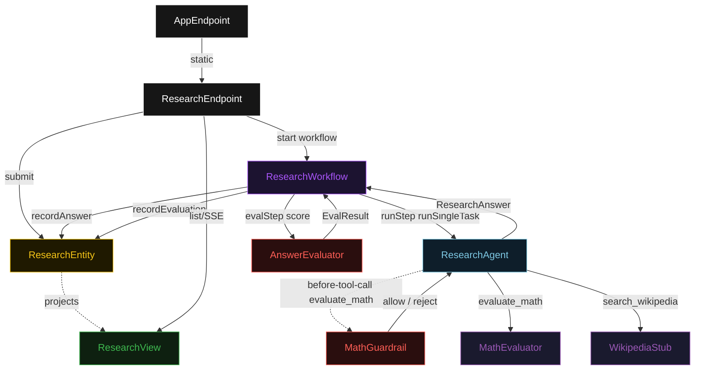
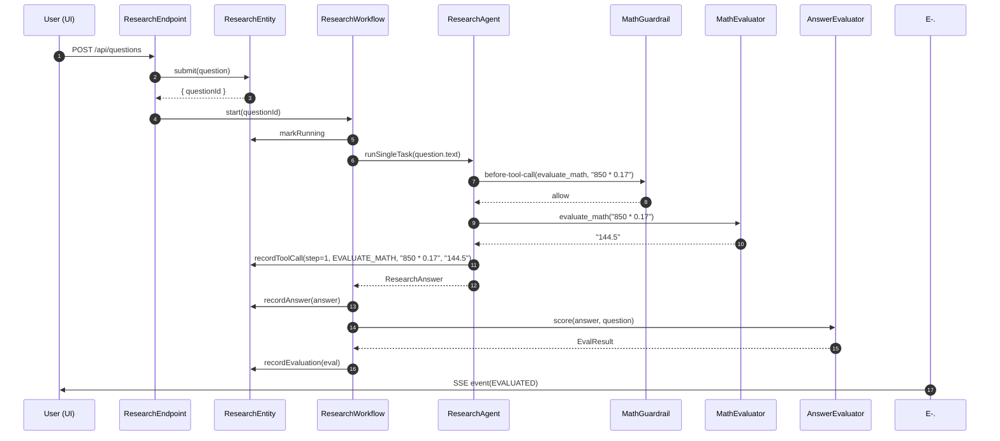
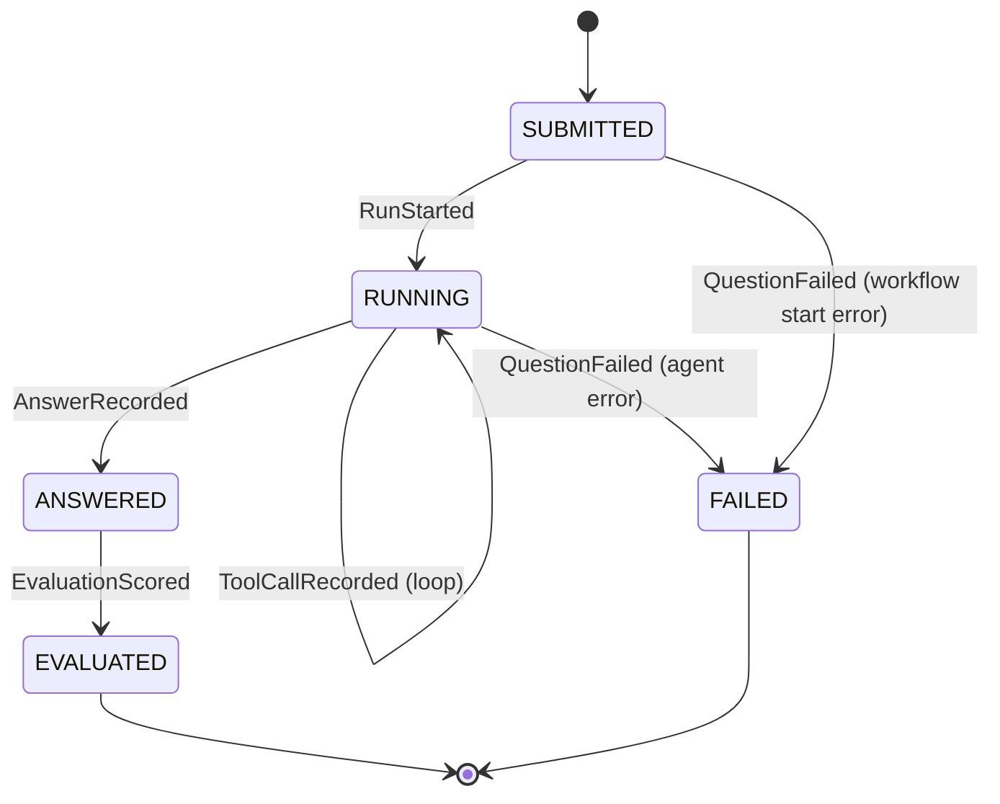
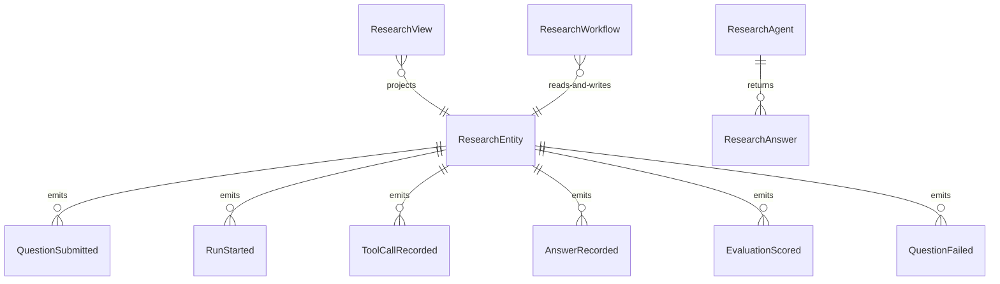

# PLAN — react-math-wiki

Architectural sketch consumed by `/akka:plan` and rendered on the generated system's Architecture tab. The four mermaid diagrams below carry the theme variables and CSS overrides from Lesson 24; without them, state names render black-on-black and edge labels clip.

---

## Component graph

## Interaction sequence — J1 (happy path, numeric word-problem)

## State machine — `ResearchEntity`

## Entity model

## Component table — Java file targets

| Component | Path (generated) |
|---|---|
| `ResearchEndpoint` | `api/ResearchEndpoint.java` |
| `AppEndpoint` | `api/AppEndpoint.java` |
| `ResearchEntity` | `application/ResearchEntity.java` (state in `domain/ResearchQuestion.java`, events in `domain/QuestionEvent.java`) |
| `ResearchWorkflow` | `application/ResearchWorkflow.java` |
| `ResearchAgent` | `application/ResearchAgent.java` (tasks in `application/ResearchTasks.java`) |
| `MathGuardrail` | `application/MathGuardrail.java` |
| `MathEvaluator` | `application/MathEvaluator.java` |
| `WikipediaStub` | `application/WikipediaStub.java` |
| `AnswerEvaluator` | `application/AnswerEvaluator.java` |
| `ResearchView` | `application/ResearchView.java` |
| `MockModelProvider` (option-a only) | `application/MockModelProvider.java` |
| Bootstrap | `Bootstrap.java` |

## Concurrency notes

- **Per-step timeout**: `runStep` 90 s, `evalStep` 5 s, `error` 5 s. Default step recovery `maxRetries(2).failoverTo(ResearchWorkflow::error)`. The 90 s on `runStep` accommodates multi-step ReAct loops and LLM latency (Lesson 4).
- **Idempotency**: every workflow uses `"research-" + questionId` as the workflow id; the `ResearchEndpoint` only starts a workflow after the entity's `submit` command succeeds — a duplicate submit on the same `questionId` is rejected by the entity before the workflow start.
- **One agent per question**: the AutonomousAgent instance id is `"researcher-" + questionId`, giving each task its own conversation context. The agent's `capability(...).maxIterationsPerTask(8)` allows up to 8 ReAct steps.
- **Guardrail per tool call**: `MathGuardrail` fires once for every `evaluate_math` invocation within the ReAct loop, not once per response. A single task may trigger the guardrail multiple times if the agent calls `evaluate_math` multiple times. Each rejection counts as one iteration against the budget.
- **Eval is synchronous and deterministic**: `AnswerEvaluator` runs in-process inside `evalStep`. No LLM call — the same answer always scores the same. This is the single-agent invariant.
- **Tool calls are in-process**: both `MathEvaluator` and `WikipediaStub` execute inside the JVM with no network I/O. The blueprint runs entirely offline once the LLM call succeeds (or the mock is selected).
