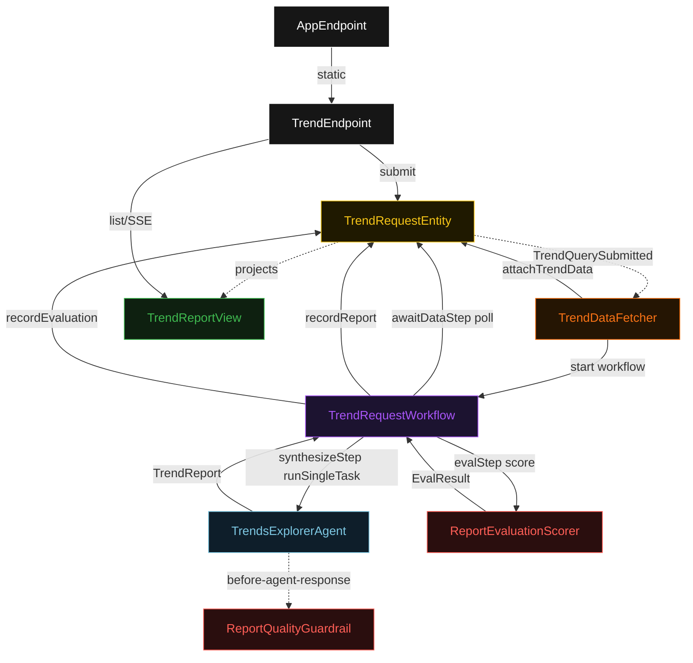
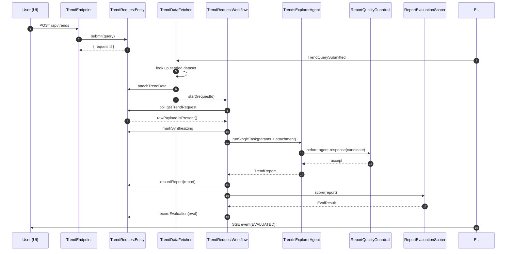
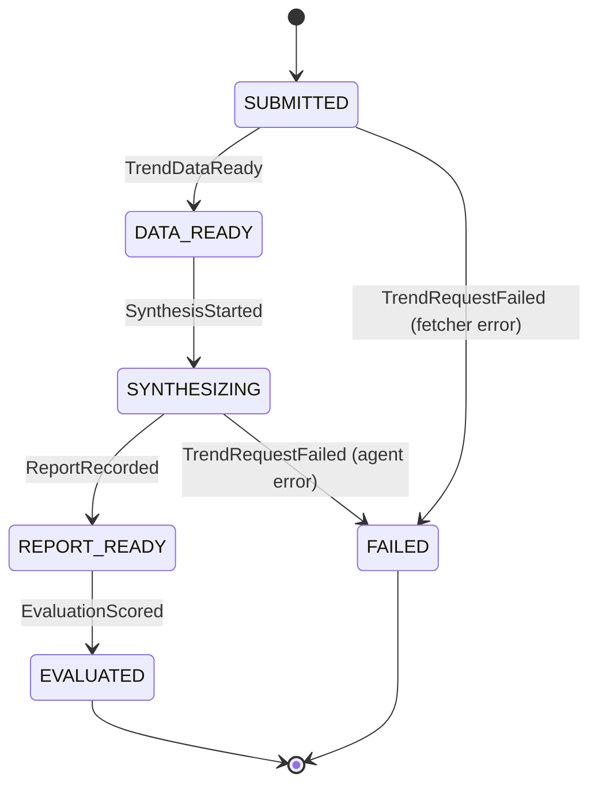
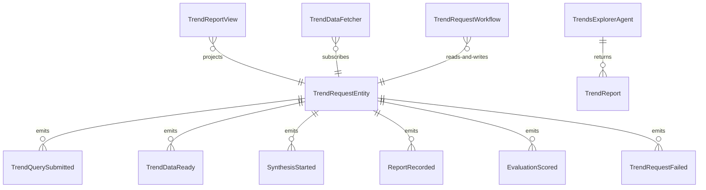

# PLAN — google-trends-agent

Architectural sketch consumed by `/akka:plan` and rendered on the generated system's Architecture tab. The four mermaid diagrams below carry the theme variables and CSS overrides from Lesson 24; without them, state names render black-on-black and edge labels clip.

---

## Component graph

## Interaction sequence — J1 (happy path)

## State machine — `TrendRequestEntity`

## Entity model

## Component table — Java file targets

| Component | Path (generated) |
|---|---|
| `TrendEndpoint` | `api/TrendEndpoint.java` |
| `AppEndpoint` | `api/AppEndpoint.java` |
| `TrendRequestEntity` | `application/TrendRequestEntity.java` (state in `domain/TrendRequest.java`, events in `domain/TrendRequestEvent.java`) |
| `TrendDataFetcher` | `application/TrendDataFetcher.java` |
| `TrendRequestWorkflow` | `application/TrendRequestWorkflow.java` |
| `TrendsExplorerAgent` | `application/TrendsExplorerAgent.java` (tasks in `application/TrendTasks.java`) |
| `ReportQualityGuardrail` | `application/ReportQualityGuardrail.java` |
| `ReportEvaluationScorer` | `application/ReportEvaluationScorer.java` |
| `TrendReportView` | `application/TrendReportView.java` |
| `MockModelProvider` (option-a only) | `application/MockModelProvider.java` |
| Bootstrap | `Bootstrap.java` |

## Concurrency notes

- **Per-step timeout**: `awaitDataStep` 15 s, `synthesizeStep` 60 s, `evalStep` 5 s, `error` 5 s. Default step recovery `maxRetries(2).failoverTo(TrendRequestWorkflow::error)`. The 60 s on `synthesizeStep` accommodates LLM latency (Lesson 4).
- **Idempotency**: every workflow uses `"trend-" + requestId` as the workflow id; the `TrendDataFetcher` Consumer is allowed to redeliver `TrendQuerySubmitted` events because `TrendRequestEntity.attachTrendData` is event-version-guarded — a second data-attach on an already-data-ready request is a no-op.
- **One agent per request**: the AutonomousAgent instance id is `"explorer-" + requestId`, giving each task its own conversation context. The agent's `capability(...).maxIterationsPerTask(3)` caps guardrail-triggered retries at 3.
- **Guardrail-driven retry**: when `ReportQualityGuardrail` rejects a candidate response, the rejection is returned as a structured error to the agent loop. The loop counts toward `maxIterationsPerTask`; if all 3 iterations fail validation, the workflow's `synthesizeStep` fails over to `error` and the entity transitions to `FAILED`.
- **Eval is synchronous and deterministic**: `ReportEvaluationScorer` runs in-process inside `evalStep`. No LLM call, no external service — the same report always scores the same. This is a deliberate single-agent guarantee.
- **No saga / no compensation**: every step is either pure read, append-only event write, or a single-task agent call. There is nothing external to roll back.
