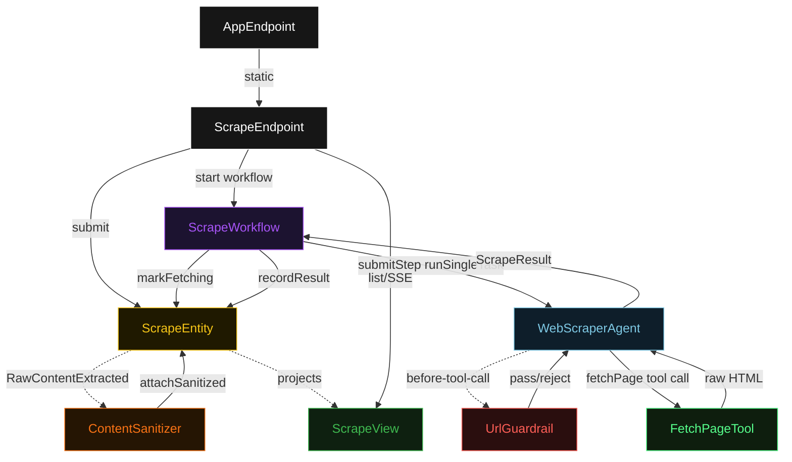
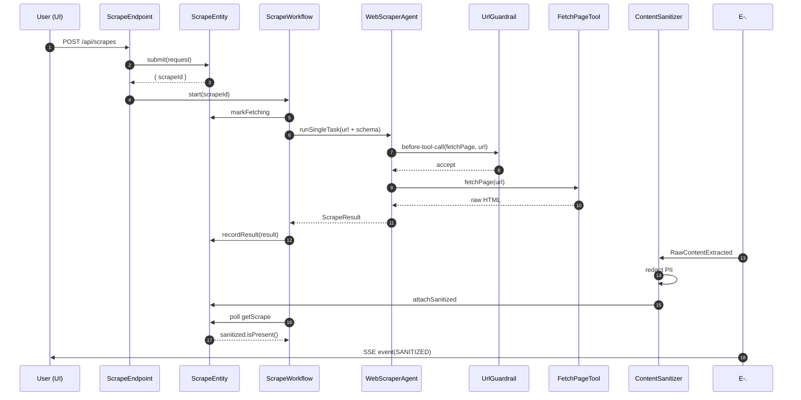
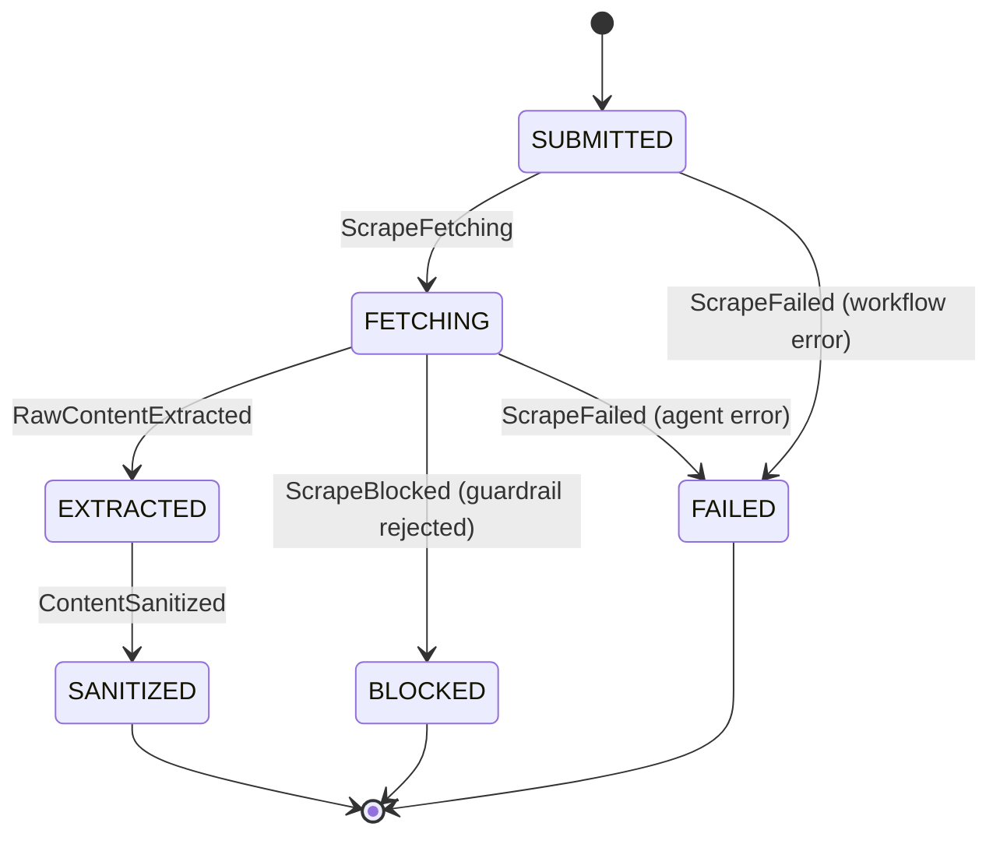
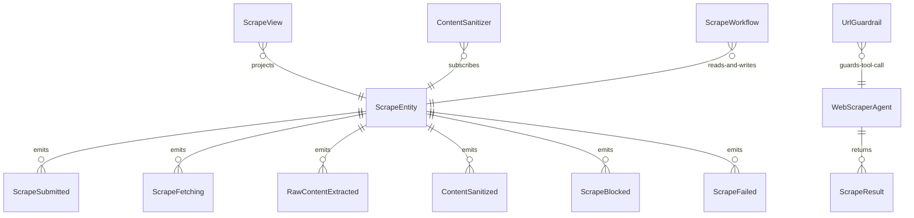

# PLAN — web-scraper-agent

Architectural sketch consumed by `/akka:plan` and rendered on the generated system's Architecture tab. The four mermaid diagrams below carry the theme variables and CSS overrides from Lesson 24; without them, state names render black-on-black and edge labels clip.

---

## Component graph

## Interaction sequence — J1 (happy path)

## State machine — `ScrapeEntity`

## Entity model

## Component table — Java file targets

| Component | Path (generated) |
|---|---|
| `ScrapeEndpoint` | `api/ScrapeEndpoint.java` |
| `AppEndpoint` | `api/AppEndpoint.java` |
| `ScrapeEntity` | `application/ScrapeEntity.java` (state in `domain/Scrape.java`, events in `domain/ScrapeEvent.java`) |
| `ContentSanitizer` | `application/ContentSanitizer.java` |
| `ScrapeWorkflow` | `application/ScrapeWorkflow.java` |
| `WebScraperAgent` | `application/WebScraperAgent.java` (tasks in `application/ScrapeTasks.java`) |
| `UrlGuardrail` | `application/UrlGuardrail.java` |
| `FetchPageTool` | `application/FetchPageTool.java` |
| `AllowlistLoader` | `application/AllowlistLoader.java` |
| `RateLimitStore` | `application/RateLimitStore.java` |
| `ScrapeView` | `application/ScrapeView.java` |
| `MockModelProvider` (option-a only) | `application/MockModelProvider.java` |
| Bootstrap | `Bootstrap.java` |

## Concurrency notes

- **Per-step timeout**: `submitStep` 90 s, `awaitSanitizedStep` 15 s, `done` 5 s, `error` 5 s. Default step recovery `maxRetries(2).failoverTo(ScrapeWorkflow::error)`. The 90 s on `submitStep` accommodates LLM latency plus HTTP fetch time (Lesson 4).
- **Idempotency**: every workflow uses `"scrape-" + scrapeId` as the workflow id. The `ContentSanitizer` Consumer is event-version-guarded — a redelivery of `RawContentExtracted` against an already-sanitized entity is a no-op.
- **One agent per scrape**: the AutonomousAgent instance id is `"scraper-" + scrapeId`, giving each task its own context. `capability(...).maxIterationsPerTask(3)` caps internal retries.
- **Guardrail on the tool, not the agent**: `UrlGuardrail` is bound to `before-tool-call` on `fetchPage`. It fires for every invocation attempt, including retries. The rate-limit window is shared across all scrape sessions for the same origin — `RateLimitStore` is a singleton bean.
- **No saga / no compensation**: every step is either a pure read, an append-only event write, or a single-task agent call. There is nothing external to roll back.
- **BLOCKED is a terminal state**: when `UrlGuardrail` rejects a tool call, the agent receives the rejection as a structured tool-output error, returns a `ScrapeResult` indicating the block, and the workflow writes `ScrapeBlocked`. The entity transitions to `BLOCKED` (terminal). The agent is not retried on a guardrail-blocked URL — retrying would not change the allowlist check.
