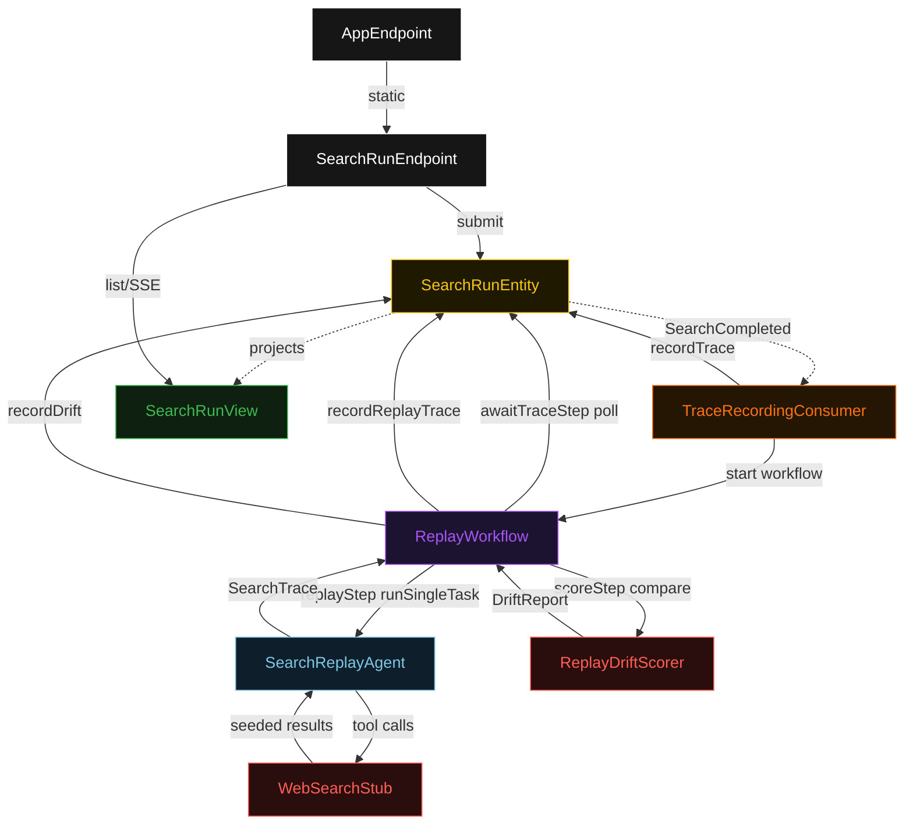
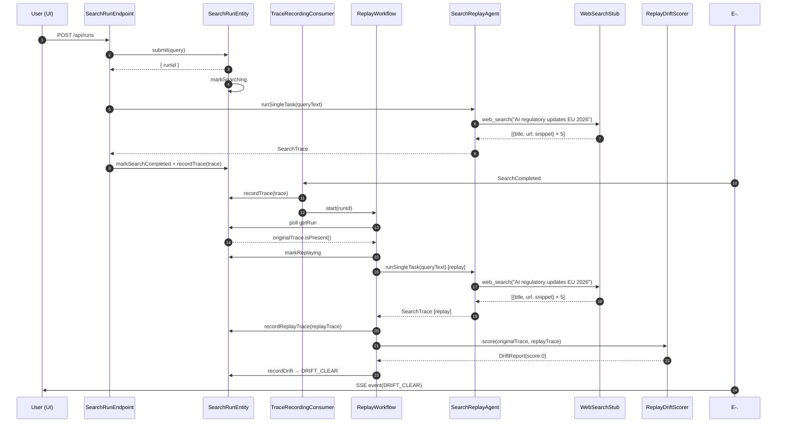
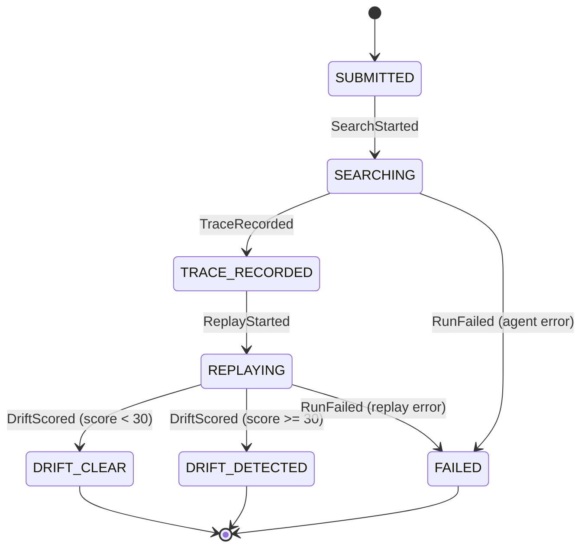
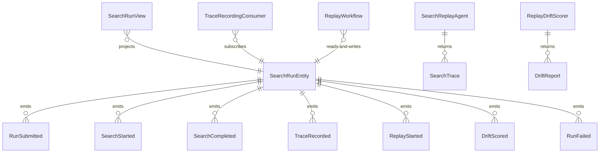

# PLAN — web-tools-replay

Architectural sketch consumed by `/akka:plan` and rendered on the generated system's Architecture tab. The four mermaid diagrams below carry the theme variables and CSS overrides from Lesson 24; without them, state names render black-on-black and edge labels clip.

---

## Component graph

## Interaction sequence — J1 (happy path)

## State machine — `SearchRunEntity`

## Entity model

## Component table — Java file targets

| Component | Path (generated) |
|---|---|
| `SearchRunEndpoint` | `api/SearchRunEndpoint.java` |
| `AppEndpoint` | `api/AppEndpoint.java` |
| `SearchRunEntity` | `application/SearchRunEntity.java` (state in `domain/SearchRun.java`, events in `domain/SearchRunEvent.java`) |
| `TraceRecordingConsumer` | `application/TraceRecordingConsumer.java` |
| `ReplayWorkflow` | `application/ReplayWorkflow.java` |
| `SearchReplayAgent` | `application/SearchReplayAgent.java` (tasks in `application/SearchTasks.java`) |
| `WebSearchStub` | `application/WebSearchStub.java` |
| `ReplayDriftScorer` | `application/ReplayDriftScorer.java` |
| `SearchRunView` | `application/SearchRunView.java` |
| `MockModelProvider` (option-a only) | `application/MockModelProvider.java` |
| Bootstrap | `Bootstrap.java` |

## Concurrency notes

- **Per-step timeout**: `awaitTraceStep` 20 s, `replayStep` 60 s, `scoreStep` 5 s, `error` 5 s. Default step recovery `maxRetries(2).failoverTo(ReplayWorkflow::error)`. The 60 s on `replayStep` accommodates LLM latency when a real provider is used (Lesson 4).
- **Idempotency**: every workflow uses `"replay-" + runId` as the workflow id; the `TraceRecordingConsumer` Consumer is allowed to redeliver `SearchCompleted` events because `SearchRunEntity.recordTrace` is event-version-guarded — a second trace attempt against an already-recorded run is a no-op.
- **One agent per run**: the AutonomousAgent instance id is `"searcher-" + runId` for the initial search and `"replay-" + runId` for the replay, each with its own conversation context. `maxIterationsPerTask(3)` caps retries.
- **Drift is deterministic**: `ReplayDriftScorer` runs in-process inside `scoreStep`. Same two traces always produce the same score — no LLM, no external service. This upholds the single-agent invariant.
- **Manual replay**: `GET /api/runs/{id}/replay` starts a new `ReplayWorkflow` instance with a versioned id `"replay-" + runId + "-" + epochSecond`. Only valid when the run is in `TRACE_RECORDED`, `DRIFT_CLEAR`, or `DRIFT_DETECTED` state. The entity transitions back to `REPLAYING` on `ReplayStarted`.
- **No saga / no compensation**: every step is either a pure read, append-only event write, or a single-task agent call. There is nothing external to roll back.
