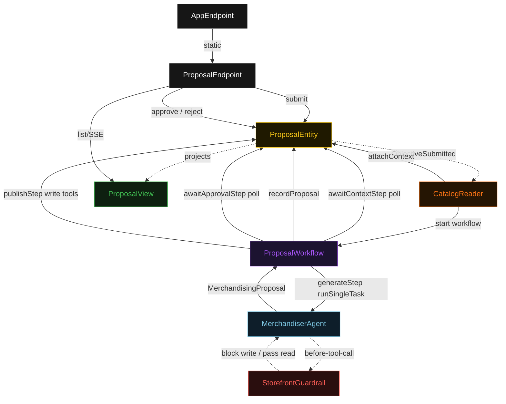
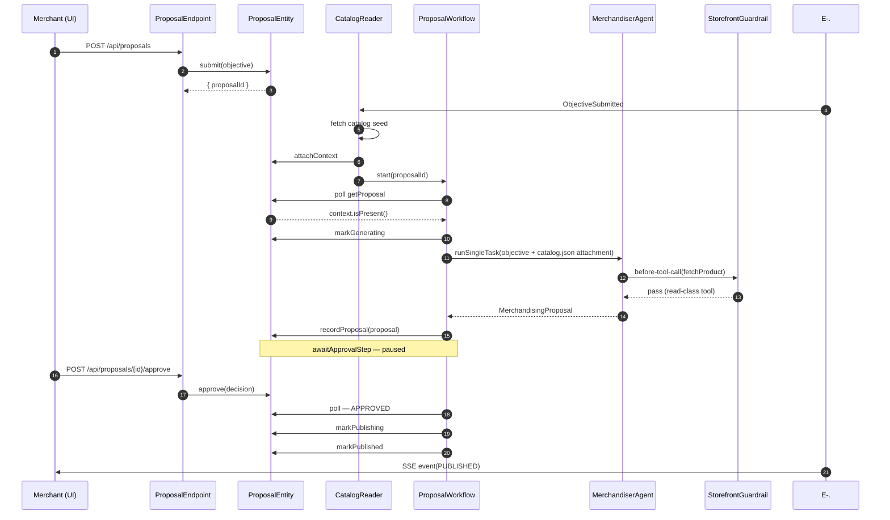
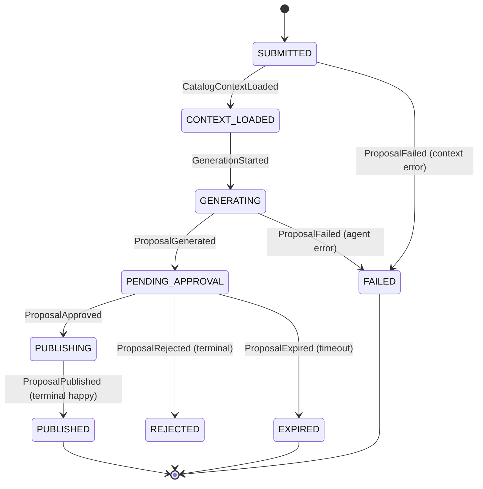
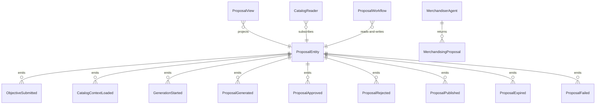

# PLAN — merchandiser

Architectural sketch consumed by `/akka:plan` and rendered on the generated system's Architecture tab. The four mermaid diagrams below carry the theme variables and CSS overrides from Lesson 24; without them, state names render black-on-black and edge labels clip.

---

## Component graph

## Interaction sequence — J1 (happy path)

## State machine — `ProposalEntity`

## Entity model

## Component table — Java file targets

| Component | Path (generated) |
|---|---|
| `ProposalEndpoint` | `api/ProposalEndpoint.java` |
| `AppEndpoint` | `api/AppEndpoint.java` |
| `ProposalEntity` | `application/ProposalEntity.java` (state in `domain/Proposal.java`, events in `domain/ProposalEvent.java`) |
| `CatalogReader` | `application/CatalogReader.java` |
| `ProposalWorkflow` | `application/ProposalWorkflow.java` |
| `MerchandiserAgent` | `application/MerchandiserAgent.java` (tasks in `application/ProposalTasks.java`) |
| `StorefrontGuardrail` | `application/StorefrontGuardrail.java` |
| `ProposalView` | `application/ProposalView.java` |
| `MockModelProvider` (option-a only) | `application/MockModelProvider.java` |
| Bootstrap | `Bootstrap.java` |

## Concurrency notes

- **Per-step timeout**: `awaitContextStep` 15 s, `generateStep` 90 s, `awaitApprovalStep` 259200 s (72 h), `publishStep` 60 s, `error` 5 s. Default step recovery `maxRetries(2).failoverTo(ProposalWorkflow::error)`. The 90 s on `generateStep` accommodates LLM latency and multi-turn tool calls (Lesson 4).
- **Idempotency**: every workflow uses `"proposal-" + proposalId` as the workflow id; `CatalogReader` is allowed to redeliver `ObjectiveSubmitted` events because `ProposalEntity.attachContext` is event-version-guarded — a second context attachment against an already-loaded proposal is a no-op.
- **One agent per proposal**: the AutonomousAgent instance id is `"merchandiser-" + proposalId`, which gives each task its own conversation context. The agent's `capability(...).maxIterationsPerTask(4)` caps guardrail-triggered retries at 4.
- **Guardrail-driven retry**: when `StorefrontGuardrail` rejects a write-class tool call, the rejection is returned as a structured error to the agent loop. The loop counts toward `maxIterationsPerTask`; if all 4 iterations fail to produce a valid proposal, the workflow's `generateStep` fails over to `error` and the entity transitions to `FAILED`.
- **Approval is external**: `awaitApprovalStep` does not poll a second agent — it polls the entity's status field, which is updated by merchant action via `ProposalEndpoint`. The approval gate is a human action boundary, not an LLM boundary.
- **No saga / no compensation on publish**: `publishStep` applies each `ChangeRecommendation` sequentially. If one write-class tool call fails mid-publish, the entity transitions to `FAILED` with the partial set of changes recorded. A deployer needing compensation would extend the publish step with rollback logic per their storefront API's contract.
