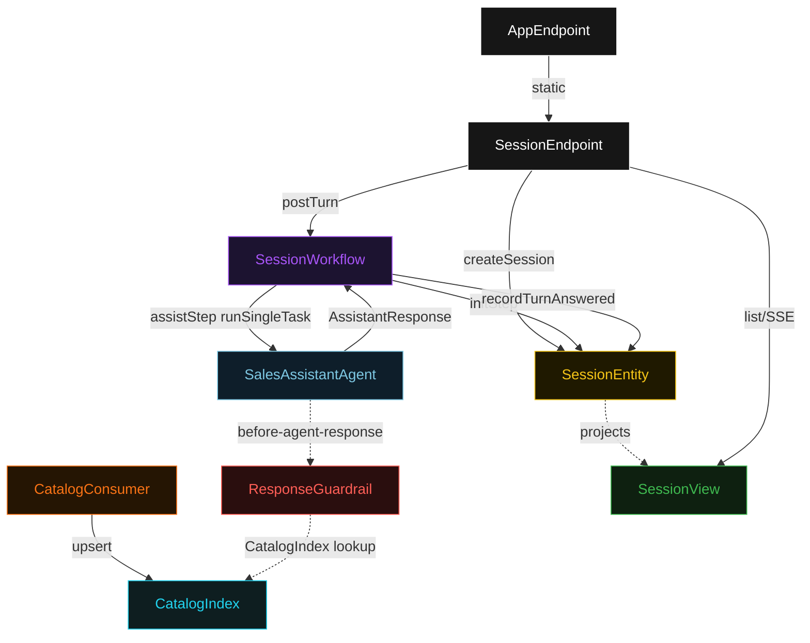
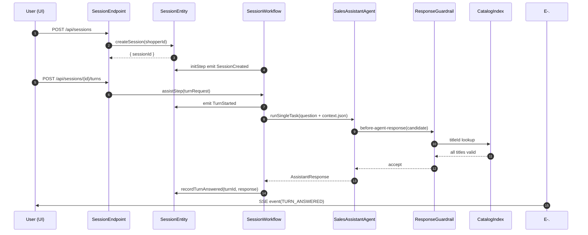
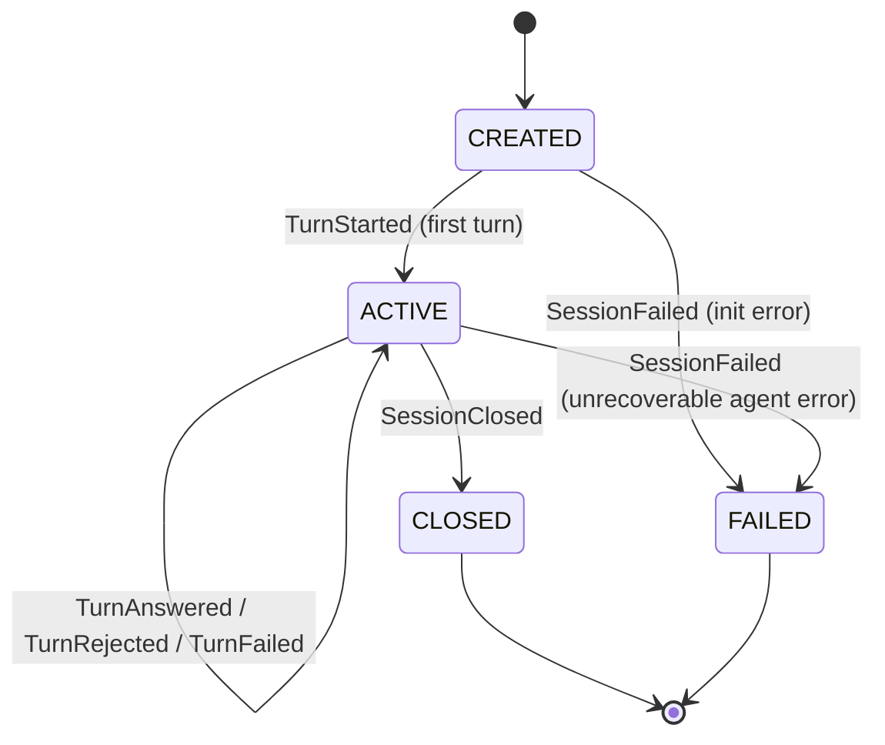
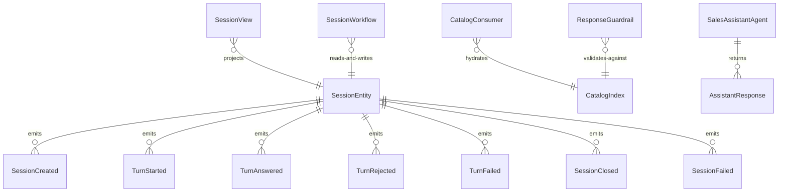

# PLAN — games-sales-assistant

Architectural sketch consumed by `/akka:plan` and rendered on the generated system's Architecture tab. The four mermaid diagrams below carry the theme variables and CSS overrides from Lesson 24; without them, state names render black-on-black and edge labels clip.

---

## Component graph

## Interaction sequence — J1 (happy path)

## State machine — `SessionEntity`

## Entity model

## Component table — Java file targets

| Component | Path (generated) |
|---|---|
| `SessionEndpoint` | `api/SessionEndpoint.java` |
| `AppEndpoint` | `api/AppEndpoint.java` |
| `SessionEntity` | `application/SessionEntity.java` (state in `domain/Session.java`, events in `domain/SessionEvent.java`) |
| `CatalogConsumer` | `application/CatalogConsumer.java` |
| `CatalogIndex` | `application/CatalogIndex.java` |
| `SessionWorkflow` | `application/SessionWorkflow.java` |
| `SalesAssistantAgent` | `application/SalesAssistantAgent.java` (tasks in `application/SalesTasks.java`) |
| `ResponseGuardrail` | `application/ResponseGuardrail.java` |
| `SessionView` | `application/SessionView.java` |
| `MockModelProvider` (option-a only) | `application/MockModelProvider.java` |
| Bootstrap | `Bootstrap.java` |

## Concurrency notes

- **Per-step timeout**: `initStep` 5 s, `assistStep` 45 s, `closeStep` 5 s, `error` 5 s. Default step recovery `maxRetries(2).failoverTo(SessionWorkflow::error)`. The 45 s on `assistStep` accommodates LLM latency (Lesson 4).
- **Session-scoped agent**: the AutonomousAgent instance id is `"assistant-" + sessionId`, which gives each session its own conversation context. The agent's `capability(...).maxIterationsPerTask(3)` caps guardrail-triggered retries at 3.
- **Guardrail-driven retry**: when `ResponseGuardrail` rejects a candidate response, the rejection is returned as a structured error to the agent loop. The loop counts toward `maxIterationsPerTask`; if all 3 iterations fail validation, `assistStep` fails over to `error` and the entity records `TurnRejected` with the final rejection code.
- **Idempotency**: workflow id is `"session-" + sessionId`; each turn within the session is handled as a distinct `assistStep` call with `turnId` as the task differentiator.
- **CatalogIndex hot-reload**: `CatalogConsumer` may receive multiple `CatalogUpdated` events (e.g., bulk catalog refresh). `CatalogIndex.upsert` is thread-safe; partial updates are safe because the index is only used for title-existence validation, not for price computation.
- **No saga / no compensation**: every step is either a pure write to the entity or a single-task agent call. There is nothing external to roll back.
