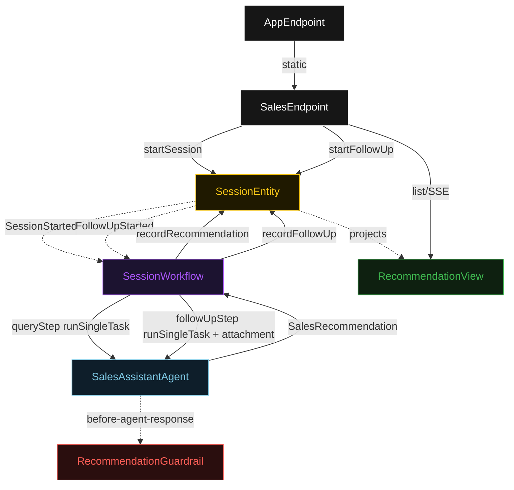
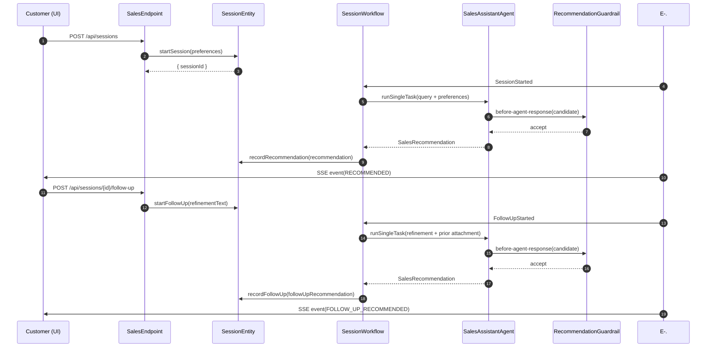
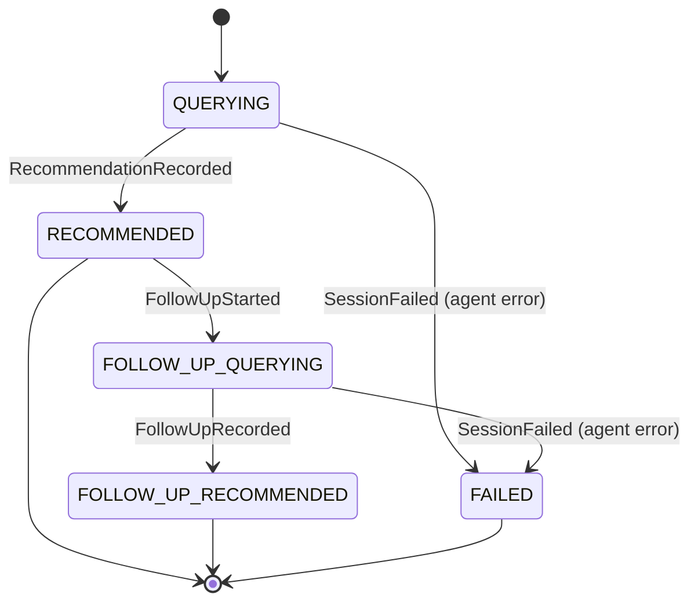
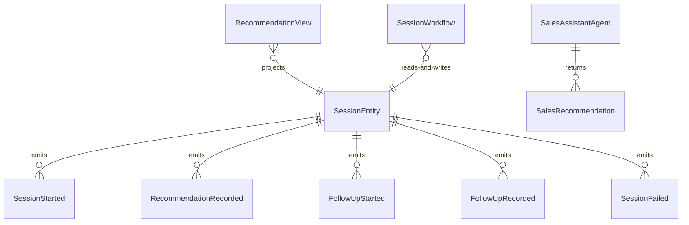

# PLAN — games-sales

Architectural sketch consumed by `/akka:plan` and rendered on the generated system's Architecture tab. The four mermaid diagrams below carry the theme variables and CSS overrides from Lesson 24; without them, state names render black-on-black and edge labels clip.

---

## Component graph

## Interaction sequence — J1 (happy path)

## State machine — `SessionEntity`

## Entity model

## Component table — Java file targets

| Component | Path (generated) |
|---|---|
| `SalesEndpoint` | `api/SalesEndpoint.java` |
| `AppEndpoint` | `api/AppEndpoint.java` |
| `SessionEntity` | `application/SessionEntity.java` (state in `domain/Session.java`, events in `domain/SessionEvent.java`) |
| `SessionWorkflow` | `application/SessionWorkflow.java` |
| `SalesAssistantAgent` | `application/SalesAssistantAgent.java` (tasks in `application/SessionTasks.java`) |
| `RecommendationGuardrail` | `application/RecommendationGuardrail.java` |
| `RecommendationView` | `application/RecommendationView.java` |
| `MockModelProvider` (option-a only) | `application/MockModelProvider.java` |
| Bootstrap | `Bootstrap.java` |

## Concurrency notes

- **Per-step timeout**: `queryStep` 60 s, `followUpStep` 60 s, `error` 5 s. Default step recovery `maxRetries(2).failoverTo(SessionWorkflow::error)`. The 60 s on each agent step accommodates LLM latency (Lesson 4).
- **Idempotency**: every workflow uses `"session-" + sessionId + "-" + queryIndex` as the workflow id; re-delivering a `SessionStarted` event to an already-running workflow is a no-op because the workflow checks session status before starting.
- **One agent per session**: the AutonomousAgent instance id is `"agent-" + sessionId`, giving each session its own conversation context. The agent's `capability(...).maxIterationsPerTask(3)` caps guardrail-triggered retries at 3.
- **Guardrail-driven retry**: when `RecommendationGuardrail` rejects a candidate response, the rejection is returned as a structured error to the agent loop. If all 3 iterations fail validation, the workflow's step fails over to `error` and the entity transitions to `FAILED`.
- **Follow-up context via attachment**: the prior `SalesRecommendation` is serialised to JSON and passed as a task attachment named `prior-recommendation.json`, never inlined into the instruction text.
- **No saga / no compensation**: each step either writes an append-only event or calls the agent. There is nothing external to roll back.
