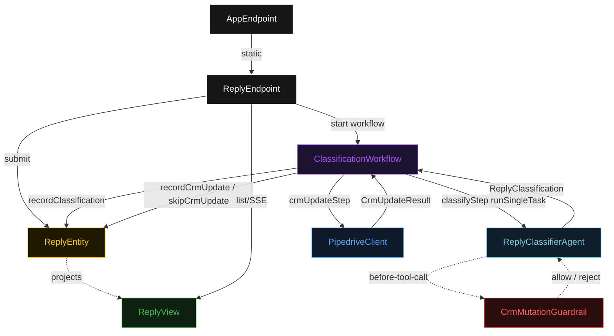
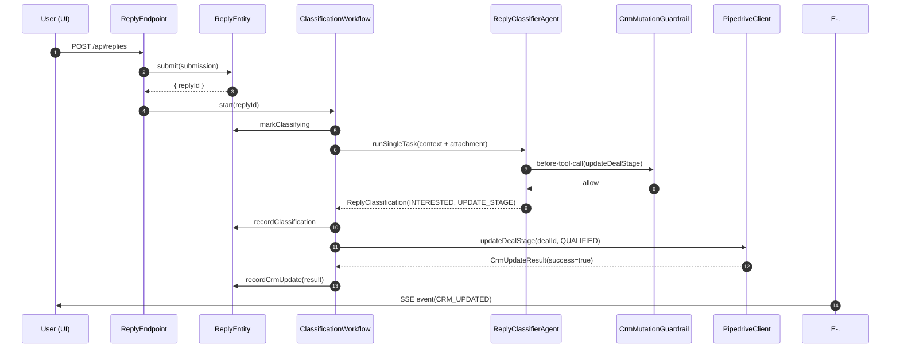
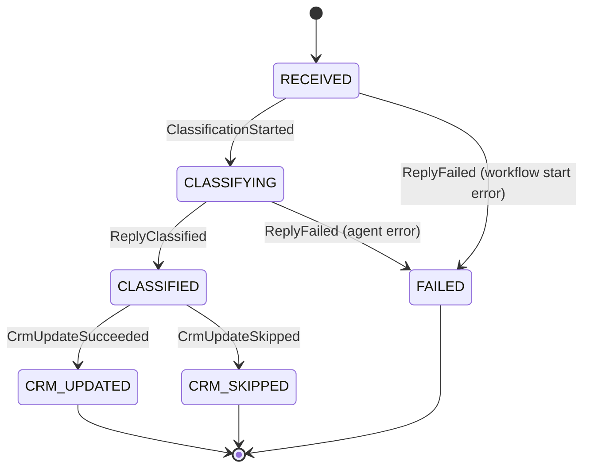
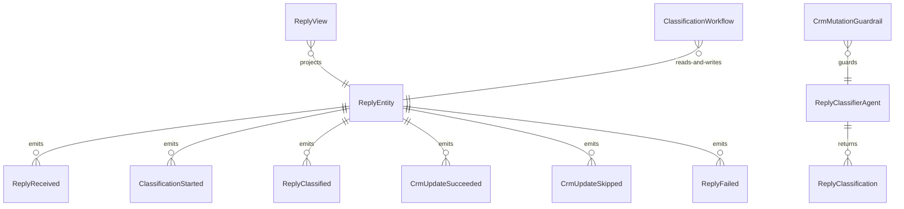

# PLAN — reply-classifier

Architectural sketch consumed by `/akka:plan` and rendered on the generated system's Architecture tab. The four mermaid diagrams below carry the theme variables and CSS overrides from Lesson 24; without them, state names render black-on-black and edge labels clip.

---

## Component graph

## Interaction sequence — J1 (happy path)

## State machine — `ReplyEntity`

## Entity model

## Component table — Java file targets

| Component | Path (generated) |
|---|---|
| `ReplyEndpoint` | `api/ReplyEndpoint.java` |
| `AppEndpoint` | `api/AppEndpoint.java` |
| `ReplyEntity` | `application/ReplyEntity.java` (state in `domain/Reply.java`, events in `domain/ReplyEvent.java`) |
| `ClassificationWorkflow` | `application/ClassificationWorkflow.java` |
| `ReplyClassifierAgent` | `application/ReplyClassifierAgent.java` (tasks in `application/ReplyTasks.java`) |
| `CrmMutationGuardrail` | `application/CrmMutationGuardrail.java` |
| `PipedriveClient` | `application/PipedriveClient.java` (interface + `SimulatedPipedriveClient.java`) |
| `ReplyView` | `application/ReplyView.java` |
| `MockModelProvider` (option-a only) | `application/MockModelProvider.java` |
| Bootstrap | `Bootstrap.java` |

## Concurrency notes

- **Per-step timeout**: `classifyStep` 60 s, `crmUpdateStep` 15 s, `error` 5 s. Default step recovery `maxRetries(2).failoverTo(ClassificationWorkflow::error)`. The 60 s on `classifyStep` accommodates LLM latency (Lesson 4).
- **Idempotency**: every workflow uses `"classify-" + replyId` as the workflow id; starting a second workflow for the same `replyId` is a no-op because the entity is already past `RECEIVED`.
- **One agent per reply**: the AutonomousAgent instance id is `"classifier-" + replyId`, giving each task its own conversation context. The agent's `capability(...).maxIterationsPerTask(3)` caps guardrail-triggered retries at 3.
- **Guardrail-driven retry**: when `CrmMutationGuardrail` rejects a tool call, the rejection is returned as a structured error to the agent loop. The loop counts toward `maxIterationsPerTask`; if all 3 iterations fail validation, the workflow's `classifyStep` fails over to `error` and the entity transitions to `FAILED`.
- **CRM update is a workflow step, not an agent tool**: `PipedriveClient.updateDealStage` is called in `crmUpdateStep`, not directly from agent code. The guardrail governs the agent's *intent* (proposed tool call); the workflow's step makes the actual external call after the guardrail passes.
- **No saga / no compensation**: each step is either an append-only entity write or a single external call. There is nothing to roll back beyond marking the entity `FAILED`.
