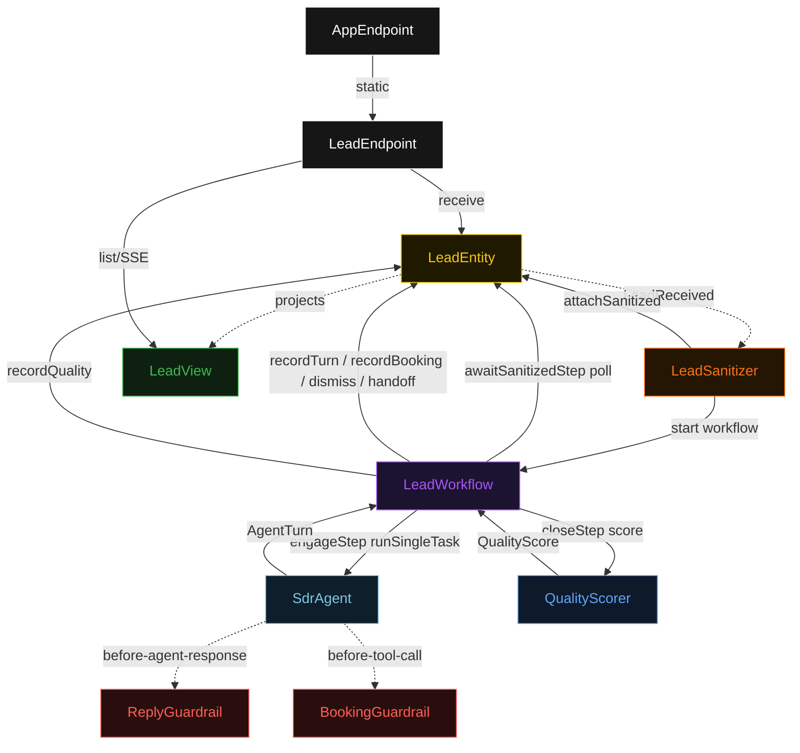
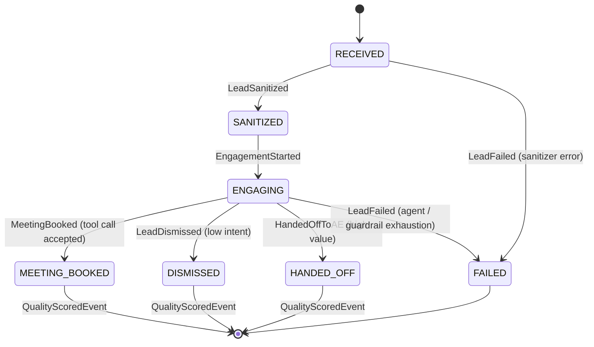
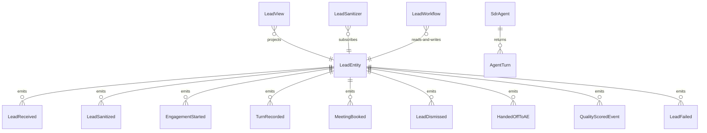

# PLAN — sdr-lead-nurture

Architectural sketch consumed by `/akka:plan` and rendered on the generated system's Architecture tab. The four mermaid diagrams below carry the theme variables and CSS overrides from Lesson 24; without them, state names render black-on-black and edge labels clip.

---

## Component graph



## Interaction sequence — J1 (happy path, meeting booked)

```mermaid
sequenceDiagram
  autonumber
  participant U as User (UI)
  participant API as LeadEndpoint
  participant E as LeadEntity
  participant S as LeadSanitizer
  participant W as LeadWorkflow
  participant A as SdrAgent
  participant RG as ReplyGuardrail
  participant BG as BookingGuardrail
  participant Sc as QualityScorer

  U->>API: POST /api/leads
  API->>E: receive(contact)
  E-->>API: { leadId }
  E-.->>S: LeadReceived
  S->>S: strip PII
  S->>E: attachSanitized
  S->>W: start(leadId)
  W->>E: poll getLead
  E-->>W: sanitized.isPresent()
  W->>E: startEngagement
  W->>A: runSingleTask(lead context)
  A->>RG: before-agent-response(candidate)
  RG-->>A: accept
  A-->>W: AgentTurn (discovery reply)
  W->>E: recordTurn
  Note over W,A: user replies; next turn
  W->>A: runSingleTask(updated context)
  A->>RG: before-agent-response(booking proposal)
  RG-->>A: accept
  A->>BG: before-tool-call(BOOK_MEETING params)
  BG-->>A: accept
  A-->>W: AgentTurn (toolCall=BOOK_MEETING)
  W->>E: recordBooking(booking)
  W->>Sc: score(conversation, close action)
  Sc-->>W: QualityScore
  W->>E: recordQuality(quality)
  E-.->>U: SSE event(MEETING_BOOKED)
```

## State machine — `LeadEntity`



## Entity model



## Component table — Java file targets

| Component | Path (generated) |
|---|---|
| `LeadEndpoint` | `api/LeadEndpoint.java` |
| `AppEndpoint` | `api/AppEndpoint.java` |
| `LeadEntity` | `application/LeadEntity.java` (state in `domain/Lead.java`, events in `domain/LeadEvent.java`) |
| `LeadSanitizer` | `application/LeadSanitizer.java` |
| `LeadWorkflow` | `application/LeadWorkflow.java` |
| `SdrAgent` | `application/SdrAgent.java` (tasks in `application/LeadTasks.java`) |
| `ReplyGuardrail` | `application/ReplyGuardrail.java` |
| `BookingGuardrail` | `application/BookingGuardrail.java` |
| `QualityScorer` | `application/QualityScorer.java` |
| `CalendarStub` | `application/CalendarStub.java` |
| `LeadView` | `application/LeadView.java` |
| `MockModelProvider` (option-a only) | `application/MockModelProvider.java` |
| Bootstrap | `Bootstrap.java` |

## Concurrency notes

- **Per-step timeout**: `awaitSanitizedStep` 15 s, `engageStep` 60 s, `closeStep` 5 s, `error` 5 s. Default step recovery `maxRetries(2).failoverTo(LeadWorkflow::error)`. The 60 s on `engageStep` accommodates LLM latency (Lesson 4).
- **Idempotency**: every workflow uses `"lead-" + leadId` as the workflow id; `LeadSanitizer` Consumer is allowed to redeliver `LeadReceived` events because `LeadEntity.attachSanitized` is event-version-guarded — a second sanitize attempt against an already-sanitized lead is a no-op.
- **One agent per lead**: the AutonomousAgent instance id is `"sdr-" + leadId`, giving each lead its own conversation context. The agent's `capability(...).maxIterationsPerTask(5)` caps guardrail-triggered retries.
- **Two guardrails on one agent**: `ReplyGuardrail` (before-agent-response) and `BookingGuardrail` (before-tool-call) are both registered on `SdrAgent`. Each check is independent; a candidate response that fails ReplyGuardrail never reaches the tool-call dispatch.
- **Quality scorer is synchronous and deterministic**: `QualityScorer` runs in-process inside `closeStep`. No LLM call — the same conversation always scores the same. This is a deliberate single-agent guarantee.
- **CalendarStub is in-process**: no external network, no auth tokens required to run the blueprint. A deployer replaces `CalendarStub` with a real calendar client and supplies credentials via the same key-sourcing mechanism as the model-provider key.
- **No saga / no compensation**: every step is append-only event writes or a single-task agent call. Nothing external to roll back.
