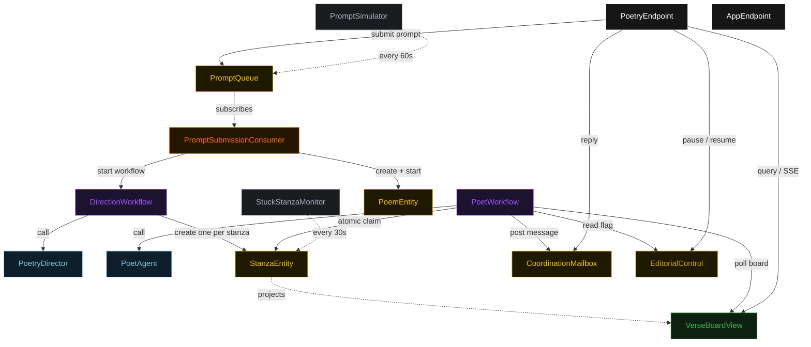
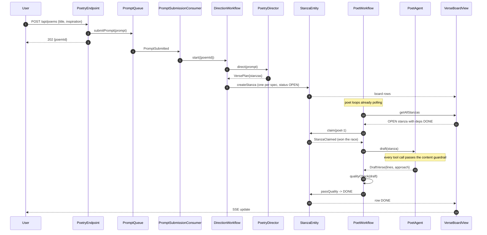
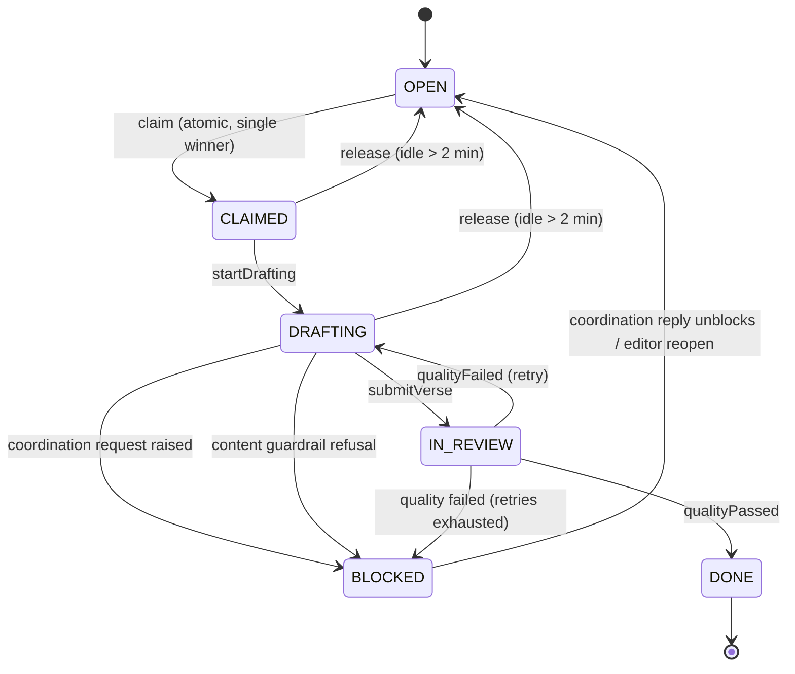
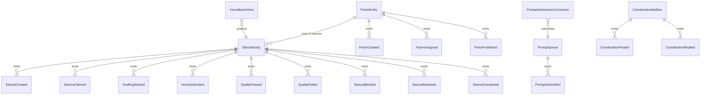

# PLAN — team-poems-multi-agent

Architectural sketch consumed by `/akka:plan` (or skipped if `/akka:specify` covers it). Diagrams are rendered on the generated system's Architecture tab with the Akka theme variables and the Lesson 24 state-label CSS overrides.

---

## Component graph

Solid arrows are synchronous commands; dashed arrows are event subscriptions and scheduled ticks. `PoetAgent` is one agent class run as several instances (`poet-1`, `poet-2`, `poet-3`); each instance is driven by its own `PoetWorkflow`.

## Interaction sequence — J1 (happy path)

## State machine — `StanzaEntity`

## Entity model

## Component table — Java file targets

| Component | Path (generated) |
|---|---|
| `PoetryDirector` | `application/PoetryDirector.java` |
| `PoetAgent` | `application/PoetAgent.java` |
| `PoemTasks` | `application/PoemTasks.java` |
| `QualityChecker` | `application/QualityChecker.java` |
| `DirectionWorkflow` | `application/DirectionWorkflow.java` |
| `PoetWorkflow` | `application/PoetWorkflow.java` |
| `StanzaEntity` | `application/StanzaEntity.java` (state in `domain/Stanza.java`, events in `domain/StanzaEvent.java`) |
| `PoemEntity` | `application/PoemEntity.java` (state in `domain/Poem.java`, events in `domain/PoemEvent.java`) |
| `CoordinationMailbox` | `application/CoordinationMailbox.java` (state + events in `domain/`) |
| `PromptQueue` | `application/PromptQueue.java` |
| `EditorialControl` | `application/EditorialControl.java` |
| `VerseBoardView` | `application/VerseBoardView.java` |
| `PromptSubmissionConsumer` | `application/PromptSubmissionConsumer.java` |
| `PromptSimulator` | `application/PromptSimulator.java` |
| `StuckStanzaMonitor` | `application/StuckStanzaMonitor.java` |
| `PoetryEndpoint` | `api/PoetryEndpoint.java` |
| `AppEndpoint` | `api/AppEndpoint.java` |
| `Bootstrap` | `Bootstrap.java` |

Akka component count: **2 autonomous-agent · 2 workflow · 4 event-sourced-entity · 1 key-value-entity · 1 view · 1 consumer · 2 timed-action · 2 http-endpoint · 1 service-setup**.

## Concurrency notes

- **Atomic claim is the whole pattern.** `StanzaEntity` is a single-writer; `claim(poetId)` emits `StanzaClaimed` only when the current status is `OPEN`. Two poet workflows that read the same `OPEN` stanza from the view and both call `claim` are serialised by the entity — the first wins, the second receives the already-claimed `Stanza` and returns to polling. No lock, no external queue.
- **Workflow step timeouts:** `DirectionWorkflow.directStep` and `PoetWorkflow.draftStep` call agents, so each sets an explicit `stepTimeout` of 90 s (Lesson 4).
- **Idle polling:** `PoetWorkflow.pollStep` self-schedules a 5 s resume timer when the team is paused or no eligible `OPEN` stanza exists.
- **Dependency gate:** a stanza is eligible only when every title in its `dependsOn` resolves to a `DONE` stanza on the board. The poll filters client-side (Lesson 2).
- **Release for liveness:** `StuckStanzaMonitor` returns a stanza claimed-but-idle for more than two minutes to `OPEN`.
- **Quality gate:** `QualityChecker` is a deterministic pure function (no LLM call); the same draft always yields the same `QualityReport`.
- **Pause:** `EditorialControl` is read at the top of `pollStep` and inside the content guardrail, so a pause both stops new claims and can refuse any in-flight tool call.
- **Idempotency:** deterministic `stanzaId = poemId + "-s" + index` makes `createStanza` idempotent if `DirectionWorkflow.createStanzasStep` is retried.
