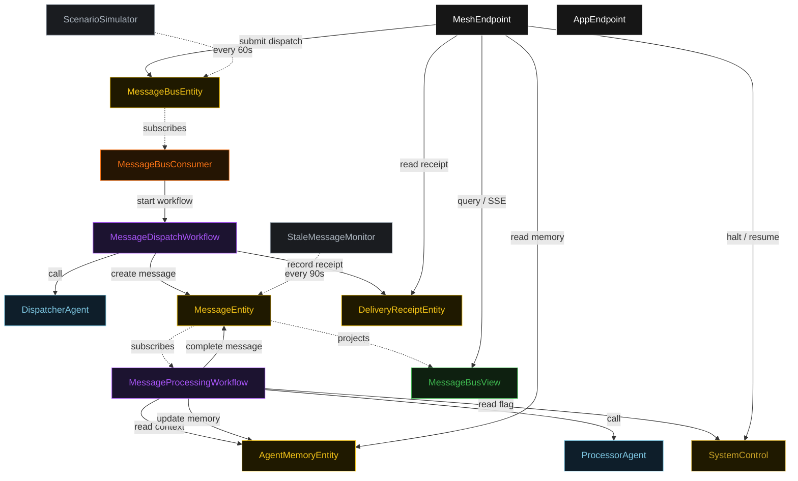
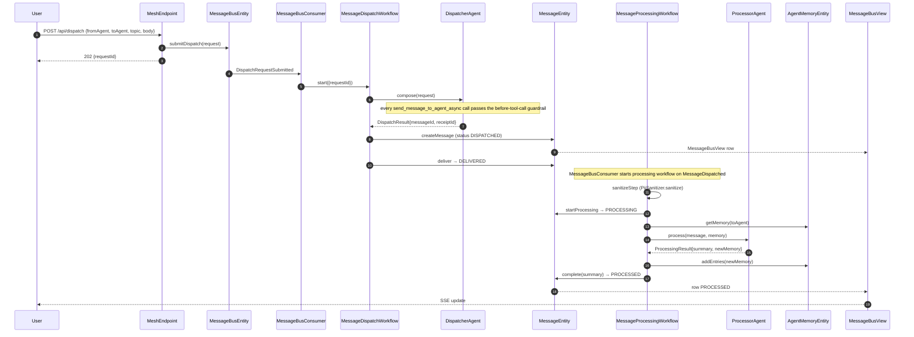
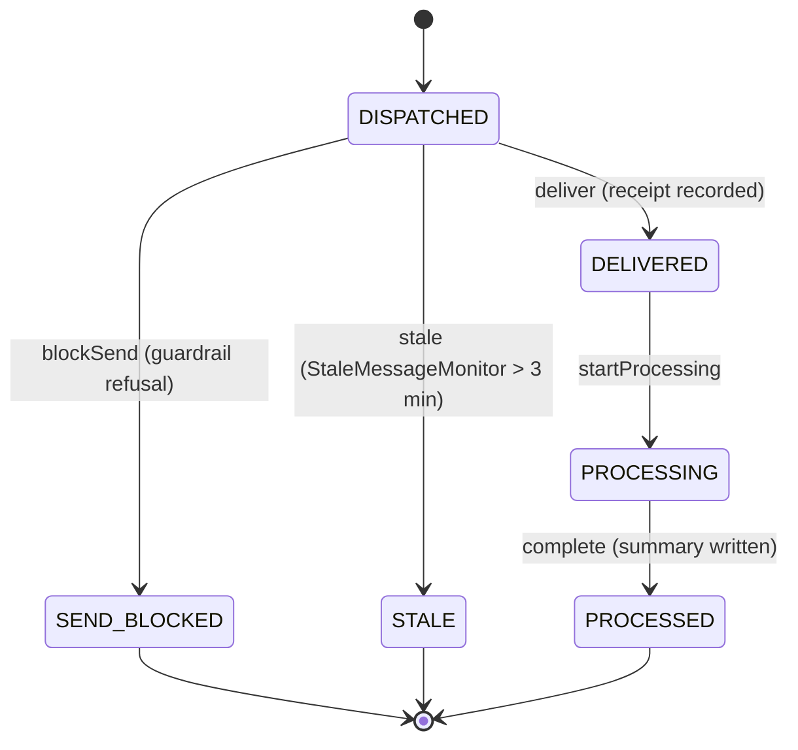
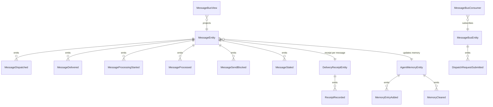

# PLAN — akka-async-agent-mesh

Architectural sketch consumed by `/akka:plan` (or skipped if `/akka:specify` covers it). Diagrams are rendered on the generated system's Architecture tab with the Akka theme variables and the Lesson 24 state-label CSS overrides.

---

## Component graph

Solid arrows are synchronous commands; dashed arrows are event subscriptions and scheduled ticks. `ProcessorAgent` is one agent class run as two instances (`agent-alpha`, `agent-beta`); each instance processes messages addressed to it via its own `MessageProcessingWorkflow`.

## Interaction sequence — J1 (happy path)

## State machine — `MessageEntity`

## Entity model

## Component table — Java file targets

| Component | Path (generated) |
|---|---|
| `DispatcherAgent` | `application/DispatcherAgent.java` |
| `ProcessorAgent` | `application/ProcessorAgent.java` |
| `MeshTasks` | `application/MeshTasks.java` |
| `PiiSanitizer` | `application/PiiSanitizer.java` |
| `MessageDispatchWorkflow` | `application/MessageDispatchWorkflow.java` |
| `MessageProcessingWorkflow` | `application/MessageProcessingWorkflow.java` |
| `MessageEntity` | `application/MessageEntity.java` (state in `domain/Message.java`, events in `domain/MessageEvent.java`) |
| `AgentMemoryEntity` | `application/AgentMemoryEntity.java` (state in `domain/AgentMemory.java`, events in `domain/AgentMemoryEvent.java`) |
| `DeliveryReceiptEntity` | `application/DeliveryReceiptEntity.java` |
| `MessageBusEntity` | `application/MessageBusEntity.java` |
| `SystemControl` | `application/SystemControl.java` |
| `MessageBusView` | `application/MessageBusView.java` |
| `MessageBusConsumer` | `application/MessageBusConsumer.java` |
| `ScenarioSimulator` | `application/ScenarioSimulator.java` |
| `StaleMessageMonitor` | `application/StaleMessageMonitor.java` |
| `MeshEndpoint` | `api/MeshEndpoint.java` |
| `AppEndpoint` | `api/AppEndpoint.java` |
| `Bootstrap` | `Bootstrap.java` |

Akka component count: **2 autonomous-agent · 2 workflow · 4 event-sourced-entity · 1 key-value-entity · 1 view · 1 consumer · 2 timed-action · 2 http-endpoint · 1 service-setup**.

## Concurrency notes

- **Async fire-and-forget is the whole pattern.** `MessageDispatchWorkflow` terminates as soon as the delivery receipt is recorded — it does not wait for `MessageProcessingWorkflow` to start or finish. The two workflows run in parallel, connected only by `MessageEntity` events that `MessageBusConsumer` turns into new workflow starts.
- **Workflow step timeouts:** `MessageDispatchWorkflow.composeStep` and `MessageProcessingWorkflow.processStep` call agents, so each sets an explicit `stepTimeout` of 90 s (Lesson 4). The default 5 s timeout would expire mid-LLM-call.
- **PII sanitizer fires before any write.** `MessageProcessingWorkflow.sanitizeStep` runs before `processStep` and before any call to `AgentMemoryEntity` or `MessageEntity.complete`, so no unsanitized payload reaches durable storage.
- **Before-tool-call guardrail reads the roster.** The G1 guardrail on `DispatcherAgent` reads `async-mesh.agents` from `application.conf` at startup; a recipient not in that list is refused before the `send_message_to_agent_async` tool executes, and the request is recorded `SEND_BLOCKED`.
- **Halt:** `SystemControl` is read at the top of `MessageProcessingWorkflow.receiveStep`, so a halt stops new processing starts without affecting the dispatch side that has already recorded its receipt.
- **Stale detection:** `StaleMessageMonitor` fires every 90 s and advances `DISPATCHED` messages older than 3 minutes to `STALE`, so the board never accumulates orphaned rows from failed workflows.
- **Memory isolation:** each agent instance (`agent-alpha`, `agent-beta`) has its own `AgentMemoryEntity` keyed by agent id, so the long-term memory of one agent cannot contaminate the other's context.
