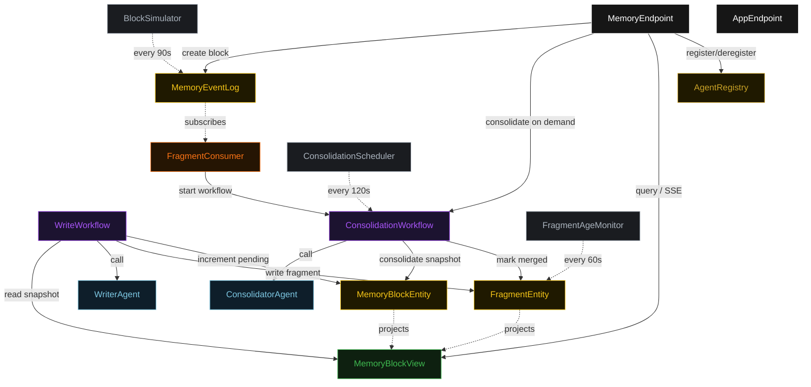
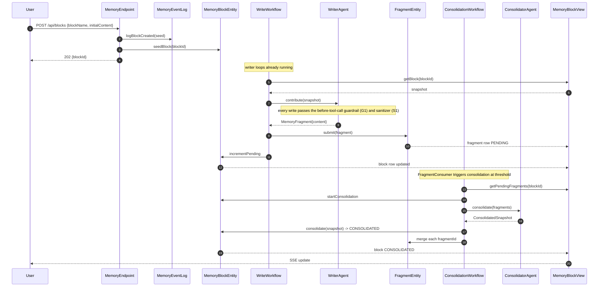
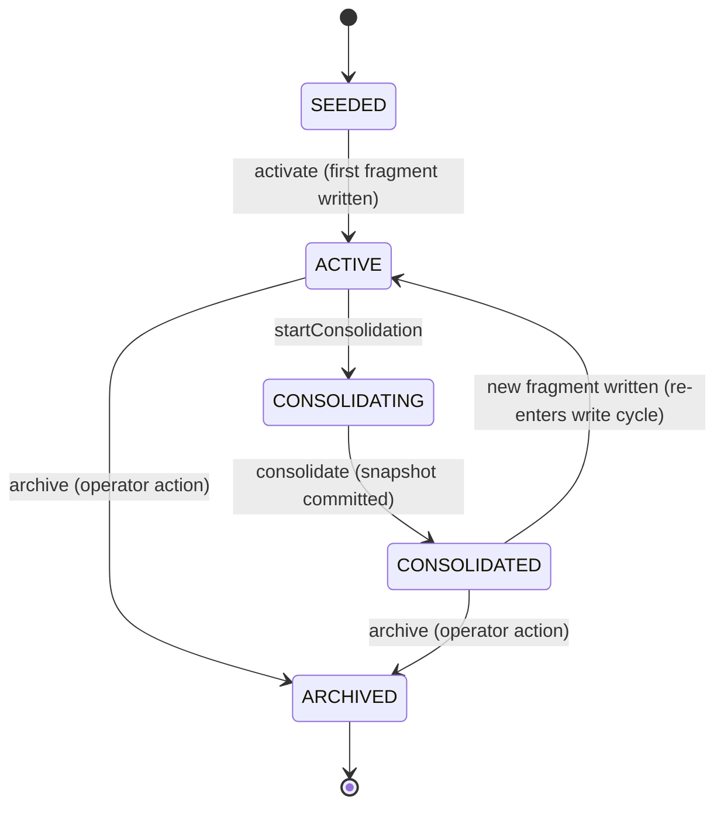
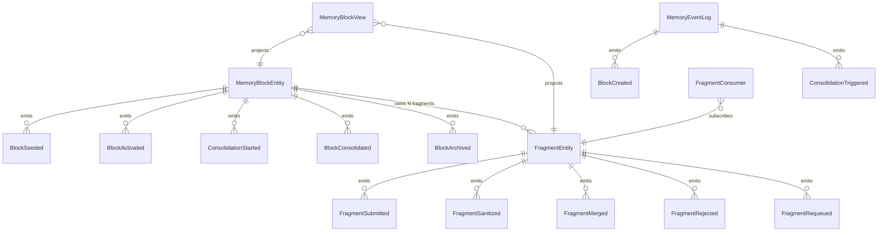

# PLAN — shared-memory-multi-agent

Architectural sketch consumed by `/akka:plan` (or skipped if `/akka:specify` covers it). Diagrams are rendered on the generated system's Architecture tab with the Akka theme variables and the Lesson 24 state-label CSS overrides.

---

## Component graph

Solid arrows are synchronous commands; dashed arrows are event subscriptions and scheduled ticks. `WriterAgent` is one agent class run as several instances (`writer-1`, `writer-2`, `writer-3`); each instance is driven by its own `WriteWorkflow`.

## Interaction sequence — J1 (happy path)

## State machine — `MemoryBlockEntity`

## Entity model

## Component table — Java file targets

| Component | Path (generated) |
|---|---|
| `WriterAgent` | `application/WriterAgent.java` |
| `ConsolidatorAgent` | `application/ConsolidatorAgent.java` |
| `MemoryTasks` | `application/MemoryTasks.java` |
| `WriteWorkflow` | `application/WriteWorkflow.java` |
| `ConsolidationWorkflow` | `application/ConsolidationWorkflow.java` |
| `MemoryBlockEntity` | `application/MemoryBlockEntity.java` (state in `domain/MemoryBlock.java`, events in `domain/MemoryBlockEvent.java`) |
| `FragmentEntity` | `application/FragmentEntity.java` (state in `domain/Fragment.java`, events in `domain/FragmentEvent.java`) |
| `MemoryEventLog` | `application/MemoryEventLog.java` |
| `AgentRegistry` | `application/AgentRegistry.java` |
| `MemoryBlockView` | `application/MemoryBlockView.java` |
| `FragmentConsumer` | `application/FragmentConsumer.java` |
| `BlockSimulator` | `application/BlockSimulator.java` |
| `ConsolidationScheduler` | `application/ConsolidationScheduler.java` |
| `FragmentAgeMonitor` | `application/FragmentAgeMonitor.java` |
| `MemoryEndpoint` | `api/MemoryEndpoint.java` |
| `AppEndpoint` | `api/AppEndpoint.java` |
| `Bootstrap` | `Bootstrap.java` |

Akka component count: **2 autonomous-agent · 2 workflow · 3 event-sourced-entity · 1 key-value-entity · 1 view · 1 consumer · 3 timed-action · 2 http-endpoint · 1 service-setup**.

## Concurrency notes

- **Atomic write is the whole pattern.** `MemoryBlockEntity` is a single-writer; `consolidate(snapshot)` emits `BlockConsolidated` only when the current status is `CONSOLIDATING`. Two consolidation workflows that race for the same block are serialised by the entity — the first wins, the second receives a rejection and is discarded.
- **Workflow step timeouts:** `WriteWorkflow.contributeStep` and `ConsolidationWorkflow.consolidateStep` call agents, so each sets an explicit `stepTimeout` (90 s and 120 s respectively — Lesson 4). The default 5 s timeout would expire mid-LLM-call.
- **Write cycle throttle:** `WriteWorkflow.scheduleStep` self-schedules a 30 s resume timer between cycles, so writers are staggered, not racing every tick.
- **Consolidation guard:** `FragmentConsumer` only starts a `ConsolidationWorkflow` if one is not already running for the block id (the workflow id matches the block id, so a duplicate start is a no-op).
- **Re-queue for liveness:** `FragmentAgeMonitor` re-queues fragments `PENDING` for more than three minutes to `REQUEUED` status so a stalled consolidation does not leave a block permanently dirty.
- **Guardrail placement:** the G1 before-tool-call guardrail fires inside `WriteWorkflow.contributeStep` before the write is dispatched; the S1 sanitizer runs in `sanitizeStep` after the agent returns but before `FragmentEntity.submit`; both are in-process, not network calls.
- **View query scope:** neither `getAllBlocks` nor `getFragmentsForBlock` has a WHERE filter on an enum column — callers filter status client-side (Lesson 2).
- **Idempotency:** `fragmentId = blockId + "-f-" + writerId + "-" + cycle` makes `submit` idempotent if `WriteWorkflow.writeFragmentStep` is retried.
