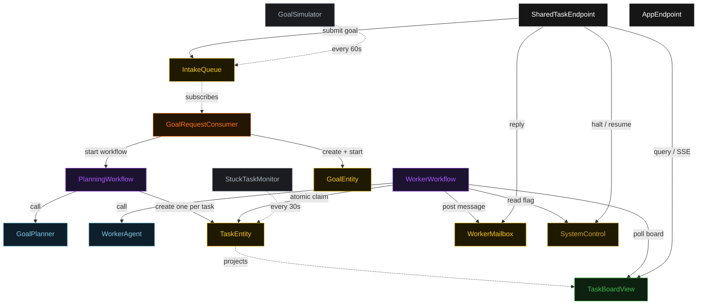
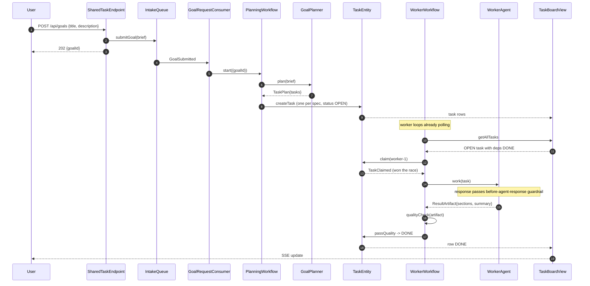
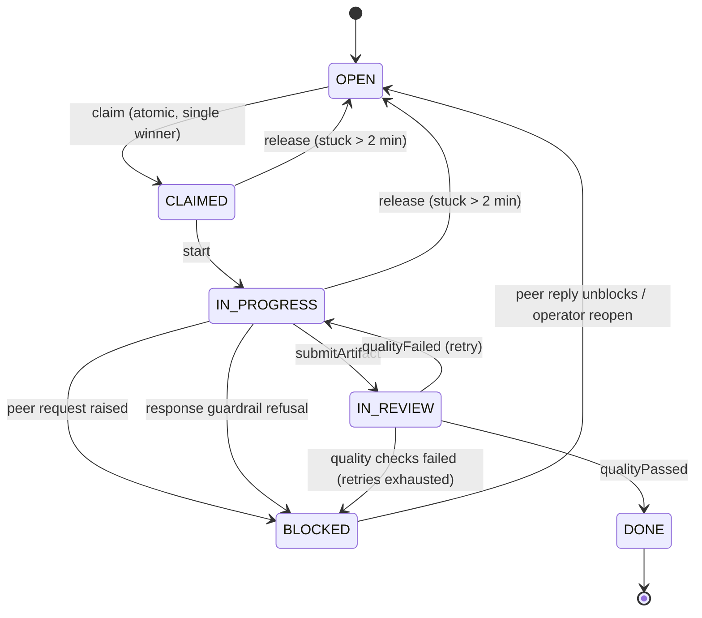
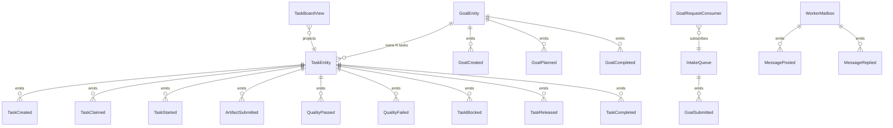

# PLAN — shared-task-team

Architectural sketch consumed by `/akka:plan` (or skipped if `/akka:specify` covers it). Diagrams are rendered on the generated system's Architecture tab with the Akka theme variables and the Lesson 24 state-label CSS overrides.

---

## Component graph

Solid arrows are synchronous commands; dashed arrows are event subscriptions and scheduled ticks. `WorkerAgent` is one agent class run as several instances (`worker-1`, `worker-2`, `worker-3`); each instance is driven by its own `WorkerWorkflow`.

## Interaction sequence — J1 (happy path)

## State machine — `TaskEntity`

## Entity model

## Component table — Java file targets

| Component | Path (generated) |
|---|---|
| `GoalPlanner` | `application/GoalPlanner.java` |
| `WorkerAgent` | `application/WorkerAgent.java` |
| `TeamTasks` | `application/TeamTasks.java` |
| `QualityChecker` | `application/QualityChecker.java` |
| `PlanningWorkflow` | `application/PlanningWorkflow.java` |
| `WorkerWorkflow` | `application/WorkerWorkflow.java` |
| `TaskEntity` | `application/TaskEntity.java` (state in `domain/Task.java`, events in `domain/TaskEvent.java`) |
| `GoalEntity` | `application/GoalEntity.java` (state in `domain/Goal.java`, events in `domain/GoalEvent.java`) |
| `WorkerMailbox` | `application/WorkerMailbox.java` (state + events in `domain/`) |
| `IntakeQueue` | `application/IntakeQueue.java` |
| `SystemControl` | `application/SystemControl.java` |
| `TaskBoardView` | `application/TaskBoardView.java` |
| `GoalRequestConsumer` | `application/GoalRequestConsumer.java` |
| `GoalSimulator` | `application/GoalSimulator.java` |
| `StuckTaskMonitor` | `application/StuckTaskMonitor.java` |
| `SharedTaskEndpoint` | `api/SharedTaskEndpoint.java` |
| `AppEndpoint` | `api/AppEndpoint.java` |
| `Bootstrap` | `Bootstrap.java` |

Akka component count: **2 autonomous-agent · 2 workflow · 4 event-sourced-entity · 1 key-value-entity · 1 view · 1 consumer · 2 timed-action · 2 http-endpoint · 1 service-setup**.

## Concurrency notes

- **Atomic claim is the whole pattern.** `TaskEntity` is a single-writer; `claim(workerId)` emits `TaskClaimed` only when the current status is `OPEN`. Two worker workflows that read the same `OPEN` task from the view and both call `claim` are serialised by the entity — the first wins, the second receives the already-claimed `Task` and returns to polling. No lock, no external queue.
- **Workflow step timeouts:** `PlanningWorkflow.decomposeStep` and `WorkerWorkflow.workStep` call agents, so each sets an explicit `stepTimeout` of 90 s (Lesson 4). The default 5 s timeout would expire mid-LLM-call.
- **Idle polling:** `WorkerWorkflow.pollStep` self-schedules a 5 s resume timer when the team is halted or no eligible `OPEN` task exists, so an idle worker is a paused workflow, not a busy loop.
- **Dependency gate:** a task is eligible only when every title in its `dependsOn` resolves to a `DONE` task on the board. The poll filters on this client-side (the view exposes no enum-status filter — Lesson 2).
- **Release for liveness:** `StuckTaskMonitor` returns a task claimed-but-idle for more than two minutes to `OPEN`, so a worker that fails mid-task does not strand work. `release` is a no-op unless the task is `CLAIMED` or `IN_PROGRESS`.
- **Quality check:** `QualityChecker` is a deterministic pure function (no LLM call) so the gate is reproducible; the same artifact always yields the same `QualityReport`. The Maven `test` phase enforces the same gate at build time.
- **Halt:** `SystemControl` is read at the top of `pollStep` and inside the before-agent-response guardrail, so a halt both stops new claims and refuses any in-flight response generation (control HT1).
- **Idempotency:** deterministic `taskId = goalId + "-t" + index` makes `createTask` idempotent if `PlanningWorkflow.createTasksStep` is retried.
- **On-decision eval:** after a goal completes, the eval scores consistency across worker contributions. It is non-blocking — it records results alongside `GoalEntity` but does not gate the `COMPLETED` transition.
