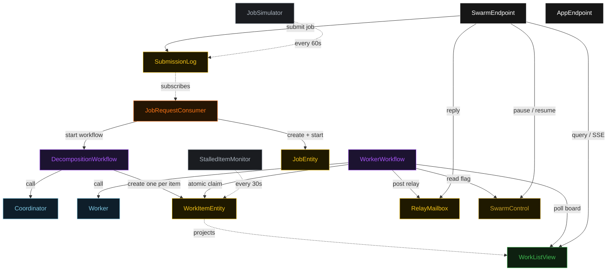
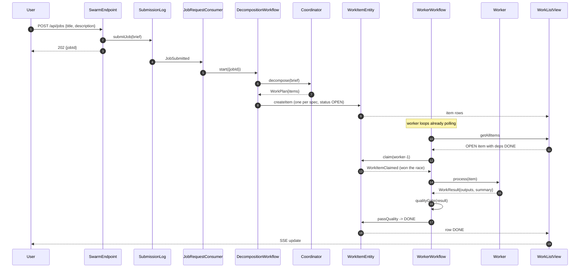
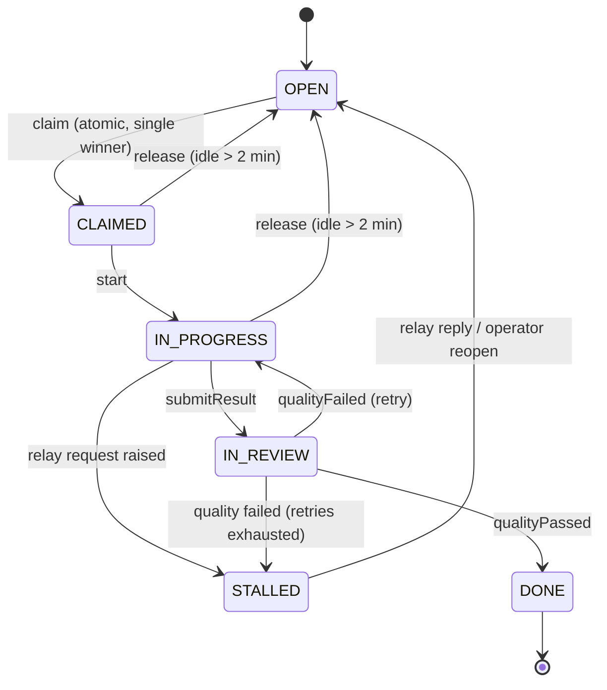
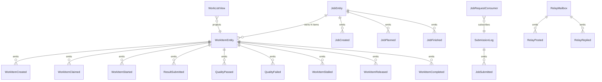

# PLAN — swarm-pattern

Architectural sketch consumed by `/akka:plan` (or skipped if `/akka:specify` covers it). Diagrams are rendered on the generated system's Architecture tab with the Akka theme variables and the Lesson 24 state-label CSS overrides.

---

## Component graph

Solid arrows are synchronous commands; dashed arrows are event subscriptions and scheduled ticks. `Worker` is one agent class run as several instances (`worker-1`, `worker-2`, `worker-3`); each instance is driven by its own `WorkerWorkflow`.

## Interaction sequence — J1 (happy path)

## State machine — `WorkItemEntity`

## Entity model

## Component table — Java file targets

| Component | Path (generated) |
|---|---|
| `Coordinator` | `application/Coordinator.java` |
| `Worker` | `application/Worker.java` |
| `SwarmTasks` | `application/SwarmTasks.java` |
| `QualityChecker` | `application/QualityChecker.java` |
| `DecompositionWorkflow` | `application/DecompositionWorkflow.java` |
| `WorkerWorkflow` | `application/WorkerWorkflow.java` |
| `WorkItemEntity` | `application/WorkItemEntity.java` (state in `domain/WorkItem.java`, events in `domain/WorkItemEvent.java`) |
| `JobEntity` | `application/JobEntity.java` (state in `domain/Job.java`, events in `domain/JobEvent.java`) |
| `RelayMailbox` | `application/RelayMailbox.java` (state + events in `domain/`) |
| `SubmissionLog` | `application/SubmissionLog.java` |
| `SwarmControl` | `application/SwarmControl.java` |
| `WorkListView` | `application/WorkListView.java` |
| `JobRequestConsumer` | `application/JobRequestConsumer.java` |
| `JobSimulator` | `application/JobSimulator.java` |
| `StalledItemMonitor` | `application/StalledItemMonitor.java` |
| `SwarmEndpoint` | `api/SwarmEndpoint.java` |
| `AppEndpoint` | `api/AppEndpoint.java` |
| `Bootstrap` | `Bootstrap.java` |

Akka component count: **2 autonomous-agent · 2 workflow · 4 event-sourced-entity · 1 key-value-entity · 1 view · 1 consumer · 2 timed-action · 2 http-endpoint · 1 service-setup**.

## Concurrency notes

- **Atomic claim is the whole pattern.** `WorkItemEntity` is a single-writer; `claim(workerId)` emits `WorkItemClaimed` only when the current status is `OPEN`. Two worker workflows that read the same `OPEN` item from the view and both call `claim` are serialised by the entity — the first wins, the second receives the already-claimed `WorkItem` and returns to polling. No lock, no external queue.
- **Workflow step timeouts:** `DecompositionWorkflow.decomposeStep` and `WorkerWorkflow.workStep` call agents, so each sets an explicit `stepTimeout` of 90 s (Lesson 4). The default 5 s timeout would expire mid-LLM-call.
- **Idle polling:** `WorkerWorkflow.pollStep` self-schedules a 5 s resume timer when the swarm is paused or no eligible `OPEN` item exists, so an idle worker is a paused workflow, not a busy loop.
- **Dependency gate:** an item is eligible only when every title in its `dependsOn` resolves to a `DONE` item on the board. The poll filters on this client-side (the view exposes no enum-status filter — Lesson 2).
- **Release for liveness:** `StalledItemMonitor` returns an item claimed-but-idle for more than two minutes to `OPEN`, so a worker that fails mid-item does not strand work. `release` is a no-op unless the item is `CLAIMED` or `IN_PROGRESS`.
- **Quality gate:** `QualityChecker` is a deterministic pure function (no LLM call) so the gate is reproducible; the same result always yields the same `QualityReport`.
- **Pause:** `SwarmControl` is read at the top of `pollStep`, so a pause both stops new claims and blocks the worker loop while paused.
- **Idempotency:** deterministic `itemId = jobId + "-i" + index` makes `createItem` idempotent if `DecompositionWorkflow.createItemsStep` is retried.
