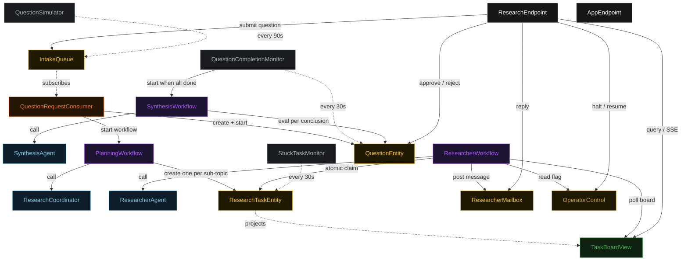
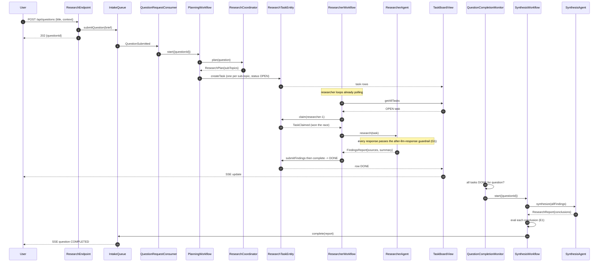
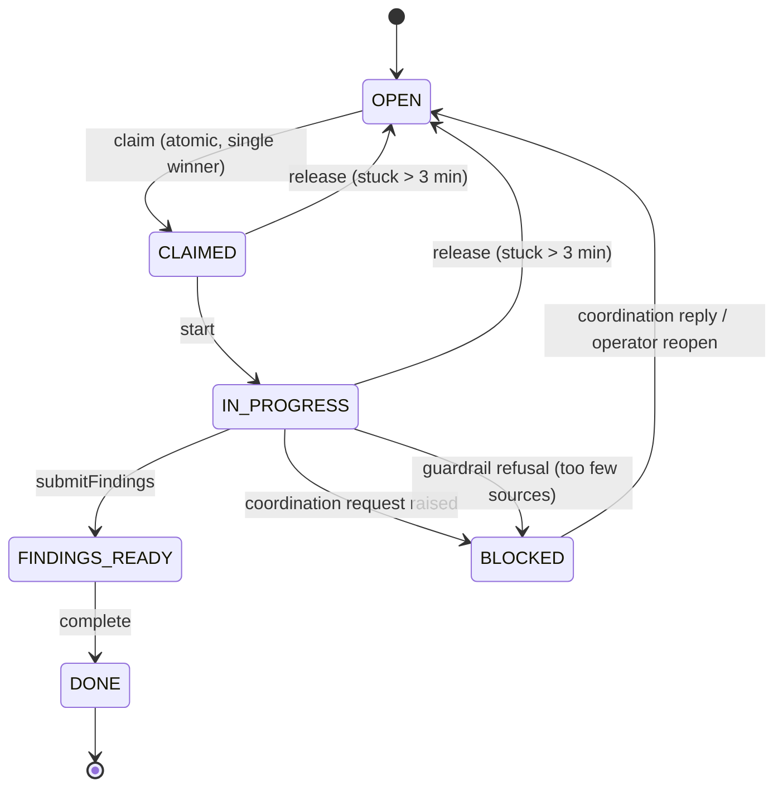
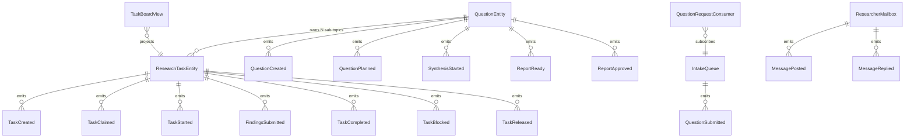

# PLAN — collab-research-team

Architectural sketch consumed by `/akka:plan` (or skipped if `/akka:specify` covers it). Diagrams are rendered on the generated system's Architecture tab with the Akka theme variables and the Lesson 24 state-label CSS overrides.

---

## Component graph

Solid arrows are synchronous commands; dashed arrows are event subscriptions and scheduled ticks. `ResearcherAgent` is one agent class run as several instances (`researcher-1`, `researcher-2`, `researcher-3`); each instance is driven by its own `ResearcherWorkflow`. `SynthesisWorkflow` is started per question by `QuestionCompletionMonitor` once all sub-topic tasks are done.

## Interaction sequence — J1 (happy path)

## State machine — `ResearchTaskEntity`

## Entity model

## Component table — Java file targets

| Component | Path (generated) |
|---|---|
| `ResearchCoordinator` | `application/ResearchCoordinator.java` |
| `ResearcherAgent` | `application/ResearcherAgent.java` |
| `SynthesisAgent` | `application/SynthesisAgent.java` |
| `ResearchTasks` | `application/ResearchTasks.java` |
| `CitationEvaluator` | `application/CitationEvaluator.java` |
| `PlanningWorkflow` | `application/PlanningWorkflow.java` |
| `ResearcherWorkflow` | `application/ResearcherWorkflow.java` |
| `SynthesisWorkflow` | `application/SynthesisWorkflow.java` |
| `ResearchTaskEntity` | `application/ResearchTaskEntity.java` (state in `domain/ResearchTask.java`, events in `domain/ResearchTaskEvent.java`) |
| `QuestionEntity` | `application/QuestionEntity.java` (state in `domain/Question.java`, events in `domain/QuestionEvent.java`) |
| `ResearcherMailbox` | `application/ResearcherMailbox.java` (state + events in `domain/`) |
| `IntakeQueue` | `application/IntakeQueue.java` |
| `OperatorControl` | `application/OperatorControl.java` |
| `TaskBoardView` | `application/TaskBoardView.java` |
| `QuestionRequestConsumer` | `application/QuestionRequestConsumer.java` |
| `QuestionSimulator` | `application/QuestionSimulator.java` |
| `QuestionCompletionMonitor` | `application/QuestionCompletionMonitor.java` |
| `StuckTaskMonitor` | `application/StuckTaskMonitor.java` |
| `ResearchEndpoint` | `api/ResearchEndpoint.java` |
| `AppEndpoint` | `api/AppEndpoint.java` |
| `Bootstrap` | `Bootstrap.java` |

Akka component count: **3 autonomous-agent · 3 workflow · 4 event-sourced-entity · 1 key-value-entity · 1 view · 1 consumer · 3 timed-action · 2 http-endpoint · 1 service-setup**.

## Concurrency notes

- **Atomic claim is the whole pattern.** `ResearchTaskEntity` is a single-writer; `claim(researcherId)` emits `TaskClaimed` only when the current status is `OPEN`. Two researcher workflows that read the same `OPEN` task from the view and both call `claim` are serialised by the entity — the first wins, the second receives the already-claimed `ResearchTask` and returns to polling. No lock, no external queue.
- **Workflow step timeouts:** `PlanningWorkflow.planStep`, `ResearcherWorkflow.researchStep`, and `SynthesisWorkflow.synthesizeStep` call agents, so each sets an explicit `stepTimeout` of 90 s (Lesson 4). The default 5 s timeout would expire mid-LLM-call.
- **Idle polling:** `ResearcherWorkflow.pollStep` self-schedules a 5 s resume timer when the team is halted or no eligible `OPEN` task exists, so an idle researcher is a paused workflow, not a busy loop.
- **Release for liveness:** `StuckTaskMonitor` returns a task claimed-but-idle for more than three minutes to `OPEN`, so a researcher that fails mid-task does not strand work. `release` is a no-op unless the task is `CLAIMED` or `IN_PROGRESS`.
- **Citation eval gate:** `CitationEvaluator` is a deterministic pure function (no LLM call) applied per `ReportConclusion` in `SynthesisWorkflow.evalStep`. The same evaluator runs in tests so the eval outcome is reproducible.
- **Synthesis trigger:** `QuestionCompletionMonitor` polls every 30 s and starts `SynthesisWorkflow` once; deterministic `questionId` as workflow id makes the start idempotent if the monitor fires more than once.
- **Halt:** `OperatorControl` is read at the top of `pollStep` and inside the after-llm-response guardrail, so a halt both stops new claims and blocks any in-flight researcher response.
- **Idempotency:** deterministic `taskId = questionId + "-t" + index` makes `createTask` idempotent if `PlanningWorkflow.createTasksStep` is retried.
